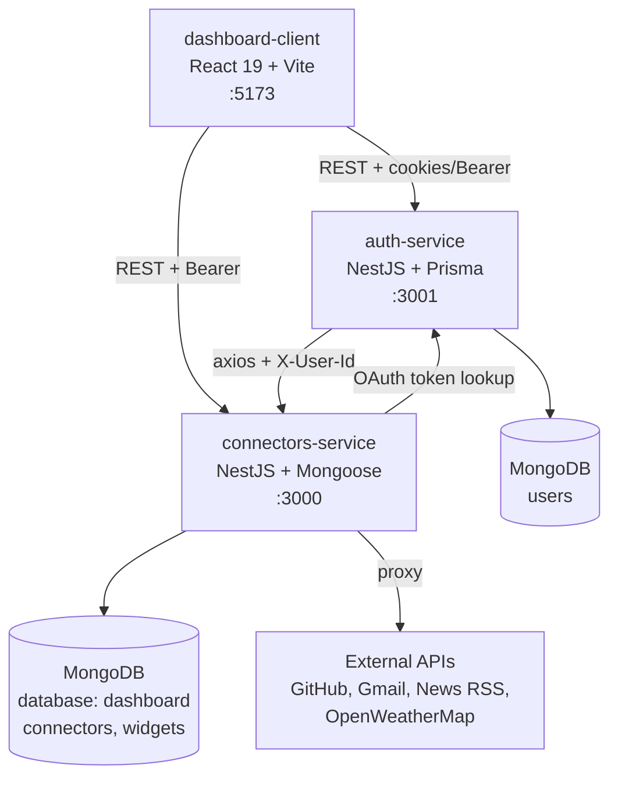
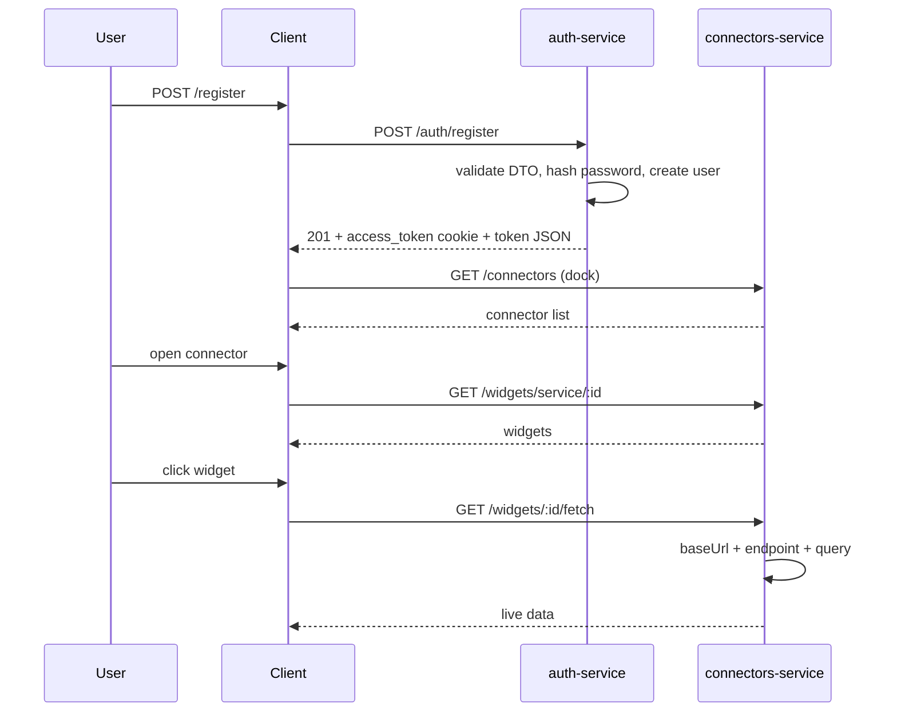
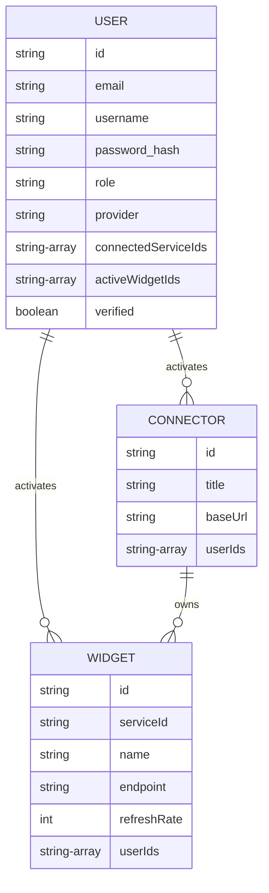

# Architecture

Dashboard is a widget-management platform built as two NestJS microservices plus a React single-page application. All persistent data lives in MongoDB.

## System overview

## Services

### auth-service (port 3001)

Owns identity. Responsibilities:

- Local register/login with bcrypt (cost 10) and JWT (`userId`, `email`, `role`, `provider`, 7d expiry) delivered as an `httpOnly` cookie plus JSON body.
- Google/GitHub OAuth via Passport strategies. OAuth access tokens are AES-256-CBC encrypted before storage.
- Email verification (`POST /auth/verify-email/:id`, `GET /auth/confirm-email/:id`) and two-step profile email change (`PUT /users/profile` stages `standByEmail`, `GET /users/confirm-update/:userId` commits it).
- Password change through a validated DTO.
- Role model: `USER`, `ADMIN`. `CustomAuthGuard` accepts Bearer or cookie; `RolesGuard` enforces `@Roles('ADMIN')`.
- `GatewayModule` proxies dashboard/connector/widget calls to the connectors-service, forwarding `X-User-Id`.
- Cross-cutting: `helmet`, global `ThrottlerGuard` (100 req/min) with stricter limits (10 req/min) on register/login, strict global `ValidationPipe` (`whitelist`, `forbidNonWhitelisted`, `transform`), fail-fast env check, `GET /health`.

### connectors-service (port 3000)

Owns the catalog. Responsibilities:

- `Connector` documents: `title`, `description`, `icon`, `baseUrl`, `userIds[]`.
- `Widget` documents: `serviceId` (ref Connector), `name`, `endpoint`, `icon`, `refreshRate` (default 300s), `userIds[]`, `positions[{user_id, position{x,y}}]`.
- Live data: `GET /widgets/:id/fetch` composes `baseUrl + endpoint + query` and calls the third-party API server-side (15s timeout).
- `GET /proxy?baseUrl=&endpoint=` is a generic fetch proxy: RSS feeds render as HTML, Gmail calls attach the user's Google OAuth token (fetched from auth-service) and redirect to Google login when absent.
- No local auth guards: every route is public and trusts the `userId` URL parameter. Only the auth-service gateway and the frontend call it, so do not expose this port publicly without adding authentication.
- Cross-cutting: `helmet`, global `ThrottlerGuard`, strict global `ValidationPipe`, fail-fast env check, `GET /health`.

### dashboard-client (port 5173 dev, nginx :80 in Docker)

React SPA with `react-router-dom`. Layers: `pages/` (routes) -> `controllers/` (domain calls) -> `services/` (axios instances + localStorage token store). No global store library: local component state plus `localStorage` keys `access_token` and `user`. API calls return `[ok, payload]` tuples. Two axios instances exist: `axiosService` (auth-service base URL from `VITE_API_URL`) and `connectorsService` (connectors base URL from `VITE_API_URL_CONNECTOR`), plus a small `fetch`-based `apiService` for public catalog reads.

## Request flows

## Data model

The auth-service `User` keeps `connectedServiceIds`/`activeWidgetIds` as the source for "my dashboard", while the connectors-service keeps mirrored `userIds` arrays on each document. The two copies are updated through separate endpoints and are eventually consistent by convention, not by transaction.
