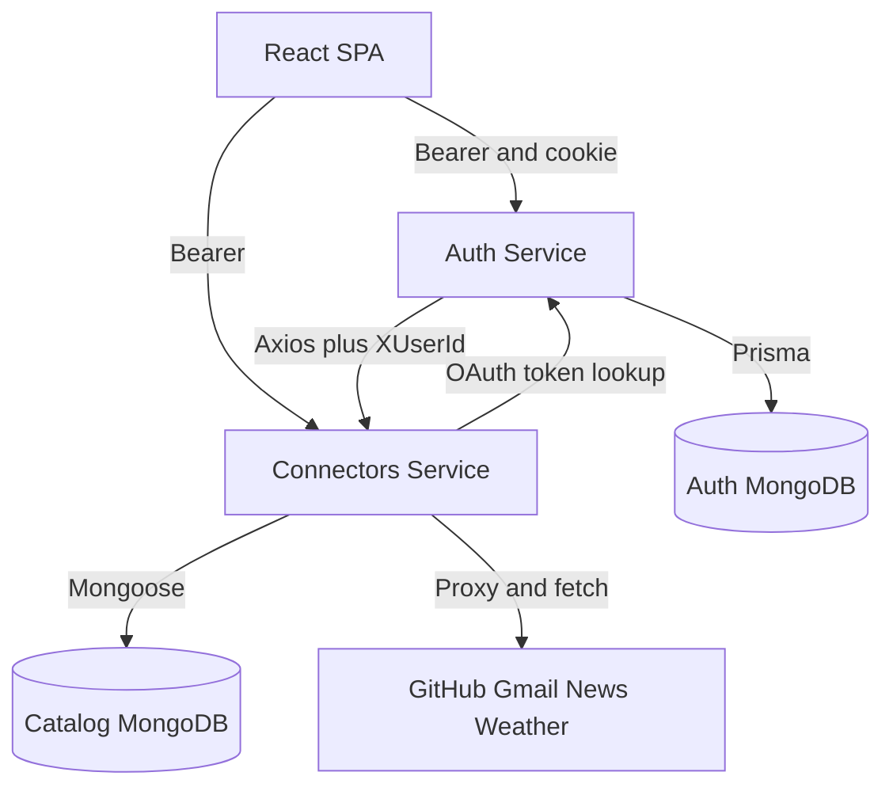
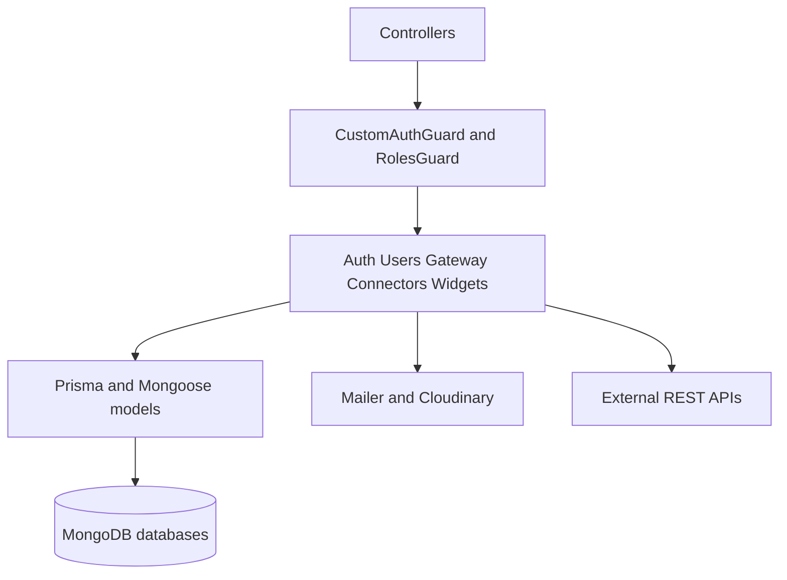
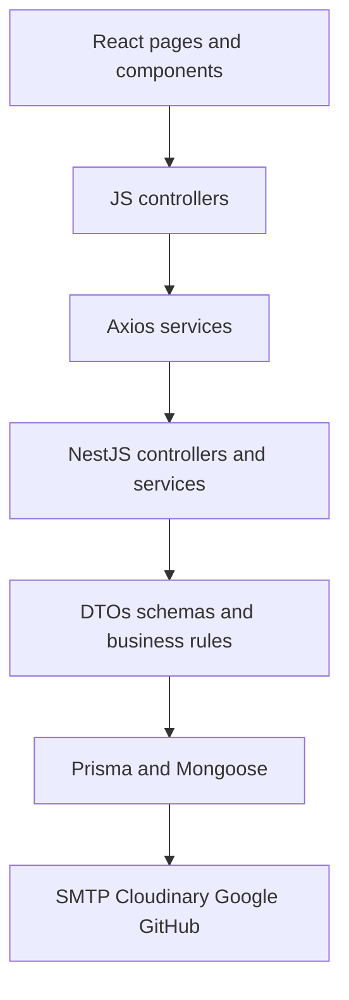

# Architecture

Dashboard is a widget-monitoring platform built as two NestJS microservices plus one React SPA, all persisted in MongoDB. The auth-service owns identity and guards private calls; the connectors-service owns the public connector and widget catalog with live third-party fetching; the client renders the dock-and-windows workspace.

## Project Tree

```text
dashboard/
├── auth-service/         # identity API (NestJS + Prisma), port 3001
├── connectors-service/   # catalog API (NestJS + Mongoose), port 3000
├── dashboard-client/     # React SPA (Vite dev, nginx prod)
└── docs/                 # this documentation set
```

Top-level roles: each service is independently deployable with its own database; the client is the only UI and calls both. Full tree: `architecture/PROJECT_TREE.md`.







## Component Breakdown

- **auth-service** validates credentials with bcrypt, signs short JWT payloads, runs Google and GitHub OAuth with encrypted token storage, and sends verification mail. Its gateway re-exposes the catalog with the user id attached.
- **connectors-service** stores connectors and widgets, activates them per user id, composes `baseUrl + endpoint` for live fetches, and proxies RSS, Gmail, and generic JSON. It has no auth guards, so it must stay behind the gateway.
- **dashboard-client** keeps the token in localStorage, normalizes calls to `[ok, payload]` tuples, and renders the dock, draggable-feel windows, profile tabs, and polling news and GitHub widgets.
- **MongoDB databases** hold users in one database and connectors plus widgets in another, linked by convention (`serviceId`, `userIds`) rather than cross-database transactions.
- **External services** are SMTP for mail, Cloudinary for avatars, Google and GitHub for OAuth and data, plus any third-party JSON or RSS a widget points at.

## Technology Decisions

| Choice | Why |
|---|---|
| NestJS microservices | Isolated deploys plus dependency injection, guards, and pipes per service |
| Prisma on auth, Mongoose on catalog | Prisma for the strict user model, Mongoose for the flexible widget documents |
| MongoDB | Document shape fits connectors and widget positions; replica set enables Prisma transactions |
| JWT in httpOnly cookie plus Bearer | Cookies survive reloads, Bearer covers API clients, Lax mode keeps OAuth working |
| React tuple API layer | One `[ok, payload]` convention removes per-call error-shape guessing |

## Design Patterns

- Layered modules: controller validates, service decides, model persists, seen in every Nest module and mirrored by the client pages, controllers, and services split.
- Gateway facade: the auth-service fronts catalog reads so the client keeps one identity-aware base URL.
- Idempotent membership updates: activate calls add a user id only once; deactivates filter it out.
- Fail-fast configuration: both APIs throw at boot when required environment variables are missing.
