# Charts Provider

Central diagram repository. Each entry states its purpose and where it is used. Module deep dives live under `docs/modules/`.

### Module Diagrams

- [Auth Module Diagrams](./modules/auth/DIAGRAMS.md)
- [Users Module Diagrams](./modules/users/DIAGRAMS.md)
- [Gateway Module Diagrams](./modules/gateway/DIAGRAMS.md)
- [Connectors Module Diagrams](./modules/connectors/DIAGRAMS.md)
- [Widgets Module Diagrams](./modules/widgets/DIAGRAMS.md)
- [Client Module Diagrams](./modules/client/DIAGRAMS.md)

### System Architecture

**Purpose**: Major components and their links. **Usage**: `ARCHITECTURE.md`.

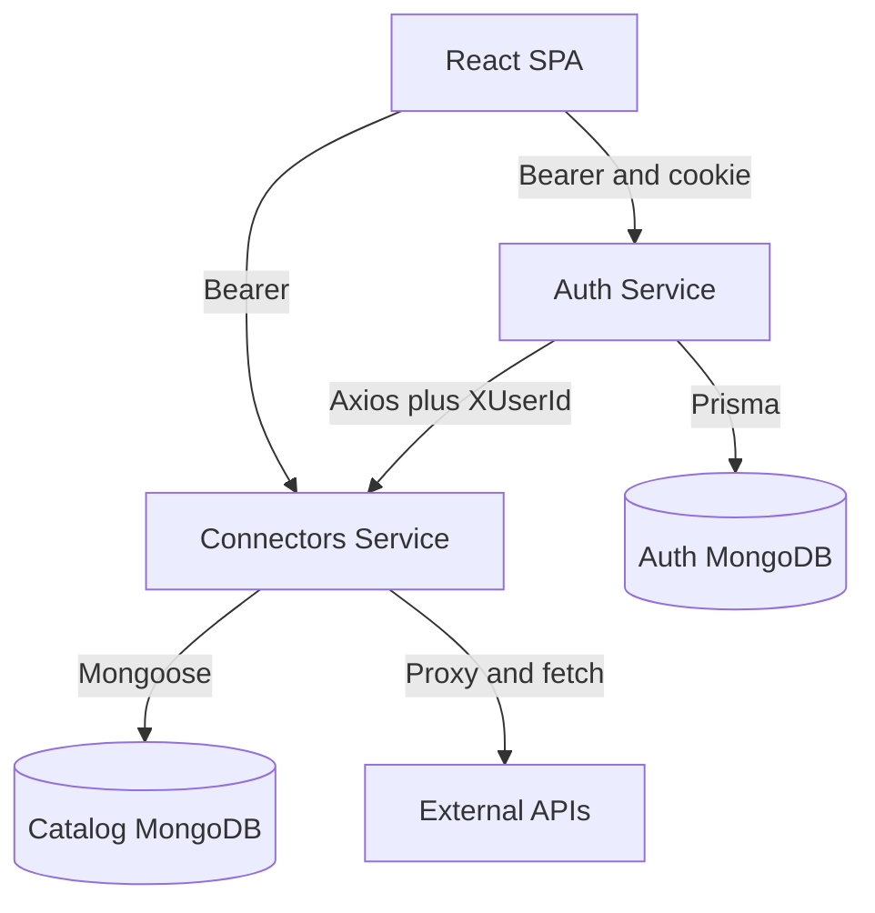

### Data Flow Diagrams

**Purpose**: Register-to-widget data movement. **Usage**: `FEATURES.md`, module `DATA_FLOW.md` files.

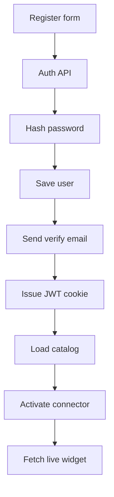

### Activity Diagrams

**Purpose**: Branching inside register and proxy flows. **Usage**: module `DATA_FLOW.md` files.

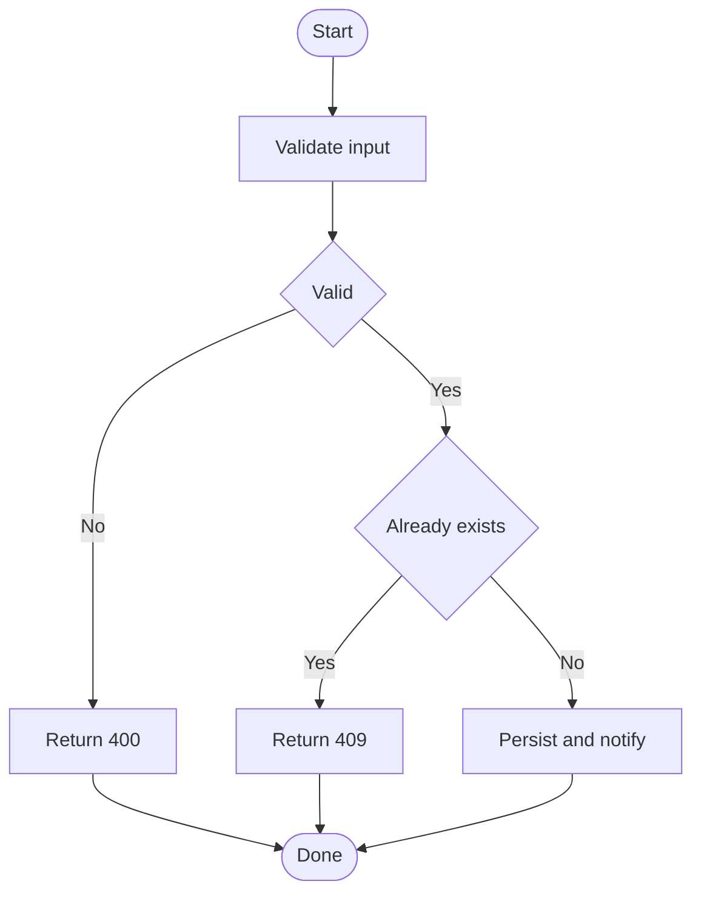

### Use Case Diagrams

**Purpose**: Actors and capabilities per module. **Usage**: module `README.md` files.

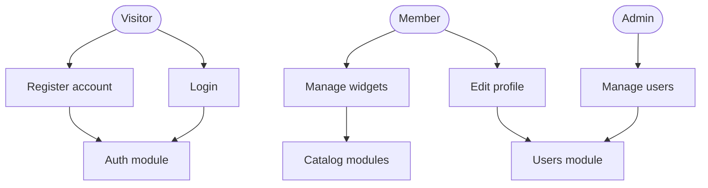

### Sequence Diagrams

**Purpose**: Exact call order for login and widget fetch. **Usage**: module `CALL_CHAINS.md` files.

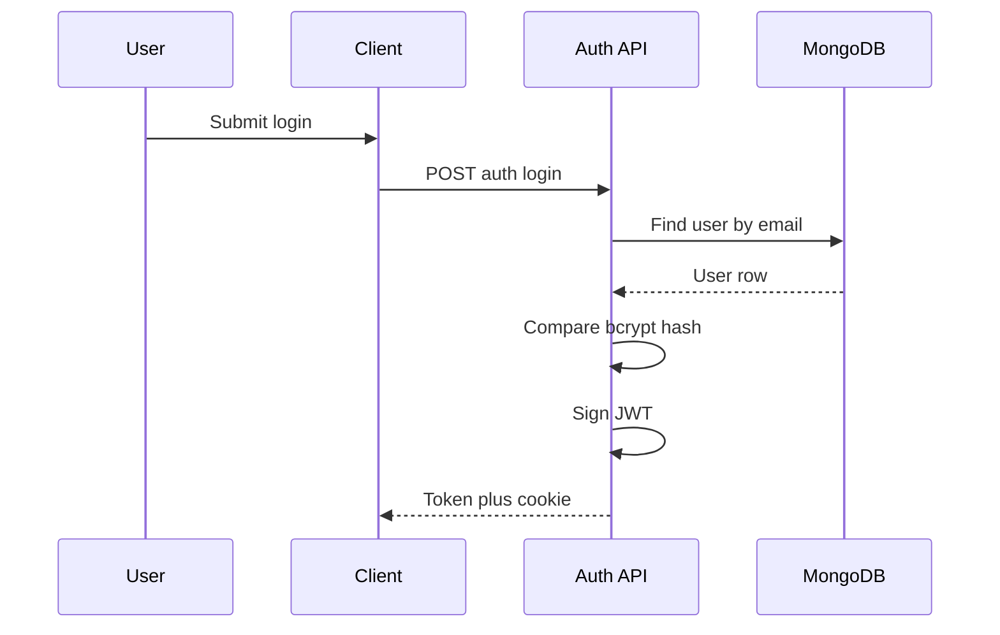

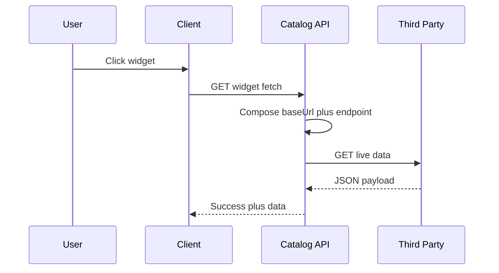

### Interaction Diagrams

**Purpose**: Static maps of which services call which. **Usage**: module `FUNCTIONS.md` files.

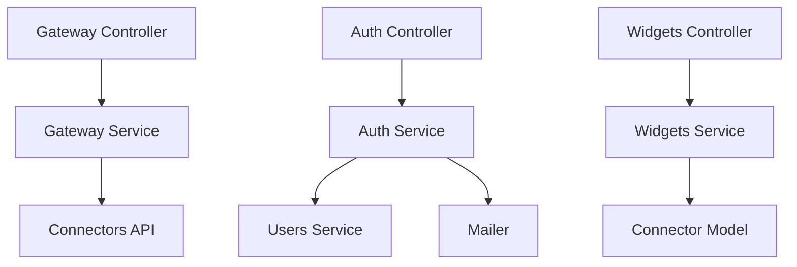

### State Diagrams

**Purpose**: Account verification and widget activation lifecycles. **Usage**: module `DATA_FLOW.md` files.

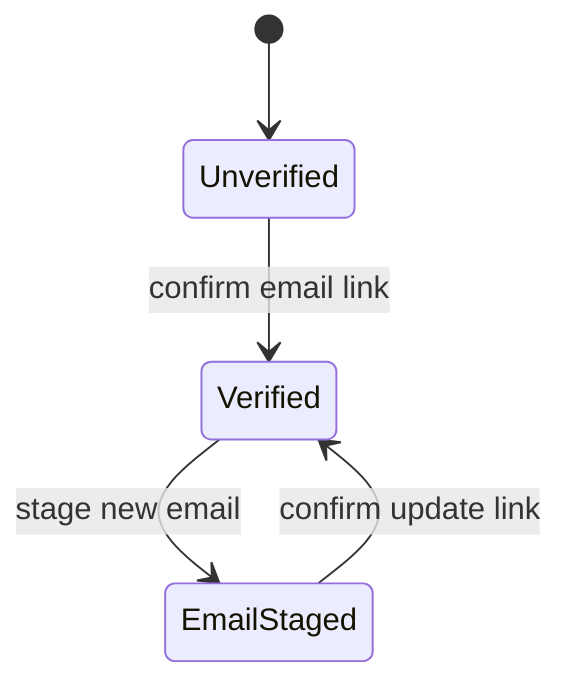

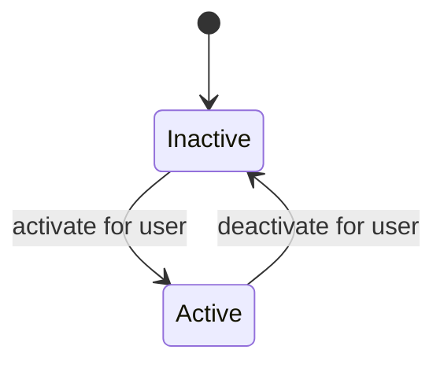

### Entity Relationship Diagrams

**Purpose**: Collections and references. **Usage**: `DATABASE.md`.

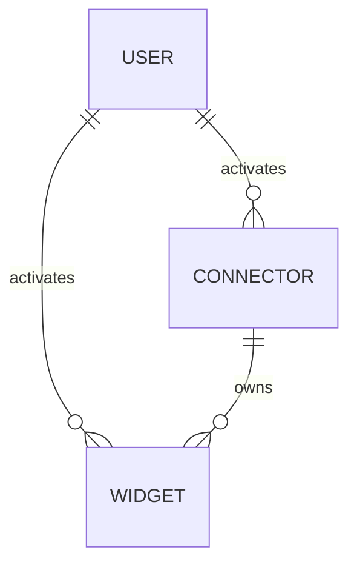

### Page Hierarchy Maps

**Purpose**: Route navigation. **Usage**: `PAGE_LISTING.md`.

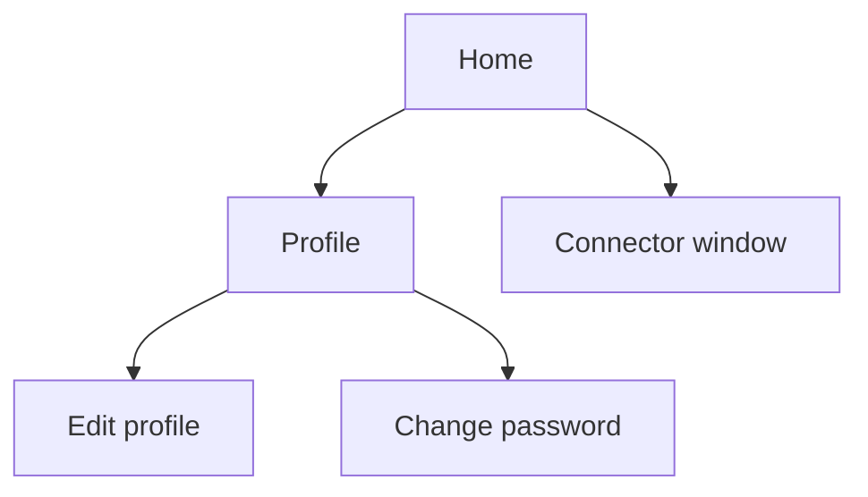

### User Journey Maps

**Purpose**: End-to-end member journey. **Usage**: `FEATURES.md`.

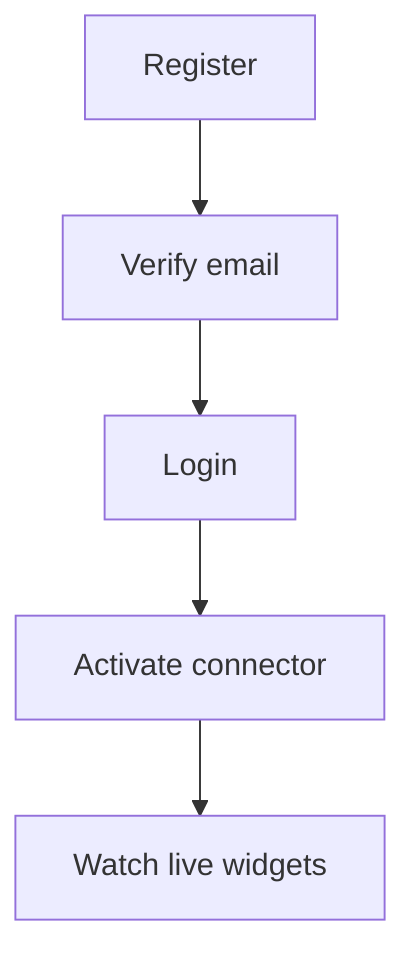

### Deployment Diagrams

**Purpose**: Images to running containers. **Usage**: `DEPLOYMENT.md`.

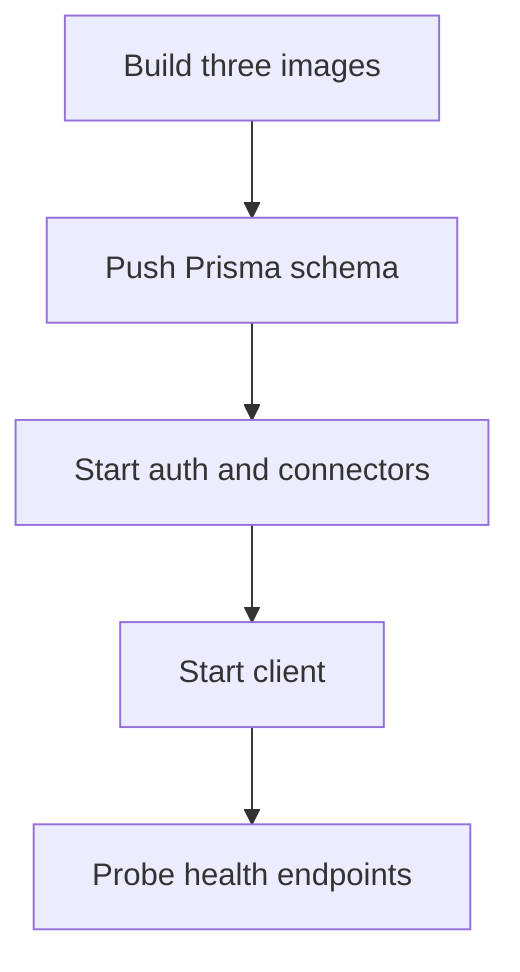
