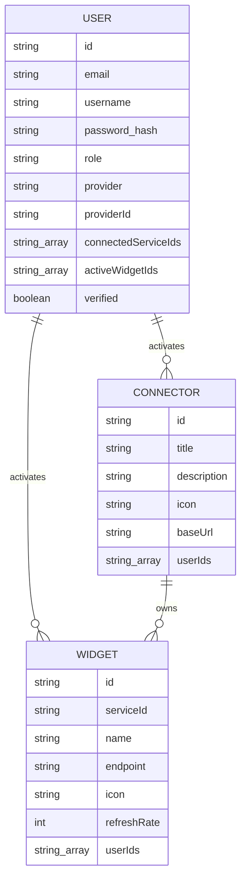

# Database

Two MongoDB databases: the auth database holds `User` (Prisma), the catalog database holds `Connector` and `Widget` (Mongoose, dbName `dashboard`). They link by convention, never by cross-database transaction.

## Table Schemas

### User (auth database, Prisma, collection `users`)

One row per account, local or OAuth. Key fields: `email` unique, `username`, `password` nullable for OAuth users, `role` (`USER`, `ADMIN`), `provider` (`LOCAL`, `GOOGLE`, `GITHUB`), `providerId`, encrypted `accessToken` and `refreshToken`, `verified`, `standByEmail` and `standByUsername` for the two-step email change, `connectedServiceIds` and `activeWidgetIds` mirroring catalog membership, plus denormalized `connectors` and `widgets` JSON.

### Connector (catalog database, Mongoose)

One integration such as GitHub or News. Key fields: `title` unique, `description`, `icon` URL, `baseUrl` URL, `userIds` of activated users. Relationships: referenced by `Widget.serviceId`, mirrored by `User.connectedServiceIds`.

### Widget (catalog database, Mongoose)

One live card inside a connector. Key fields: `serviceId` reference to Connector, `name`, `endpoint` appended to the connector `baseUrl`, `icon`, `refreshRate` in seconds defaulting to 300, `userIds` of activated users, `positions` with per-user window coordinates. Relationships: owned by one Connector, mirrored by `User.activeWidgetIds`.

## Indexes & Constraints

- `User.email` is unique, which enforces one account per address across providers.
- `Connector.title`, `icon`, and `baseUrl` are unique, which keeps the catalog deduplicated.
- `Widget.icon` is unique and `Widget.userIds` is indexed for fast per-user lookups.
- The commented-out composite unique on `provider` plus `providerId` is not enforced, so OAuth duplicates are prevented in service code instead of the database.
