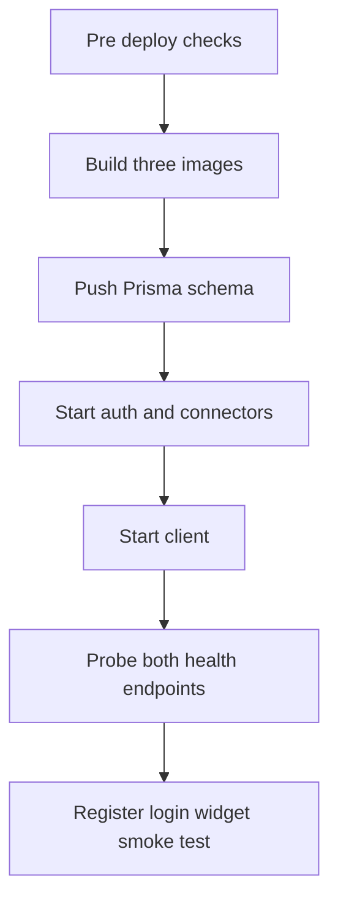

# Deployment

## Deployment Platforms

Docker (recommended: one image per project, nginx for the SPA) or a standalone server with PM2. There is no platform lock-in and no Replit dependency.

## Pre-Deployment Checklist

- [ ] Real secrets in environment, never in images or git
- [ ] `NODE_ENV=production` so cookies get the `secure` flag
- [ ] `FRONTEND_URL`, `CONNECTORS_SERVICE_URL`, and both `VITE_*` URLs point at public hosts
- [ ] `npm test`, `npm run test:e2e`, client `npm run lint`, and all three `npm run build` are green
- [ ] Connectors-service port is not publicly exposed (its routes trust `userId` params)

## Deployment Steps

```bash
docker build -t dashboard-auth ./auth-service
docker build -t dashboard-connectors ./connectors-service
docker build -t dashboard-client ./dashboard-client
docker run -d --env-file ./auth-service/.env -p 3001:3001 dashboard-auth
docker run -d --env-file ./connectors-service/.env -p 3000:3000 dashboard-connectors
docker run -d -p 8080:80 dashboard-client
```

On a plain server instead: `npm ci`, `npx prisma db push`, `npm run build` per service, then `pm2 start dist/main.js` for each API and serve the client `dist/` with the shipped `nginx.conf`.



## Post-Deployment

Probe `GET /health` on both APIs and run one register-to-widget smoke pass in the browser. Watch API logs for `503` (connectors unreachable) and `401` spikes (bad `FRONTEND_URL` or clock skew on JWT).

## Rollback Procedure

Re-tag and redeploy the previous image (`docker run` the old tag), or `pm2 restart` the previous `dist/` on a server. Database changes here are additive (Prisma push, idempotent seed), so rolling code back needs no data migration.
