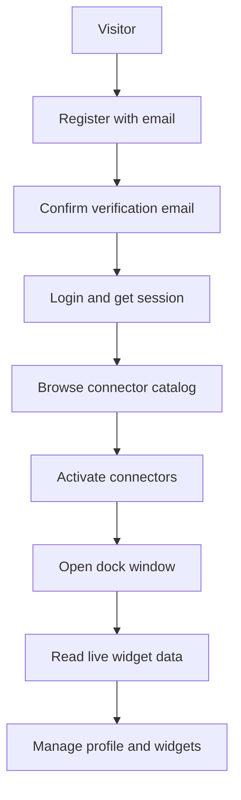
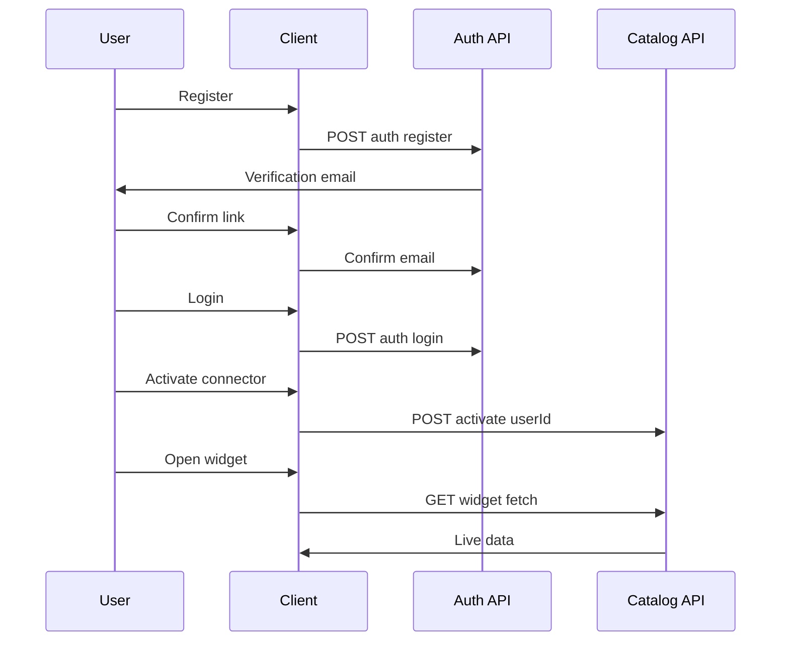

# Features

## Feature Overview

| Area | Feature | Status |
|---|---|---|
| Identity | Email registration with verification link | [Implemented] |
| Identity | Login with httpOnly session cookie | [Implemented] |
| Identity | Google and GitHub OAuth login | [Implemented] |
| Identity | Password change and two-step email change | [Implemented] |
| Identity | Admin user list, edit, and delete | [Implemented] |
| Catalog | Browse connectors and their widgets | [Implemented] |
| Catalog | Activate and deactivate per user | [Implemented] |
| Catalog | Live widget fetch with query params | [Implemented] |
| Catalog | Generic fetch proxy with RSS and Gmail HTML views | [Implemented] |
| Workspace | macOS-style dock with multi-window widgets | [Implemented] |
| Workspace | Auto-refresh polling with per-widget rates | [Implemented] |
| Workspace | GitHub repos, stars, and sports news widgets | [Implemented] |
| Workspace | Drag and drop layout plus custom themes | [Planned] |
| Workspace | Connector marketplace and saved layouts | [Planned] |
| Platform | WebSocket notifications and team workspaces | [Planned] |
| Platform | Mobile app and no-code connector builder | [Planned] |

Each feature is a short slice: a route, a service method, and a UI state. Admin-only paths reuse the same role guard as the user list.

