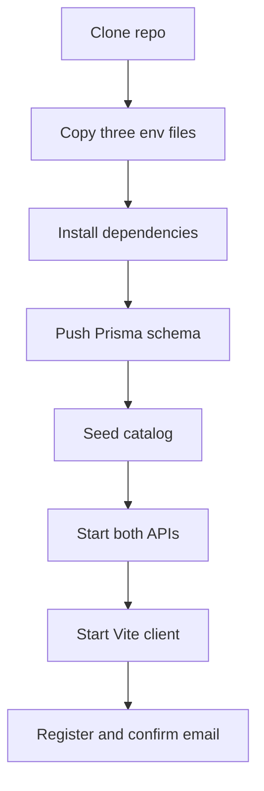

# Installation

## Prerequisites

- Node.js 20 or higher and npm 9 or higher
- A reachable MongoDB (local `mongod` with replica-set mode, or Atlas)
- SMTP credentials for verification emails
- Ports 3001, 3000, and 5173 free

## Installation Steps

1. Clone the repository and enter it.
2. Copy each template: `auth-service/.env`, `connectors-service/.env`, `dashboard-client/.env` from the matching `.env.example`, then fill in secrets. Never commit `.env` files.
3. Install dependencies in all three projects: `npm install` inside `auth-service`, `connectors-service`, and `dashboard-client`.
4. Push the auth schema: `cd auth-service && npx prisma db push`.
5. Seed the catalog: `cd connectors-service && npm run seed` (needs `DATABASE_URL`).
6. Start the backends: `npm run start:dev` in both services.
7. Start the UI: `cd dashboard-client && npm run dev`, then open `http://localhost:5173`.
8. Register an account, confirm the email link, and activate a connector.

## Environment Setup

Every variable is documented in the `.env.example` files. The services refuse to boot when required values are missing. The two URLs the frontend needs are `VITE_API_URL` (auth-service) and `VITE_API_URL_CONNECTOR` (connectors-service).

## Verification

- `GET http://localhost:3001/health` and `GET http://localhost:3000/health` return `status ok`.
- `npm test` passes in both services; `npm run lint` reports 0 errors in the client.

## Troubleshooting

- Prisma `P1013` or replica-set errors: the auth database URL must include a database name and point at a replica set.
- Empty catalog: rerun `npm run seed` with the right `DATABASE_URL`.
- Login loops or CORS errors: check `FRONTEND_URL` on the APIs and the `VITE_*` URLs in the client.
