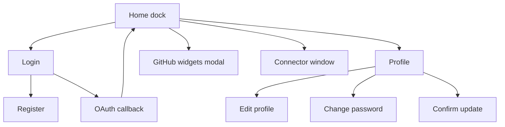
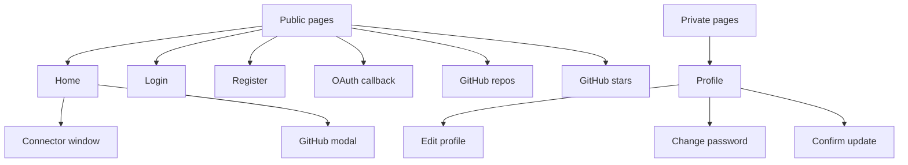

# Page Listing

## Route Structure Overview

## Page Inventory

| Route | Page Name | Description | Auth Required | Roles | Key Components |
|---|---|---|---|---|---|
| `/` | Dashboard | Dock plus multi-window widget workspace | No | All | Window, WidgetCard, WeatherCard |
| `/login` | Login | Email login with Google and GitHub buttons | No | Guest | Login form, Alert |
| `/register` | Register | Account creation with password rules | No | Guest | Register form, Alert |
| `/auth/callback` | OAuth callback | Stores token from provider redirect | No | All | AuthCallback |
| `/profile` | Profile | Counts, tabs for services and widgets | Yes | User, Admin | Nav, ProfileCard, ProfileTabs |
| `/edit-profile` | Edit profile | Stages username or email change | Yes | User, Admin | Edit form, Alert |
| `/change-password` | Change password | Current plus new password with logout | Yes | User, Admin | Password form, Alert |
| `/confirm-update/:userId` | Confirm update | Commits staged email change | Yes | User, Admin | ConfirmUpdate |
| `/github` | GitHub repos | Public repos for a typed username | No | All | GithubReposWidget |
| `/githstar` | GitHub stars | Starred repos for a typed username | No | All | GithubStarsWidget |

## Page Hierarchy

## Protected vs Public Routes

Public routes render for anyone but redirect to `/login` from guards inside the page when a token already exists. Protected routes read `localStorage` on mount and push to `/login` without a token. There is no central route guard; each page enforces its own rule.
