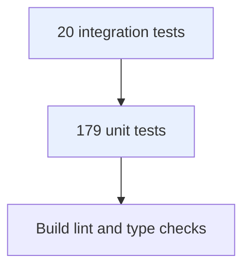
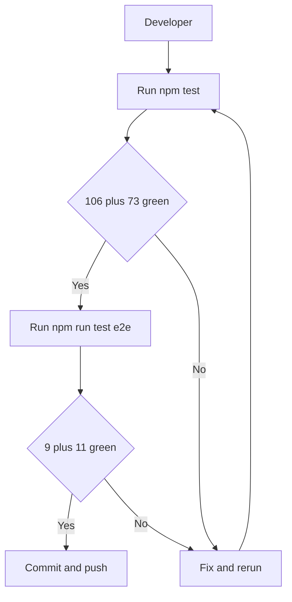

# Testing Strategy

Unit tests with mocked dependencies carry the bulk: 179 unit tests assert services, controllers, guards, strategies, DTOs, and template helpers including every error branch. Integration tests prove the real seams: 20 end-to-end tests run both APIs over HTTP against real MongoDB with real bcrypt, JWT, guards, and validation.





## Test Coverage Goals

Backend services target at least 90 percent line coverage and hold about 99 percent (auth 99.4, connectors 100). Every service method needs a success case plus each failure case: not found, conflict, unauthorized, validation, upstream error, network failure. The client has no runner yet; its gate is `npm run lint` with 0 errors.

## Testing Tools

Jest with ts-jest for units, Supertest for HTTP, mongodb-memory-server for the catalog, the environment replica set plus `prisma db push` for auth, with the mailer mocked in end-to-end runs.

## Running Tests

```bash
cd auth-service && npm test          # 106 unit, expect 17 suites green
cd connectors-service && npm test    # 73 unit, expect 8 suites green
cd auth-service && npm run test:e2e  # 9 integration, needs local MongoDB replica set
cd connectors-service && npm run test:e2e  # 11 integration, in-memory MongoDB
cd auth-service && npm run test:cov  # expect about 99 percent lines
cd dashboard-client && npm run lint  # expect 0 errors
```

## CI/CD Integration

No CI pipeline is configured in the repository yet. Until one exists, the pre-push gate is manual: unit suites, both end-to-end suites, client lint, and all three builds. The natural next step is a workflow running exactly the commands above on every pull request.
