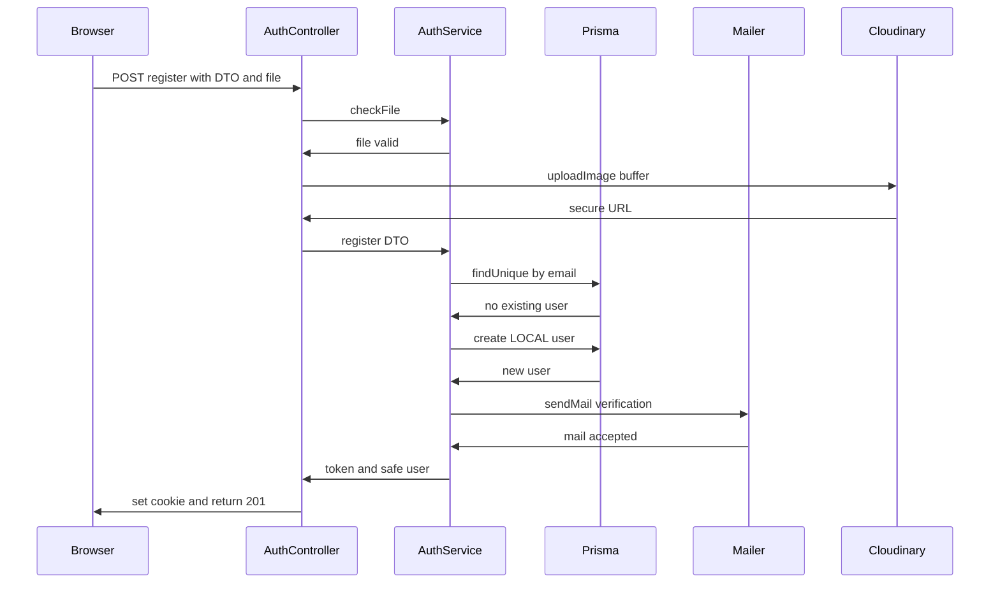
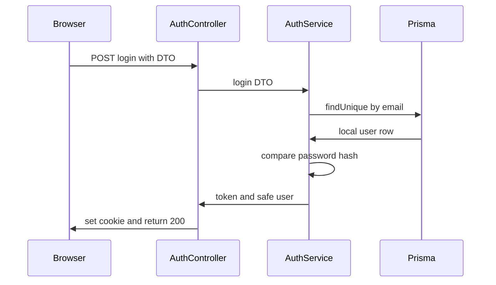
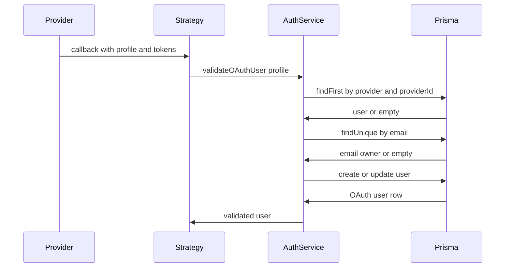
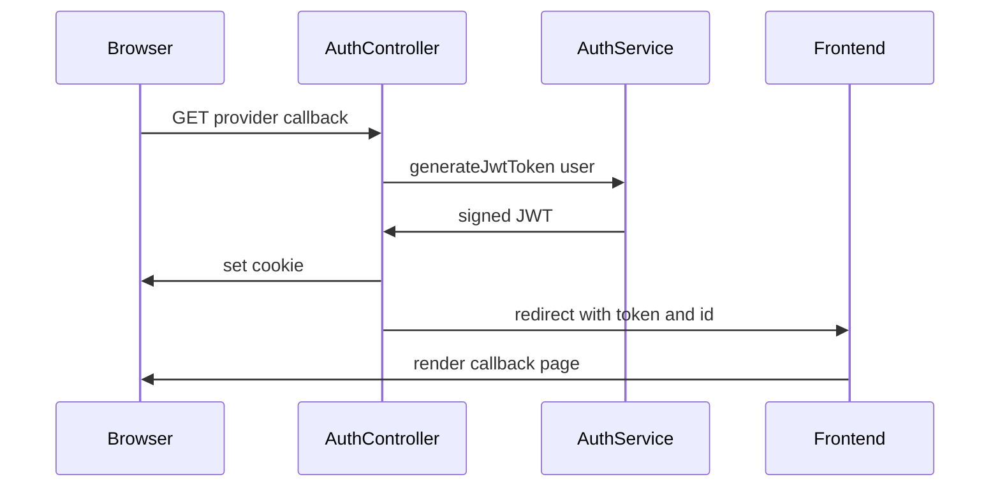
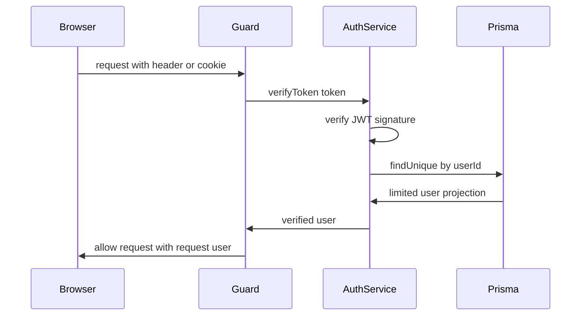
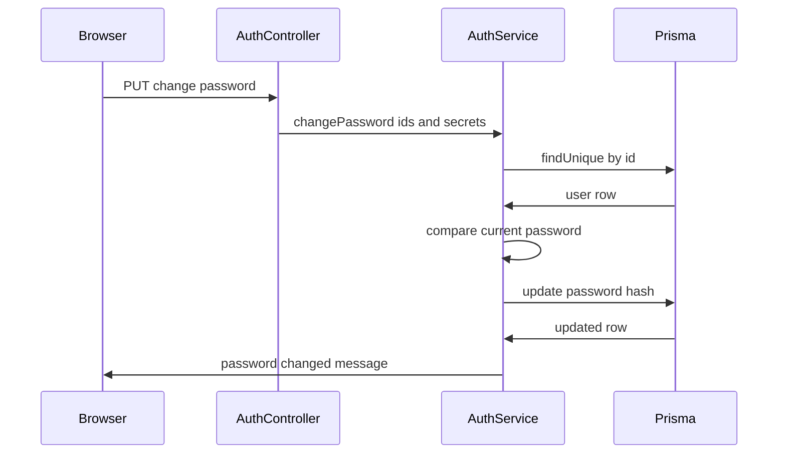

# Auth Module Call Chains

## Register

Narrative step sequence:

1. Browser posts `RegisterDto` plus optional `profile` file to `POST /auth/register`
2. Global `ValidationPipe` validates email, username, and strong password fields
3. Controller calls `checkFile` when a file exists and rejects non image or oversized uploads with 400
4. Controller calls `uploadImage` and stores the returned `secure_url` in `registerData.image`
5. `AuthService.register` checks for an existing email and rejects duplicates with 409
6. Service checks password equality and rejects mismatches with 400
7. Service hashes the password with `bcrypt` and creates a `LOCAL` user through Prisma
8. Service calls `sendMail`, which renders `verificationEmail.html` and sends it
9. Service calls `generateJwtToken` and returns token plus sanitized user
10. Controller sets the `httpOnly` cookie and returns 201

Why the chain exists:

- Each step isolates one failure mode so duplicate accounts, weak input, bad uploads, and mail errors do not corrupt the user table

Edge cases and error paths:

- Duplicate email returns `ConflictException` mapped to 400 by the controller catch block
- Mismatched passwords return `BadRequestException`
- Invalid file type returns 400 with invalid file type
- Cloudinary failure returns 400 with registration failed
- Mail failure after user creation leaves a valid but unverified user

## Login

Narrative step sequence:

1. Browser posts `LoginDto` to `POST /auth/login`
2. `ValidationPipe` validates email and password presence
3. `AuthService.login` loads the user by email
4. Service rejects unknown users, non local providers, and missing passwords with 401
5. Service compares passwords with `bcrypt.compare` and rejects mismatches with 401
6. Service signs a JWT and returns token plus sanitized user
7. Controller sets the `httpOnly` cookie and returns 200

Why the chain exists:

- The same generic invalid credentials error hides whether the email exists, whether the account is OAuth only, or whether the password was wrong

Edge cases and error paths:

- OAuth only account login returns 401 even with a correct looking password
- Throttle limit of 10 per minute returns 429 on password guessing bursts
- Missing user password field returns 401

## ValidateOAuthUser

Narrative step sequence:

1. Google or GitHub redirects to the provider callback
2. Passport strategy receives `accessToken`, `refreshToken`, and profile
3. Strategy calls `validateOAuthUser` with profile plus tokens
4. Service requires an email and rejects provider responses without one with 400
5. Service maps the provider string to the `AuthProvider` enum
6. Service looks up by `provider` and `providerId`
7. On first login it checks email ownership, rejects cross provider conflicts with 409, then creates a verified user with encrypted tokens
8. On return visits it updates encrypted tokens and profile image
9. Strategy calls `done` with the resulting user

Why the chain exists:

- It merges provider identity, local email uniqueness, and secret token storage in one place so controllers stay thin

Edge cases and error paths:

- Missing provider email returns `BadRequestException`
- Same email under another provider returns `ConflictException`
- Unknown provider string maps to undefined and Prisma rejects the write
- Token encryption uses `ENCRYPTION_KEY` or a weak default when unset

## OAuth callback

Narrative step sequence:

1. Passport guard finishes strategy validation and sets `request.user`
2. Controller reads `request.user` in `googleAuthCallback` or `githubAuthCallback`
3. Controller calls `generateJwtToken` for that user
4. Controller sets the `httpOnly` cookie with the JWT
5. Controller reads `FRONTEND_URL` with localhost fallback
6. Controller redirects to the frontend callback page with token and id

Why the chain exists:

- The backend owns token creation while the frontend owns session display, so the redirect hands both cookie and query values to the SPA

Edge cases and error paths:

- Strategy failure never reaches the callback and passport returns an OAuth error
- Missing `request.user` signs a token with undefined fields
- Token in the redirect URL can leak through browser history or logs even though the cookie is also set

## VerifyToken

Narrative step sequence:

1. Guarded route receives a request with bearer header or cookie
2. `CustomAuthGuard` prefers the header and falls back to `access_token` cookie
3. Guard rejects missing tokens with 401
4. Guard calls `AuthService.verifyToken`
5. Service verifies JWT signature and expiry with `JwtService`
6. Service reloads a limited user projection by `userId`
7. Service rejects unknown users with 401
8. Guard attaches the user to `request.user` and checks optional role metadata

Why the chain exists:

- Central verification keeps every protected auth and users route consistent and lets token revocation happen through user deletion

Edge cases and error paths:

- Missing token returns no authentication token provided
- Expired or tampered token returns invalid or expired token
- Valid token for a deleted user returns user not found wrapped as 401
- Role mismatch returns insufficient permissions

## ChangePassword

Narrative step sequence:

1. Logged in user calls `PUT /auth/change-password` with current and new passwords
2. `CustomAuthGuard` verifies the token and `CurrentUser` supplies the user id
3. `AuthService.changePassword` loads the user by id
4. Service rejects unknown users with 404
5. Service compares the current password with `bcrypt.compare` and rejects mismatches with 400
6. Service hashes the new password and updates the user row
7. Service returns a password changed message

Why the chain exists:

- Requiring the current password proves possession of the session plus knowledge of the secret, which blocks session hijack password takeover

Edge cases and error paths:

- Wrong current password returns current password is incorrect
- OAuth user without a stored password may fail the compare step
- Weak new password below 8 chars is rejected by `UpdatePasswordDto` validation
- Service uses `require bcrypt` locally instead of the top level import, which still resolves but is inconsistent

