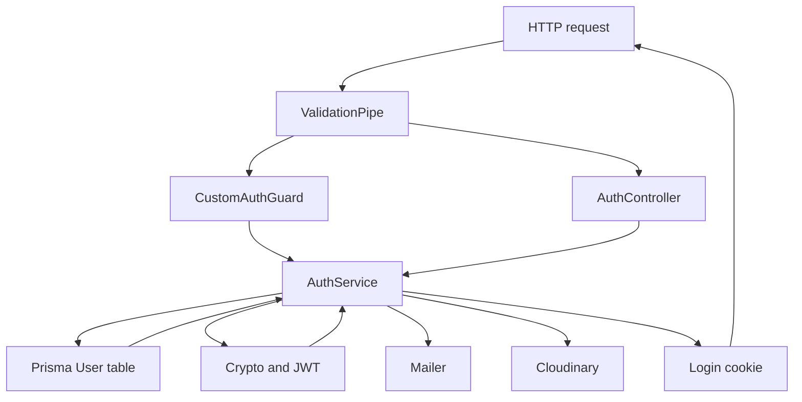
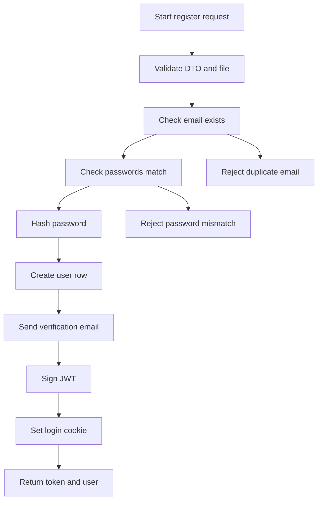

# Auth Module Data Flow

## Inputs

- `POST /auth/register` body as `RegisterDto` with `email`, `username`, `password`, `passwordConfirmation`, optional `image`, plus an optional multipart `profile` file field limited to 5 MB
- `POST /auth/login` body as `LoginDto` with `email` and `password`
- OAuth profiles from Google and GitHub consisting of `id`, `emails`, `displayName`, `photos`, `accessToken`, and `refreshToken`
- Authenticated requests carrying either an `Authorization` header with a bearer token or an `access_token` cookie
- `POST /auth/verify-email/:id` and `GET /auth/confirm-email/:id` path parameter `id` holding a user id
- `PUT /auth/change-password` body as `UpdatePasswordDto` with `currentPassword` and `newPassword`
- `GET /auth/oauth-token` identity taken from `request.user` set by `CustomAuthGuard`
- Environment values `JWT_SECRET`, `ENCRYPTION_KEY`, `FRONTEND_URL`, `MAIL_FROM` or `MAIL_USER`, and mail transport settings

## Transformations

- Global `ValidationPipe` with `whitelist`, `forbidNonWhitelisted`, and `transform` strips unknown fields and validates `RegisterDto`, `LoginDto`, and `UpdatePasswordDto` before controller code runs
- `checkFile` rejects a missing file, a non image mimetype, or a file larger than 5 MB
- `uploadImage` streams the file buffer to Cloudinary with `upload_stream` and resolves with `secure_url`
- `register` checks for an existing email, checks that both passwords match, hashes the password with `bcrypt.hash` cost 10, creates a `LOCAL` user, sends verification mail, and signs a JWT
- `login` loads the user by email, rejects non local providers and missing passwords, compares with `bcrypt.compare`, and signs a JWT
- `validateOAuthUser` requires an email from the provider, looks up by `provider` plus `providerId`, creates a new verified user on first login or updates stored tokens and image on return visits, and encrypts provider tokens with AES 256 CBC
- `generateJwtToken` signs `userId`, `email`, `role`, and `provider` with a 7 day expiry
- `verifyToken` verifies the JWT signature and expiry, then reloads a limited user projection from MongoDB
- `changePassword` compares the current password with `bcrypt.compare`, hashes the new password, and updates the stored hash
- `sendMail` loads the user, builds a verification link, renders `verificationEmail.html` through `EmailTemplateUtil.getVerificationEmail`, and sends it with `MailerService`
- `confirmMail` delegates to `UsersService.update` with `verified` set to true
- `getOAuthToken` loads only the encrypted `accessToken` field and decrypts it
- `sanitizeUser` removes `password`, `accessToken`, and `refreshToken` before returning a user object
- `encrypt` creates a random 16 byte IV and returns `ivhex` plus ciphertext, while `decrypt` splits that string and reverses the cipher

## Outputs

- JSON shaped like `AuthResponseDto` with `access_token` and a sanitized `user` for register and login
- `httpOnly` `access_token` cookie with `sameSite lax`, 24 hour `maxAge`, and `secure` in production, set on register, login, and both OAuth callbacks
- OAuth callback redirects to the frontend callback page with token and user id as query values
- `GET /auth/me` returns the verified user object attached by the guard
- `GET /auth/oauth-token` returns `access_token` with the decrypted provider token or null
- `POST /auth/logout` clears the cookie and returns a logged out message
- `POST /auth/verify-email/:id` returns a verification email sent message
- `GET /auth/confirm-email/:id` redirects to the frontend confirmed page
- `PUT /auth/change-password` returns a password changed message
- Error JSON with status 400 for bad input, 401 for bad credentials or bad tokens, 404 for unknown users, and 409 for duplicate emails

## State changes

- New `User` row created on local register with hashed password, `provider LOCAL`, and `verified false`
- New verified `User` row created on first OAuth login with `provider GOOGLE` or `GITHUB`, `providerId`, encrypted tokens, and optional image
- Existing OAuth user row updated with fresh encrypted tokens and latest profile image
- `verified` flipped to true by `confirmMail`
- `password` hash replaced by `changePassword`
- No session table is written because auth state lives in the signed JWT plus the browser cookie
- Mail provider state changes when verification mail is accepted for delivery
- Cloudinary state changes when a profile picture upload succeeds

