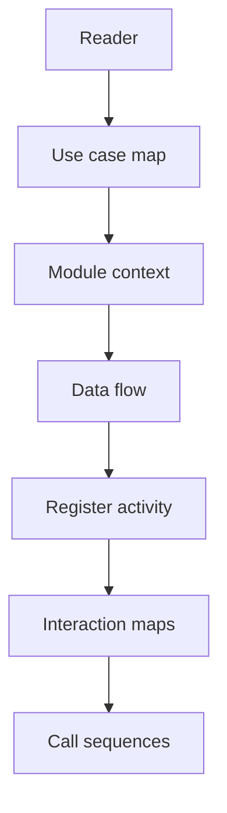

# Auth Module Diagrams

## Reading order

1. Use case map in `docs/modules/auth/README.md`
2. Module context flowchart in `docs/modules/auth/README.md`
3. Data flow flowchart in `docs/modules/auth/DATA_FLOW.md`
4. Register activity flowchart in `docs/modules/auth/DATA_FLOW.md`
5. Public interaction flowchart in `docs/modules/auth/FUNCTIONS.md`
6. OAuth token storage flowchart in `docs/modules/auth/FUNCTIONS.md`
7. Register sequence in `docs/modules/auth/CALL_CHAINS.md`
8. Login sequence in `docs/modules/auth/CALL_CHAINS.md`
9. Validate OAuth user sequence in `docs/modules/auth/CALL_CHAINS.md`
10. OAuth callback sequence in `docs/modules/auth/CALL_CHAINS.md`
11. Verify token sequence in `docs/modules/auth/CALL_CHAINS.md`
12. Change password sequence in `docs/modules/auth/CALL_CHAINS.md`

## Diagram purposes

1. Use case map shows every actor goal from visitor to verified user in one glance.
2. Module context flowchart shows how browser, controller, service, database, mailer, Cloudinary, and frontend connect.
3. Data flow flowchart traces requests through validation, guards, service, crypto, storage, mail, uploads, and cookies.
4. Register activity flowchart orders the trickiest validation plus creation plus mailing chain step by step.
5. Public interaction flowchart maps browser routes through guards and services to storage and mail.
6. OAuth token storage flowchart isolates encrypt on write and decrypt on read for provider tokens.
7. Register sequence details controller plus service plus Prisma plus mailer plus Cloudinary calls in time order.
8. Login sequence details credential lookup plus hash compare plus cookie issue in time order.
9. Validate OAuth user sequence details provider callback plus first login versus return visit branches.
10. OAuth callback sequence details JWT creation plus cookie plus frontend redirect handoff.
11. Verify token sequence details header versus cookie extraction plus JWT check plus user reload.
12. Change password sequence details current password proof plus hash rotation.

## Prerequisites

- Read `auth-service/src/auth/auth.controller.ts` and `auth-service/src/auth/auth.service.ts` first because every diagram traces those two files.
- Read `auth-service/src/auth/guards/auth.guard.ts` before the verify token and guarded route diagrams.
- Read `auth-service/src/users/users.service.ts` before the confirm mail edge because auth delegates verification there.
- Read `auth-service/prisma/schema.prisma` before storage diagrams so `User`, `AuthProvider`, and standby fields make sense.
- Read `auth-service/src/main.ts` and `auth-service/src/app.module.ts` before throttling, cookie, CORS, mail, and validation behavior.

