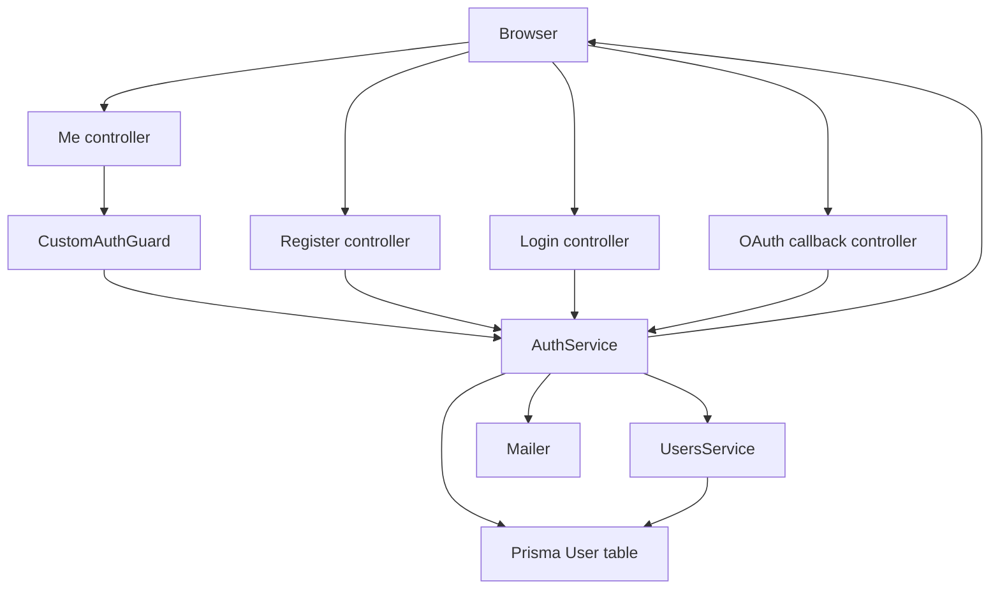
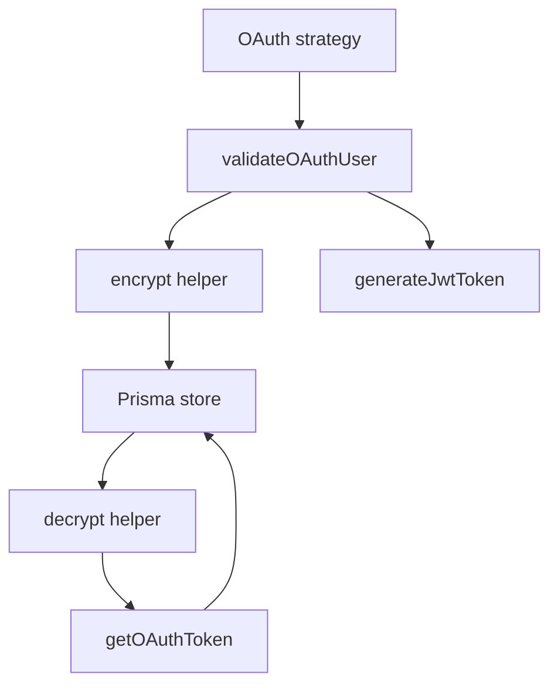

# Auth Module Functions

## Public API surface

Controller routes in `auth-service/src/auth/auth.controller.ts` under the `auth` prefix:

- `POST /auth/register` calls `register` with `RegisterDto`, optional `profile` file, throttled to 10 requests per minute
- `POST /auth/login` calls `login` with `LoginDto`, throttled to 10 requests per minute
- `GET /auth/google` starts Google OAuth through `AuthGuard google`
- `GET /auth/google/callback` finishes Google OAuth, signs a JWT, sets the cookie, and redirects to the frontend
- `GET /auth/github` starts GitHub OAuth through `AuthGuard github`
- `GET /auth/github/callback` finishes GitHub OAuth, signs a JWT, sets the cookie, and redirects to the frontend
- `GET /auth/me` guarded by `CustomAuthGuard`, returns the current user from `CurrentUser`
- `GET /auth/oauth-token` guarded by `CustomAuthGuard`, calls `getOAuthToken` with the current user id
- `POST /auth/logout` guarded by `CustomAuthGuard`, clears the `access_token` cookie
- `POST /auth/verify-email/:id` calls `sendMail` with the path id
- `GET /auth/confirm-email/:id` calls `confirmMail` with the path id and redirects to the frontend
- `PUT /auth/change-password` guarded by `CustomAuthGuard`, calls `changePassword` with `UpdatePasswordDto` fields

Service methods in `auth-service/src/auth/auth.service.ts`:

- `register(data: RegisterDto)` creates a local user and returns token plus sanitized user
- `login(data: LoginDto)` checks credentials and returns token plus sanitized user
- `validateOAuthUser(profile: any, provider: string)` finds or creates an OAuth user
- `getOAuthToken(userId: string)` returns the decrypted provider access token or null
- `generateJwtToken(user: any)` signs `userId`, `email`, `role`, and `provider`
- `verifyToken(token: string)` verifies a JWT and reloads the user projection
- `changePassword(userId: string, currentPassword: string, newPassword: string)` rotates the password hash
- `sendMail(id: string)` sends the verification email for a user id
- `confirmMail(id: string)` marks a user verified through `UsersService.update`
- `uploadImage(file: Express.Multer.File, folder: string)` uploads a buffer to Cloudinary
- `checkFile(file: Express.Multer.File)` validates image type and size

## Internal helpers

- `sanitizeUser(user: any)` in `AuthService` strips `password`, `accessToken`, and `refreshToken`
- `encrypt(text: string)` in `AuthService` encrypts OAuth tokens with AES 256 CBC and a random IV
- `decrypt(text: string)` in `AuthService` reverses `encrypt` for the stored `ivhex` format
- `CustomAuthGuard.canActivate` in `auth-service/src/auth/guards/auth.guard.ts` extracts bearer or cookie token, calls `verifyToken`, attaches `request.user`, and enforces `roles` metadata
- `RolesGuard.canActivate` in `auth-service/src/auth/guards/roles.guard.ts` allows the request when `request.user.role` matches the `roles` metadata
- `CurrentUser` in `auth-service/src/auth/decorators/current-user.decorator.ts` returns `request.user`
- `Roles` in `auth-service/src/auth/decorators/roles.decorator.ts` stores role names with `SetMetadata`
- `GoogleStrategy.validate` and `GithubStrategy.validate` in `auth-service/src/auth/strategies/` attach tokens to the profile and call `validateOAuthUser`
- `JwtStrategy.validate` in `auth-service/src/auth/strategies/jwt.strategy.ts` loads a user by JWT payload id
- `EmailTemplateUtil.loadTemplate`, `getVerificationEmail`, and `getUpdateConfirmationEmail` in `auth-service/src/common/utils/emailTemplate.utils.ts` render HTML email files
- `assertRequiredEnv` in `auth-service/src/main.ts` stops boot when `DATABASE_URL`, `JWT_SECRET`, `MAIL_HOST`, `MAIL_USER`, or `MAIL_PASS` is missing

## Relationships

- `AuthController` depends on `AuthService` and `ConfigService`
- `AuthService` depends on `JwtService`, `MailerService`, `UsersService`, and `ConfigService`
- `AuthModule` imports `PassportModule`, `UsersModule` through `forwardRef`, and async `JwtModule` with a 7 day expiry
- `AuthModule` provides and exports `AuthService` and `CustomAuthGuard` plus `JwtStrategy`, `GoogleStrategy`, and `GithubStrategy`
- `CustomAuthGuard` depends on `AuthService` and `Reflector`
- `confirmMail` calls `UsersService.update`, which creates the auth to users dependency that needs `forwardRef` on both sides
- `sendMail` and user update confirmation mail both use `EmailTemplateUtil` and `MailerService`
- Global `ThrottlerGuard` from `auth-service/src/app.module.ts` plus route level `Throttle` decorators shape the public rate limits

## Data flow between functions

- Register starts in `register` controller code, passes through `checkFile` and `uploadImage`, then `AuthService.register`, then `sendMail` and `generateJwtToken` before the cookie is set
- Login goes from controller to `AuthService.login` to `generateJwtToken` to cookie
- Google and GitHub callbacks go from passport strategy `validate` to `validateOAuthUser` to controller `generateJwtToken` to cookie and redirect
- Every guarded route goes from `CustomAuthGuard.canActivate` to `AuthService.verifyToken` to Prisma and back to `request.user`
- `confirmEmail` goes from controller to `AuthService.confirmMail` to `UsersService.update`
- `changePassword` goes from controller plus `CurrentUser` to `AuthService.changePassword` to Prisma
- `getOAuthToken` goes from controller plus `CurrentUser` to `AuthService.getOAuthToken` to `decrypt`
- OAuth token storage goes from strategy profile to `encrypt` to Prisma, and reading goes from Prisma to `decrypt` to response

