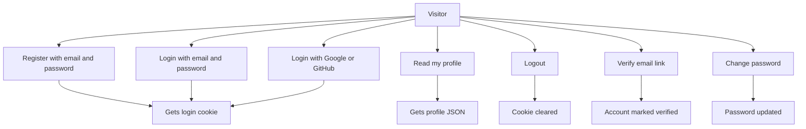
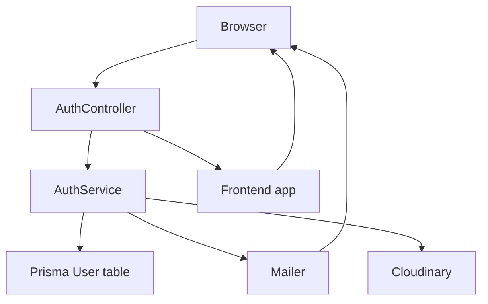

# Auth Module

## What this module is for

This module handles who you are and proves it on every request. It lets you sign up, log in, log out, confirm your email, change your password, and sign in with Google or GitHub. If you are logged in, it is because this module said so.

Think of it like the front desk of a hotel. You show your ID once, you get a room key, and then every door checks that key.

## Where it lives in the code

All auth code lives under `auth-service/src/auth/`:

- `auth-service/src/auth/auth.controller.ts` defines the HTTP routes under `auth`
- `auth-service/src/auth/auth.service.ts` holds the real logic
- `auth-service/src/auth/auth.module.ts` wires the controller, service, guards, and strategies
- `auth-service/src/auth/guards/auth.guard.ts` defines `CustomAuthGuard`
- `auth-service/src/auth/guards/roles.guard.ts` defines `RolesGuard`
- `auth-service/src/auth/decorators/current-user.decorator.ts` defines `CurrentUser`
- `auth-service/src/auth/decorators/roles.decorator.ts` defines `Roles`
- `auth-service/src/auth/dto/register.dto.ts` defines `RegisterDto`
- `auth-service/src/auth/dto/login.dto.ts` defines `LoginDto`
- `auth-service/src/auth/dto/auth-response.dto.ts` defines `AuthResponseDto`
- `auth-service/src/auth/strategies/google.strategy.ts` defines `GoogleStrategy`
- `auth-service/src/auth/strategies/github.strategy.ts` defines `GithubStrategy`
- `auth-service/src/auth/strategies/jwt.strategy.ts` defines `JwtStrategy`
- `auth-service/src/email-templates/verificationEmail.html` is the signup email body
- `auth-service/src/email-templates/updateConfirmation.html` is used by the users module
- `auth-service/src/email-templates/passwordReset.html` exists on disk
- `auth-service/src/common/utils/emailTemplate.utils.ts` loads those HTML files with `EmailTemplateUtil`
- `auth-service/lib/prisma.ts` exports the shared Prisma client
- `auth-service/prisma/schema.prisma` defines the `User` model and the `AuthProvider` enum
- `auth-service/src/app.module.ts` imports `AuthModule` and sets up throttling and mail
- `auth-service/src/main.ts` adds `helmet`, `cookieParser`, `ValidationPipe`, and CORS

## Main characters

- `AuthController` receives HTTP requests, sets and clears the `access_token` cookie, and redirects OAuth logins back to the frontend
- `AuthService` checks passwords, creates users, signs and verifies JWTs, encrypts OAuth tokens, sends mail, and uploads profile pictures
- `CustomAuthGuard` reads the token from the `Authorization` header or the `access_token` cookie and calls `verifyToken`
- `RolesGuard` reads the `roles` metadata and allows only matching `user.role` values
- `CurrentUser` pulls `request.user` into the controller method argument
- `Roles` stores required roles with `SetMetadata`
- `GoogleStrategy` and `GithubStrategy` handle the OAuth dance and call `validateOAuthUser`
- `JwtStrategy` loads a user from a JWT payload for passport based routes
- `RegisterDto` and `LoginDto` validate request bodies through the global `ValidationPipe`
- `EmailTemplateUtil` fills `{{username}}` and link placeholders in the HTML email files
- Prisma `User` model stores `email`, `username`, `password`, `provider`, `providerId`, encrypted `accessToken` and `refreshToken`, `verified`, `role`, arrays of service and widget ids, plus standby fields

## How it connects to other modules

- It imports `UsersService` from `auth-service/src/users/users.service.ts` and calls `update` inside `confirmMail`
- It is imported by `UsersModule` with `forwardRef`, so `UsersController` can use `CustomAuthGuard`, `Roles`, `RolesGuard`, and `CurrentUser`
- It reads and writes the `User` table through `auth-service/lib/prisma.ts`
- It sends mail through `MailerModule` configured in `auth-service/src/app.module.ts`
- It uploads profile pictures through `cloudinary` inside `uploadImage`
- It relies on global wiring in `auth-service/src/main.ts` for `helmet`, `cookieParser`, `ValidationPipe`, and CORS, and on `ThrottlerModule` plus per route `Throttle` limits
- It redirects OAuth and email confirmation flows to `FRONTEND_URL` or `http://localhost:5173`

## Typical happy-path flow

You post your email, username, and password twice to `POST /auth/register`. The controller checks an optional profile picture, the service makes sure the email is free and the passwords match, hashes the password with `bcrypt`, creates a `LOCAL` user in MongoDB, sends a verification email, signs a JWT that lasts 7 days, and stores it in an `httpOnly` cookie. You are now logged in and can call `GET /auth/me` to get your profile.

