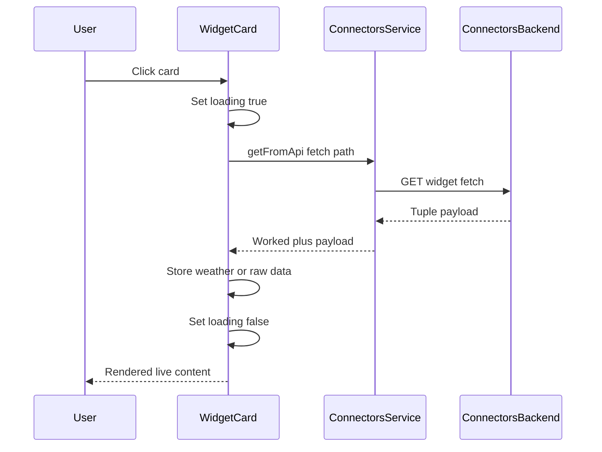
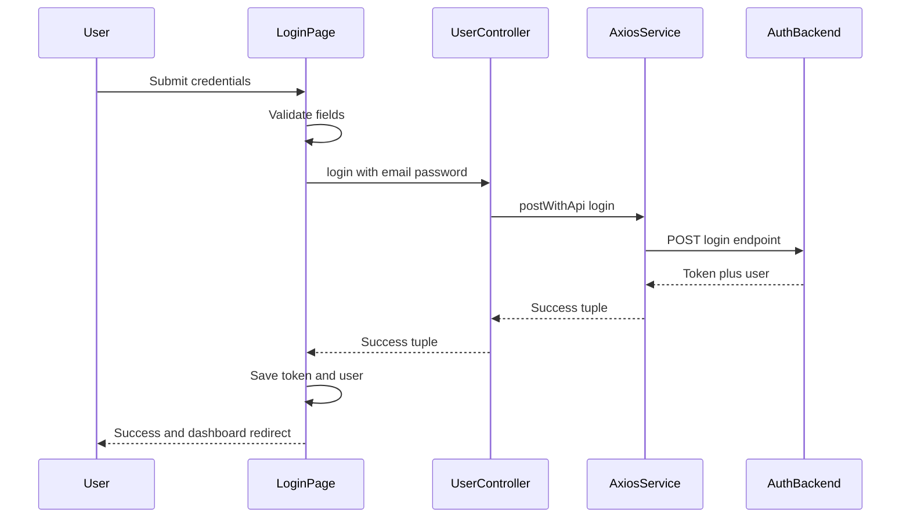
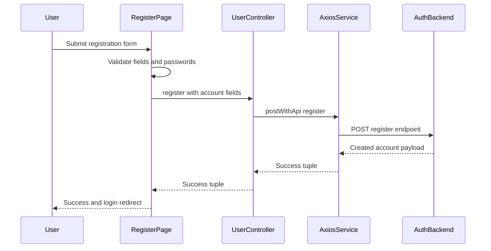
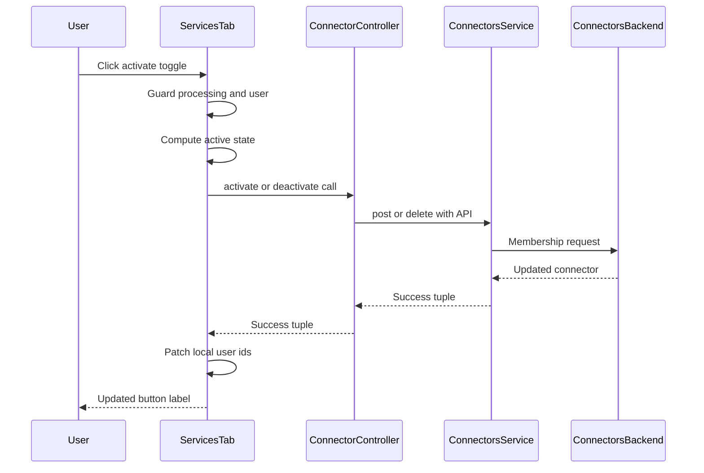
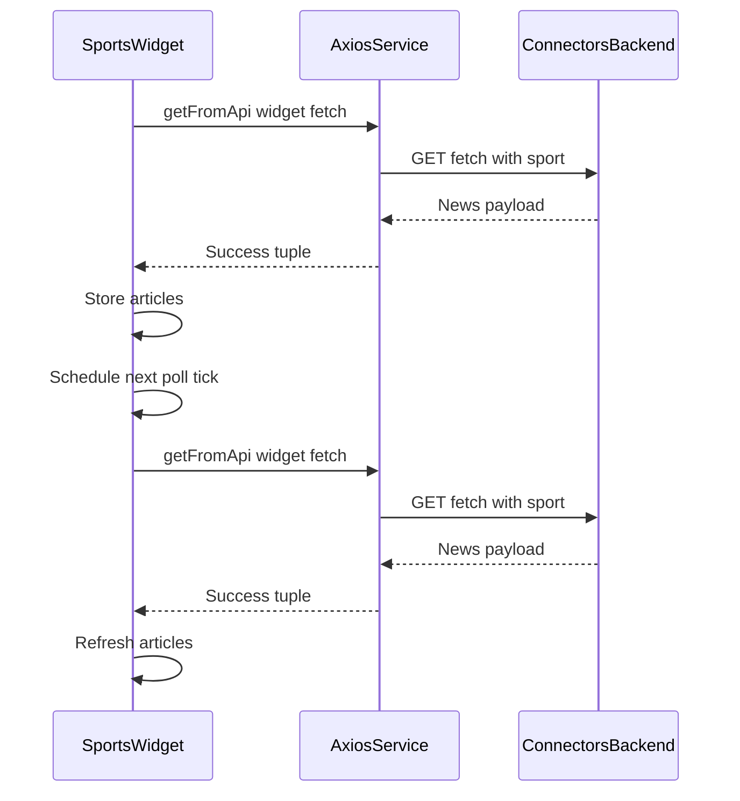

# Client Call Chains

## WidgetCard Click To Render Chain

Narrative step sequence:

1. The user clicks a `WidgetCard` inside a service `Window`.
2. `fetchWidgetData` sets `isLoading` to true and calls `getFromApi` with the widget fetch path.
3. The service returns a `[worked, payload]` tuple.
4. When `worked` is true and `payload.data` exists, the card stores it as `weather` for `WeatherCard`.
5. Otherwise it stores the raw payload as `data` for the generic JSON view.
6. Loading is cleared in the `finally` block and the card re-renders.

Why the chain exists: widgets stay cheap until needed, so no outside call happens until a click proves the user wants that widget's live content.

Edge cases and error paths:

- Network or server failure stores a `Cannot load widget` error object.
- A falsy tuple stores the error payload in the generic view.
- Widgets named `Sports News` never enter this chain and render `SportsNewsWidget` instead.

## Login Submit Chain

Narrative step sequence:

1. The user submits email and password in `Login.jsx`.
2. `handleSubmit` clears errors, sets loading, and rejects empty fields immediately.
3. `login` from `userController` posts the credentials through `postWithApi`.
4. On `[true, result]` the page saves `access_token` and `user`, refreshes axios, shows success, and navigates to `/` after two seconds.
5. On `[false, result]` the page shows the backend message or a fallback login error.

Why the chain exists: login must validate locally, authenticate remotely, persist credentials for every later request, and only then move the user.

Edge cases and error paths:

- Missing email or password stops before any network call.
- A failed tuple shows the backend message without navigation.
- An existing token on page mount redirects to `/` immediately.
- Google and GitHub buttons redirect the browser to OAuth instead of using this chain.

## Register Submit Chain

Narrative step sequence:

1. The user submits username, email, password, and confirmation in `Register.jsx`.
2. `handleSubmit` checks required fields, the 8 character minimum, and password equality.
3. `register` posts username, email, password, and password confirmation with expected status 201.
4. On success the page shows a confirmation email message and navigates to `/login` after two seconds.
5. On failure the page shows the backend message or a fallback registration error.

Why the chain exists: registration must catch simple mistakes locally so the backend only sees well-formed account requests.

Edge cases and error paths:

- Empty fields, short passwords, or mismatched passwords stop before any network call.
- A failed tuple keeps the user on the form with an error banner.
- An existing token on page mount redirects to `/` immediately.

## ServicesTab Activate Toggle Chain

Narrative step sequence:

1. The user clicks Activate or Deactivate in `ServicesTab`.
2. `handleToggleConnector` ignores the click when the id is processing or no user id exists.
3. It marks the id in `processingIds` and computes the current state with `isConnectorActive`.
4. It calls `deactivateConnector` when active or `activateConnector` when inactive.
5. On `[true, result]` it patches `userIds` locally, and on failure it reloads the full list.
6. It removes the id from `processingIds` and re-enables the button.

Why the chain exists: toggles must stay responsive, prevent double clicks, and keep local membership consistent with the server.

Edge cases and error paths:

- Double clicks are ignored through the processing set.
- Missing user id silently ignores the toggle.
- A failed toggle discards local edits by reloading from the server.

## SportsNewsWidget Polling Loop

Narrative step sequence:

1. `SportsNewsWidget` mounts with the selected sport defaulting to soccer.
2. `fetchNews` sets loading, clears errors, and calls `getFromApi` with the widget id and sport query.
3. On success with `data.success` it stores `data.data.articles`, otherwise it stores a load error and clears articles.
4. The effect starts an interval using `widget.refreshRate` seconds, falling back to 300 seconds.
5. Changing the sport reruns the effect, fetches immediately, and restarts the timer.
6. Unmount clears the interval to stop background requests.

Why the chain exists: sports headlines go stale fast, so the widget refreshes itself while staying on the currently selected sport.

Edge cases and error paths:

- A failed tuple or exception shows `Cannot load news` with an empty list.
- A missing `refreshRate` uses the 300 second fallback.
- Rapid sport changes reset the timer because the effect depends on the selected sport.

