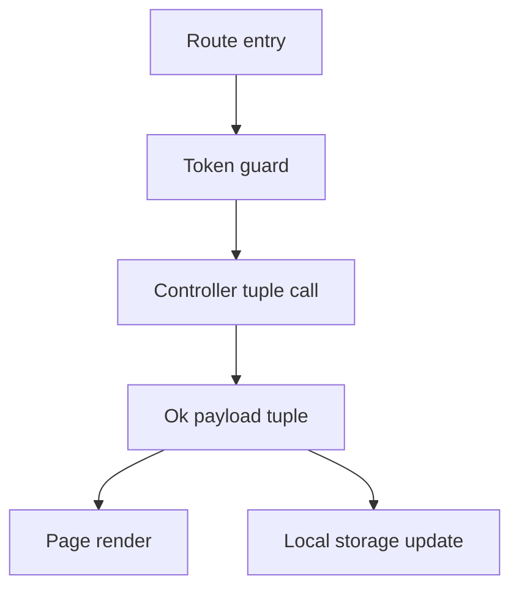
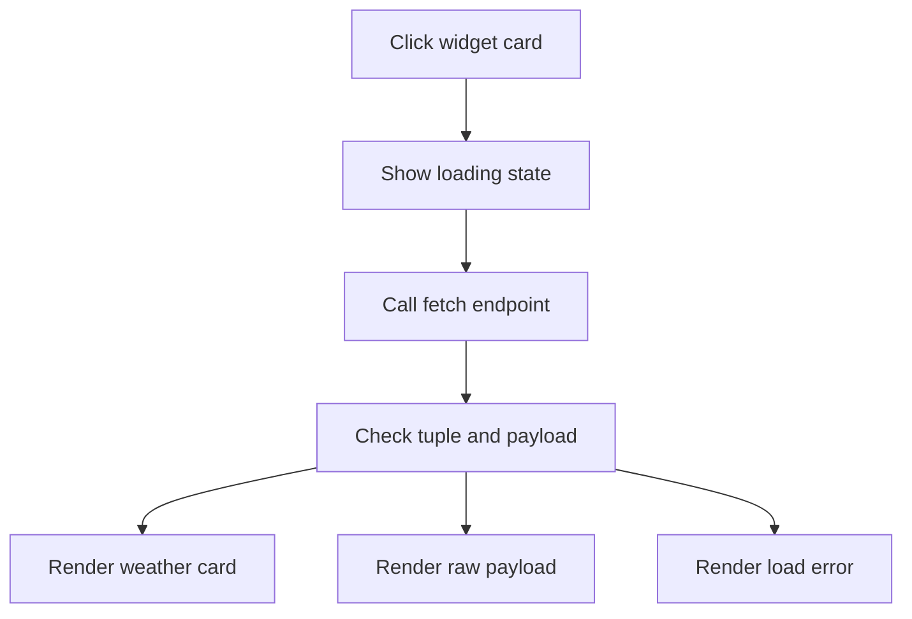

# Client Data Flow

## Inputs

- Route paths from `App.jsx`: `/`, `/login`, `/register`, `/auth/callback`, `/profile`, `/edit-profile`, `/change-password`, `/confirm-update/:userId`, `/github`, and `/githstar`.
- Form fields for email, password, username, password confirmation, sport choice, GitHub username, and profile edits.
- Query params on `/auth/callback`, namely `token` and `id`.
- Stored auth values under the `access_token` and `user` localStorage keys.
- Backend payloads for connectors, widgets, user profiles, dashboard summaries, and third-party widget data.
- Public GitHub responses for repository and starred lists.
- Widget metadata including `_id`, `name`, `description`, `icon`, and `refreshRate`.

## Transformations

- `Login.jsx` validates that email and password are present before calling `login`.
- `Register.jsx` checks required fields, an 8 character minimum password, and matching password confirmation before calling `register`.
- `AuthCallback.jsx` reads `token` and `id` from search params and writes them to localStorage.
- `Profile.jsx` merges dashboard connectors and widgets into the stored user object and rewrites it.
- `EditProfile.jsx` diffs the form against the loaded profile and only sends changed `standByUsername` or `standByEmail` fields.
- `ServicesTab` and `WidgetsTab` flip membership locally after a successful toggle and reload from the server after a failure.
- `WidgetCard` unpacks the `[worked, payload]` tuple and routes `payload.data` into the weather view or keeps the raw payload otherwise.
- `SportsNewsWidget` converts `refreshRate` seconds into milliseconds and falls back to 300 seconds when the field is missing.

```js
const [worked, payload] = await getFromApi(`${CONNECTORS_BASE_URL}/widgets/${widget._id}/fetch`);
if (worked === true && payload.data) {
  setWeather(payload.data);
} else {
  setData(payload);
}
```

## Outputs

- Authenticated redirects to `/` after login or OAuth callback, and to `/login` when no token exists.
- Rendered connector dock, floating service windows, clickable widget cards, weather cards, sports lists, and GitHub lists.
- Success and error banners on auth, profile, password, confirmation, and widget screens.
- Updated localStorage entries for `access_token` and `user` after login, callback, dashboard load, and logout clearing.
- Outbound API calls for activation, deactivation, profile updates, password changes, and live widget fetches.

## State changes

- `access_token` and `user` are written on login and OAuth callback and cleared on logout.
- Dashboard state changes include `connectors`, `openApps`, `showGithubModal`, per-window `widgets`, and per-card `data`, `weather`, and `isLoading`.
- Profile tab state changes include `allConnectors`, `allWidgets`, `loading`, `processingIds`, and the active tab id.
- Sports state changes include `articles`, `loading`, `selectedSport`, and `error`, refreshed on every poll tick.
- GitHub tab state changes include `repos` or `stars`, `loading`, `username`, and the input value.

## Diagrams

Data-flow flowchart:



Activity flow for the trickiest path, widget click to render:


