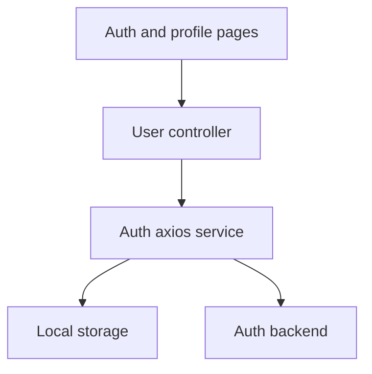
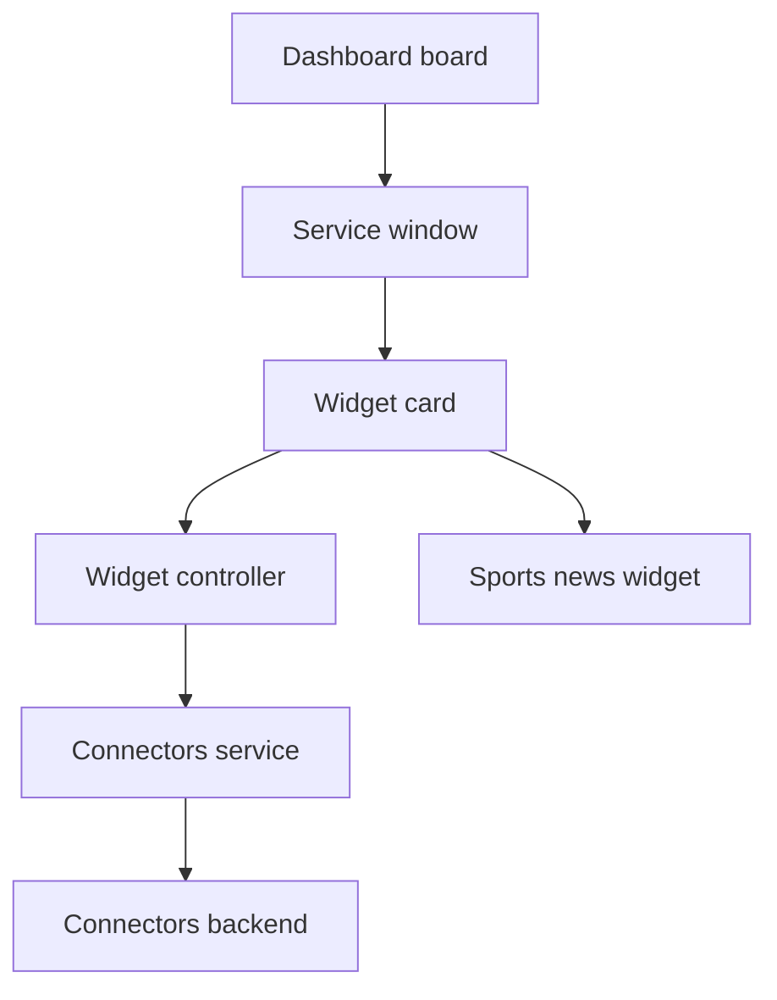

# Client Functions

## Public API surface

Routes from `App.jsx` with their real page components:

```text
Route / maps to Dashboard
Route /login maps to Login
Route /register maps to Register
Route /auth/callback maps to AuthCallback
Route /profile maps to Profile
Route /edit-profile maps to EditProfile
Route /change-password maps to ChangePassword
Route /confirm-update/:userId maps to ConfirmUpdate
Route /github maps to GithubReposWidget
Route /githstar maps to GithubStarsWidget
```

Controller functions with real names and tuple returns:

```js
register(userData, method)
login(userData, method)
logout()
updateUserProfile(userId, data)
confirmUserUpdate(userId)
getUserProfile(userId)
changeUserPassword(userId, data)
getCurrentUser()
getUserDashboard()
getAllWidgets()
activateWidget(widgetId, userId)
deactivateWidget(widgetId, userId)
getAllConnectors()
activateConnector(connectorId, userId)
deactivateConnector(connectorId, userId)
getUserRepos(username)
getUserStars(username)
```

Service functions with real names:

```js
getFromApi(endpoint)
postWithApi(endpoint, data, successStatus)
updateWithApi(endpoint, id, data, autoJoin)
deleteWithApi(endpoint, id, successCode)
deleteAllWithApi(endpoint)
refreshAxios()
getConnectors()
getWidgets()
getWidgetsByService(serviceId)
saveInLocalStorage(key, value)
fetchFromLocalStorage(key)
```

Component props observed in the real source:

```text
WidgetCard receives widget
SportsNewsWidget receives widget
GithubReposWidget receives refreshRate default 60
GithubStarsWidget receives refreshRate default 90
ProfileTabs receives user
Window receives app onClose zIndex
WeatherCard receives weather
Alert receives type message
```

## Internal helpers

- `getAppId` accepts either `_id` or `id` so Mongo documents and local objects work everywhere.
- `openApp` and `closeApp` add or remove floating windows without duplicates.
- `fetchWidgetData` inside `WidgetCard` toggles loading, unpacks the tuple, and separates weather payloads from raw payloads.
- `fetchNews` wrapped in `useCallback` keeps the polling timer stable across renders.
- `formatDate` renders recent sports dates as relative hours and older dates as short calendar dates.
- `handleToggleConnector` and `handleToggleWidget` guard with `processingIds`, call the matching controller, then patch local membership or reload.
- `isConnectorActive` and `isWidgetActive` check whether the stored user id appears in `userIds`.
- `loadRepos`, `loadStars`, `loadAllWidgets`, and `loadAllConnectors` centralize list fetching and loading flags.

## Relationships

- Pages call controllers, controllers call services, and services call axios or fetch.
- `axiosService` targets the auth backend while `connectorsService` and `apiService` target the connectors backend.
- `githubController` bypasses both backends and calls the public GitHub API directly.
- `localStorageService` feeds the request interceptors, guards, tabs, and profile pages with `access_token` and `user`.
- `ProfileTabs` hosts `ServicesTab` and `WidgetsTab`, while `Dashboard` hosts `Window`, `WidgetCard`, `WeatherCard`, `SportsNewsWidget`, and the GitHub widgets.

## Data flow between functions

1. A page event calls a controller such as `login`, `activateWidget`, or `getUserRepos`.
2. The controller builds an endpoint string and calls a tuple-returning service helper.
3. The service returns `[true, data]` on the expected status or `[false, errorPayload]` otherwise.
4. The caller updates React state, localStorage, navigation, or an error banner based on the first tuple item.

## Diagrams

Auth and navigation interaction flowchart:



Board and widget interaction flowchart:


