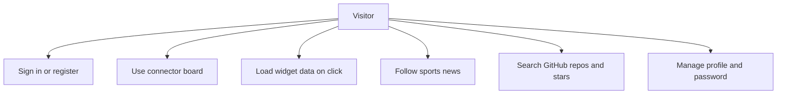
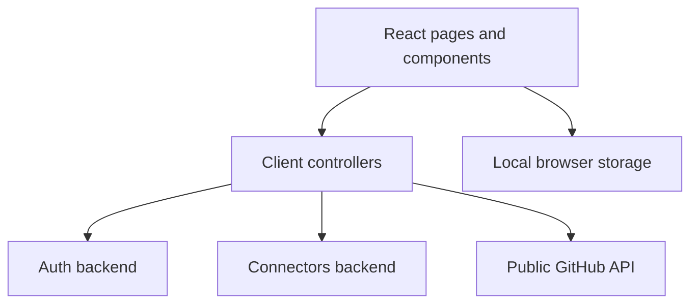

# Client Module

## What this module is for

This module is the React dashboard you'll actually click around in. It handles sign-in, profile pages, service and widget toggles, and the desktop-like board where each widget loads its own live data. It's like a remote control for the whole system: the buttons live here, while the heavy work happens on the backends.

## Where it lives in the code

All source files are under `dashboard-client/src/`:

- `text` — `App.jsx` declares the ten routes for dashboard, auth, profile, GitHub, and confirmation pages
- `text` — `main.jsx` boots React with `BrowserRouter` and strict mode
- `text` — `pages/dashboard.jsx` implements the connector board plus `Window`, `WidgetCard`, and `WeatherCard`
- `text` — `pages/auth/Login.jsx`, `pages/auth/Register.jsx`, and `pages/auth/AuthCallback.jsx` handle sign-in flows
- `text` — `pages/user/Profile.jsx`, `EditProfile.jsx`, `ChangePassword.jsx`, and `ConfirmUpdate.jsx` handle account pages
- `text` — `components/user/Nav.jsx`, `ServicesTab.jsx`, `WidgetsTab.jsx`, `ProfileTabs.jsx`, `ProfileCard.jsx`, and `ToggleSwitch.jsx` build the profile UI
- `text` — `components/news/FootNewsWidget.jsx` implements the polling sports news widget
- `text` — `components/githubWidgets/Repo.jsx` and `Favori.jsx` implement the repository and starred widgets
- `text` — `controllers/userController.js`, `widgetController.js`, `connectorController.js`, and `githubController.js` wrap API access
- `text` — `services/axiosService.js`, `connectorsService.js`, `apiService.js`, and `localStorageService.js` manage HTTP and browser storage

## Main characters

- `jsx` — `App` maps each URL to its page component, including the `/confirm-update/:userId` and `/auth/callback` routes
- `jsx` — `Dashboard` loads connectors, opens floating windows, and shows the GitHub modal
- `jsx` — `WidgetCard` fetches live widget data only when you click the card
- `jsx` — `SportsNewsWidget` polls its fetch endpoint on `refreshRate` with a 300 second fallback
- `jsx` — `Nav` guards pages with the stored token and offers a mobile hamburger menu
- `js` — Controllers return `[ok, payload]` tuples so pages can branch on the first item
- `js` — `localStorageService` persists auth state under the `access_token` and `user` keys

## How it connects to other modules

- It calls the auth backend through `axiosService` for login, registration, profile, password, dashboard, and OAuth callback work.
- It calls the connectors backend through `connectorsService` and `apiService` for connectors and widget activation, listing, and fetching.
- It calls the public GitHub API directly from `githubController` for repository and starred lists.
- Auth state flows back into every request because both axios instances attach the stored bearer token.

## Typical happy-path flow

1. You sign in on `/login` and the app stores `access_token` and `user` in localStorage.
2. You land on `/` and the dashboard loads the connector list into the bottom dock.
3. You click a connector icon and a floating window loads that service's widgets.
4. You click a `WidgetCard` and it fetches live data, or you change the sport in `SportsNewsWidget` and it polls fresh headlines.
5. You visit `/profile` and use the services and widgets tabs to activate exactly what you want to see.

## Diagrams

Use-case overview, drawn as a flowchart:

Module context flowchart:

