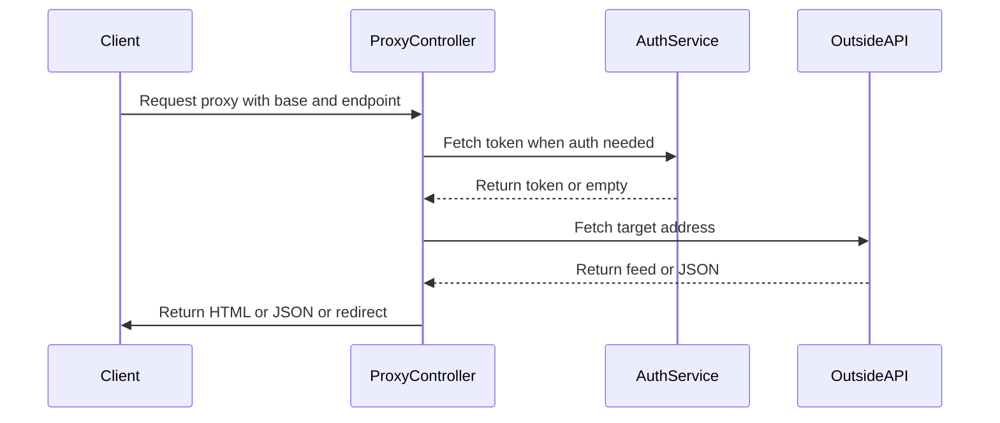
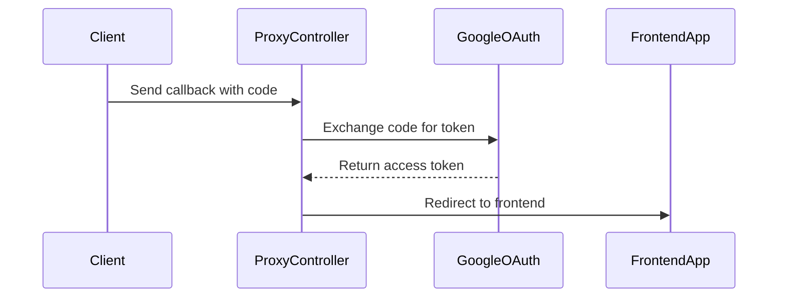
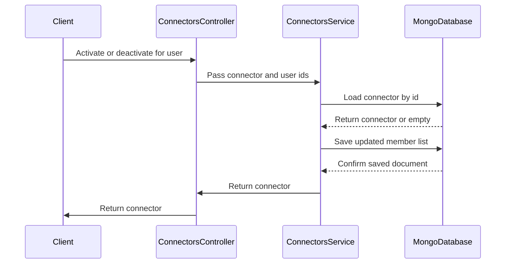

# Connectors Call Chains

## proxy branch chain

Narrative step sequence:

```text
1. Client calls GET proxy with baseUrl and endpoint query params.
2. Controller rejects the call with 400 when baseUrl is missing or not http.
3. Controller joins baseUrl and endpoint into one full address.
4. Controller marks the call as needing auth when it targets Gmail, Drive, or Calendar hosts.
5. When auth is needed it asks the auth service for an access token.
6. When auth is needed but no token exists it redirects to auth google login.
7. News addresses are parsed with rss-parser and returned as HTML with five items.
8. Gmail addresses are listed then expanded with detail calls and returned as HTML.
9. All other addresses are fetched once and returned as JSON.
10. A downstream 401 redirects to auth google login, other errors return 500.
```

Why the chain exists: widgets need live outside content but browsers should not hold every API key or token. One endpoint can validate the address, add auth only when needed, and normalize news and mail into small HTML cards while leaving other APIs as raw JSON.

Edge cases and error paths:

```text
Non http baseUrl returns 400 and blocks file and bare host tricks.
Empty endpoint still works because it defaults to empty string.
Token fetch failure is swallowed so public content still works.
Gmail without token never reaches Google and redirects to login.
Gmail detail loop only expands the first five messages.
Token expiry during fetch maps 401 to login redirect.
Any other fetch failure returns 500 with error message detail.
```



## googleCallback code exchange

Narrative step sequence:

```text
1. Client finishes Google consent and calls GET proxy callback with code.
2. Controller reads Google client id, secret, and callback address from config.
3. Controller posts code plus secrets to the Google token endpoint.
4. Google returns an access token for the response.
5. Controller reads the frontend address from config.
6. Controller redirects the browser to the frontend address.
```

Why the chain exists: OAuth requires a server side secret exchange. The browser only carries the short lived code. This endpoint trades that code for a token without exposing the client secret to the frontend.

Edge cases and error paths:

```text
Missing client id or secret makes the Google exchange fail.
Wrong callback address makes Google reject the code.
Reused or expired code makes Google reject the exchange.
Any failure returns plain text Authentication failed.
The new access token is read but not persisted in this code.
```



## activateForUser and deactivateForUser idempotency

Narrative step sequence:

```text
1. Gateway forwards POST activate or DELETE deactivate with connector id and user id.
2. Service loads the connector by id with findById.
3. Missing connector throws NotFoundException.
4. Activate pushes the user id only when it is not already present, then saves.
5. Deactivate filters the user id out of the list, then saves.
6. Service returns the saved connector document.
```

Why the chain exists: connection to a user is membership in a `userIds` array, not a separate join row. These two methods are the only safe way to add or remove one member without replacing the whole list. The guard makes repeat calls harmless.

Edge cases and error paths:

```text
Unknown connector id throws NotFoundException on both paths.
Repeat activate keeps exactly one copy of the user id.
Deactivate of a missing user id still saves and returns success.
Concurrent activates can race because read then save is not atomic.
No ownership check exists so any caller with the id can change membership.
```


