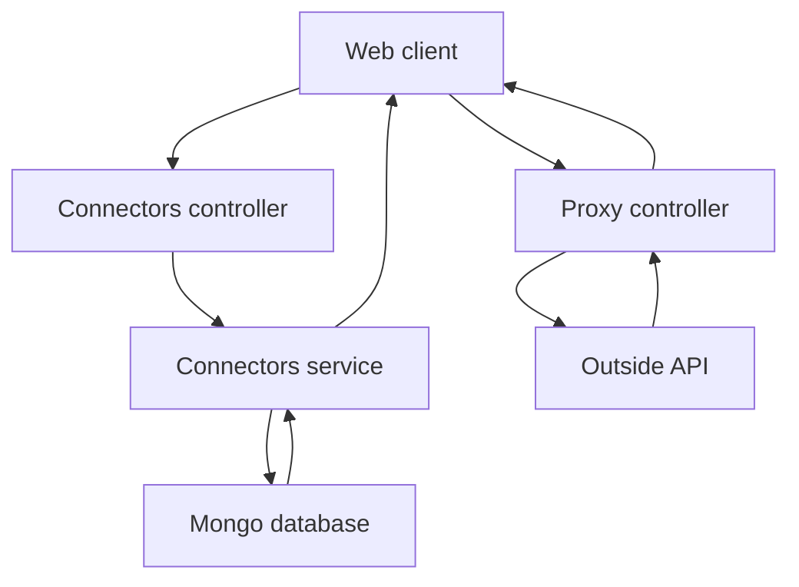
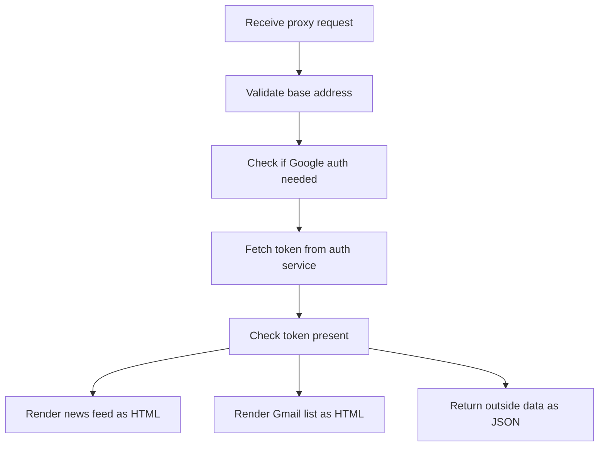

# Connectors Data Flow

## Inputs

Data routes accept JSON bodies validated by DTOs:

```ts
// dto/create-connector.dto.ts
title: string;         // required non empty string
description?: string;  // optional string
icon: string;          // required URL
baseUrl: string;       // required URL
userIds?: string[];    // optional array
```

```ts
// dto/update-connector.dto.ts
export class UpdateConnectorDto extends PartialType(CreateConnectorDto) {}
```

Real route inputs:

```http
POST /connectors
GET /connectors
PUT /connectors/:id
DELETE /connectors/:id
GET /connectors/user/:userId
POST /connectors/:id/activate/:userId
DELETE /connectors/:id/deactivate/:userId
GET /proxy?baseUrl=&endpoint=
GET /proxy/callback?code=
```

The proxy also reads these settings with local defaults:

```text
AUTH_SERVICE_URL default auth on local port 3001
FRONTEND_URL default client on local port 5173
GOOGLE_CLIENT_ID and GOOGLE_CLIENT_SECRET with no defaults
GOOGLE_CALLBACK_URL default proxy callback on local port 3000
```

## Transformations

`ConnectorsService` turns DTOs into Mongoose documents. `create` builds a model instance and saves it. `update` calls `findByIdAndUpdate` with `new true`. `findByUser` queries with `userIds` containing the given id. `activateForUser` pushes the id only when missing. `deactivateForUser` filters the id out and saves.

The proxy builds the target address by trimming slashes:

```ts
const fullUrl = `${baseUrl.replace(/\/$/, '')}/${(endpoint || '').replace(/^\//, '')}`;
```

It then decides if auth is needed by checking whether the address contains the Gmail, Drive, or Calendar Google host names. If auth is needed it asks the auth service for a token at `GET auth oauth-token`. News addresses go through `rss-parser`, Gmail addresses go through one list call plus up to five detail calls, and all other addresses go through one plain GET.

## Outputs

Data routes return Mongoose documents or wrapped results:

```ts
// create
return { success: true, message: 'Connector created successfully', data: response };
// update
return { success: true, message: 'Connector updated successfully', data: updated };
// remove
return { message: 'Connector deleted successfully' };
// findAll, findOne, findByUser, activate, deactivate return documents
```

Proxy outputs depend on the branch:

```text
Invalid baseUrl returns 400 Invalid baseUrl query parameter
Missing Google token redirects to auth google login
News branch returns text html with up to five articles
Gmail branch returns text html with up to five emails
Other APIs return response dot data as JSON
Expired token with 401 redirects to auth google login
Other failures return 500 Failed to fetch from external API
Google callback success redirects to frontend URL
Google callback failure sends Authentication failed text
```

## State changes

MongoDB is the only lasting state. The `Connector` schema uses timestamps and stores `title`, `description`, `icon`, `baseUrl`, and `userIds`. Creation adds a row. Update edits fields. Remove deletes the row. Activation adds one id to `userIds` and is idempotent. Deactivation removes one id and always saves, even when nothing changed. `findAll`, `findByUser`, and proxy reads change nothing.

`main.ts` adds process level state: it throws at boot when `DATABASE_URL` is missing, then enables helmet headers, CORS, strict validation, and throttling at 100 requests per minute. The proxy parser instance is created once per controller. The Google callback in this code reads the new access token but does not save it; it only redirects to the frontend.

Deployment constraint: because there are no auth guards, anyone who can reach this service can pass any `userId` and read or change any connector. Keep it behind the gateway.

## Data flow diagram



## Activity diagram for proxy branching


