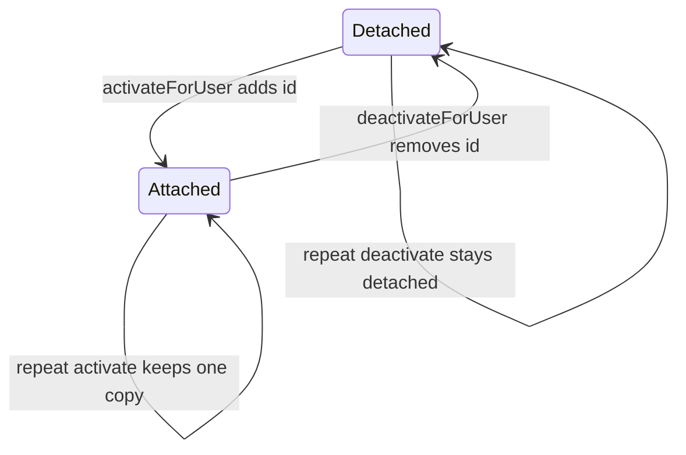

# Connectors Diagrams

## Reading order

```text
1. Use case diagram first for who creates, activates, and previews connectors.
2. Module context flowchart next for controllers, service, database, and auth links.
3. Data flow flowchart next for DTO to Mongo and proxy to outside API paths.
4. Activity diagram next for the proxy branch choice between news, Gmail, and JSON.
5. Interaction flowcharts next for data routes and proxy routes separately.
6. Sequence diagrams last for proxy chain, Google callback, and activation chains.
7. State diagram last for connector membership from detached to attached.
```

## Diagram purposes

```text
1. Use case diagram in README shows user goals such as create, list, activate, deactivate, preview, and Google login.
2. Module context in README shows gateway, both controllers, service, Mongo, and auth service links.
3. Data flow flowchart in DATA_FLOW shows validated input to service to database and proxy to outside API return.
4. Activity diagram in DATA_FLOW shows the trickiest choice of token check then news, Gmail, or generic JSON branch.
5. Data routes interaction flowchart in FUNCTIONS shows client to controller to service to Mongo round trip.
6. Proxy routes interaction flowchart in FUNCTIONS shows client to proxy to auth and outside API with frontend redirect.
7. Proxy sequence diagram in CALL_CHAINS shows time order of token fetch then outside fetch then HTML or JSON.
8. Google callback sequence diagram in CALL_CHAINS shows time order of code exchange then frontend redirect.
9. Activation sequence diagram in CALL_CHAINS shows time order of load, mutate member list, save, and return.
10. Membership state diagram below shows detached and attached states for one user id.
```



## Prerequisites

Read the connectors schema and DTOs first to see field rules and unique constraints. Then read the connectors controller and service for data routes, then the proxy controller for outside fetching and Google handling. Then read `main.ts` and `app.module.ts` for database boot, validation, CORS, helmet, and throttling. Finally read the gateway module to see how user ids are forwarded. Deployment note: this service has no auth guards and trusts user id params, so only expose it through the gateway.
