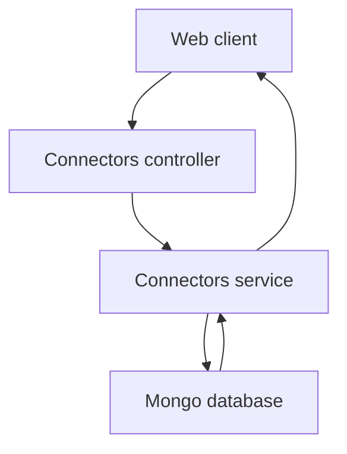
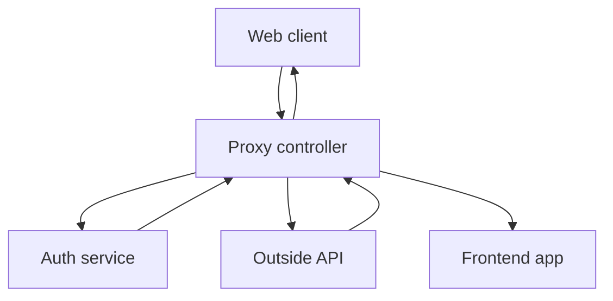

# Connectors Functions

## Public API surface

Real endpoints only. No auth guards are registered on these controllers.

Connectors data routes in `connectors.controller.ts`:

```http
POST /connectors
GET /connectors
PUT /connectors/:id
DELETE /connectors/:id
GET /connectors/user/:userId
POST /connectors/:id/activate/:userId
DELETE /connectors/:id/deactivate/:userId
```

Proxy routes in `proxy.controller.ts`:

```http
GET /proxy?baseUrl=&endpoint=
GET /proxy/callback?code=
```

Service methods in `connectors.service.ts`:

```ts
create(createConnectorDto: CreateConnectorDto)
findAll()
findOne(id: string)
update(id: string, updateConnectorDto: UpdateConnectorDto)
remove(id: string)
findByUser(userId: string)
activateForUser(connectorId: string, userId: string)
deactivateForUser(connectorId: string, userId: string)
```

Note: `findOne` exists in the service but has no route in the controller. `GET connectors id` from the gateway therefore has no matching data route in this service.

## Internal helpers

There are no private helper methods in `ConnectorsService` or `ProxyController`. The closest things to helpers are inline steps:

```ts
// inline duplicate check in create
if (error.code === 11000) {
  throw new ConflictException('Connector already exists.');
}
```

```ts
// inline address check in proxy
if (!baseUrl || !/^https?:\/\/.+/i.test(baseUrl)) {
  return res.status(400).json({ error: 'Invalid baseUrl query parameter' });
}
```

```ts
// inline auth detection in proxy
const requiresAuth =
  fullUrl.includes('gmail.googleapis.com') ||
  fullUrl.includes('drive.googleapis.com') ||
  fullUrl.includes('calendar.googleapis.com');
```

Validation comes from `CreateConnectorDto` plus the global `ValidationPipe` with `whitelist`, `forbidNonWhitelisted`, and `transform`. RSS parsing comes from the `rss-parser` instance stored as `private parser`.

## Relationships

```text
ConnectorsController -> ConnectorsService -> Mongoose Connector model
ProxyController -> ConfigService for auth, frontend, and Google settings
ProxyController -> auth service for oauth token and Google login redirect
ProxyController -> rss-parser for news feeds
ProxyController -> Google token endpoint for code exchange
ConnectorsModule -> registers Connector schema and both controllers
AppModule -> imports ConnectorsModule, WidgetsModule, DatabaseModule
main.ts -> asserts DATABASE_URL, enables helmet, CORS, validation, throttle
```

DTO relationships:

```text
CreateConnectorDto defines title, description, icon, baseUrl, userIds
UpdateConnectorDto extends PartialType of CreateConnectorDto
Connector schema enforces unique title, icon, baseUrl, and userIds
```

## Data flow between functions

Create and update pass DTOs straight into Mongoose:

```ts
// controller
create(createConnectorDto: CreateConnectorDto) {
  return connectorsService.create(createConnectorDto);
}
// service
const createdConnector = new this.connectorModel(createConnectorDto);
const response = await createdConnector.save();
```

Activation passes two path params and mutates one array:

```ts
// controller
activateForUser(connectorId, userId) {
  return connectorsService.activateForUser(connectorId, userId);
}
// service
const connector = await connectorModel.findById(connectorId);
if (!connector.userIds.includes(userId)) {
  connector.userIds.push(userId);
  await connector.save();
}
```

The proxy never calls `ConnectorsService`. It reads query params, optionally reads a token, fetches an outside address, and writes directly to the Express response with `res.json`, `res.send`, or `res.redirect`.

## Interaction flowchart for data routes



## Interaction flowchart for proxy routes


