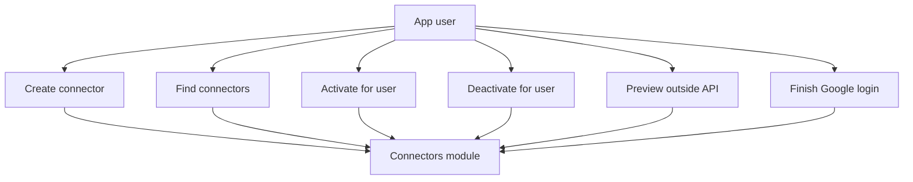
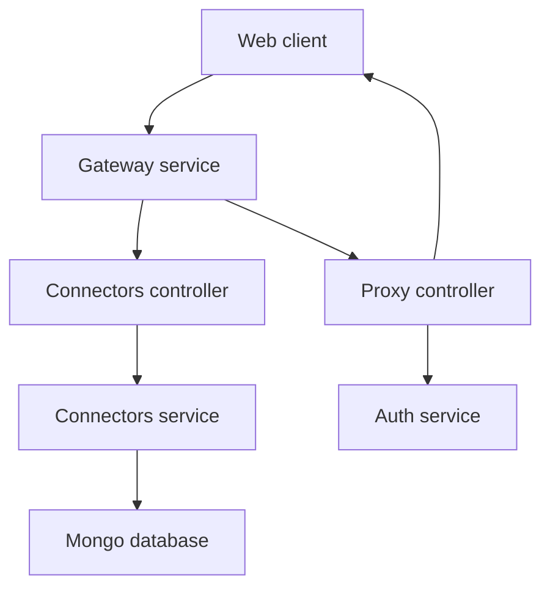

# Connectors Module

## What this module is for

This module keeps your list of outside services and fetches their content for you. You can create a connector, attach it to your account, detach it again, and preview live data through a proxy. It also handles the Google login round trip when Gmail needs permission.

It's a bit like a universal remote. You register each device once, pick which ones you use, and press one button to see what's on.

## Where it lives in the code

Real paths inside `connectors-service`:

```text
connectors-service/src/modules/connectors/connectors.controller.ts
connectors-service/src/modules/connectors/connectors.service.ts
connectors-service/src/modules/connectors/connectors.module.ts
connectors-service/src/modules/connectors/proxy.controller.ts
connectors-service/src/modules/connectors/dto/create-connector.dto.ts
connectors-service/src/modules/connectors/dto/update-connector.dto.ts
connectors-service/src/modules/connectors/schemas/connector.schema.ts
```

Wiring for the whole service:

```text
connectors-service/src/main.ts
connectors-service/src/app.module.ts
```

## Main characters

`ConnectorsController` owns the plain data routes. `ConnectorsService` talks to MongoDB through the `Connector` model. `ProxyController` fetches outside APIs and renders some as HTML.

```ts
// connectors.controller.ts
create(createConnectorDto)      // POST connectors
findAll()                       // GET connectors
update(id, updateConnectorDto)  // PUT connectors id
remove(id)                      // DELETE connectors id
findByUser(userId)              // GET connectors user userId
activateForUser(connectorId, userId)
deactivateForUser(connectorId, userId)
```

```ts
// proxy.controller.ts
proxy(baseUrl, endpoint, res)   // GET proxy
googleCallback(code, res)       // GET proxy callback
```

```ts
// schemas/connector.schema.ts
title: string       // unique and required
description: string
icon: string        // unique and required, must be a URL
baseUrl: string     // unique, must be a URL
userIds: string[]   // unique array in schema
```

Important honesty note: there are no auth guards here. Routes trust the `userId` path parameter and the `X-User-Id` header sent by the gateway. Do not expose this service directly to the internet.

## How it connects to other modules

`ConnectorsModule` registers the `Connector` schema with Mongoose and exposes both controllers:

```ts
controllers: [ConnectorsController, ProxyController]
providers: [ConnectorsService]
```

`AppModule` imports `ConnectorsModule` plus `WidgetsModule` and `DatabaseModule`, enables global config, and applies a global throttle of 100 requests per minute. `main.ts` requires `DATABASE_URL`, turns on helmet and CORS, and uses a strict `ValidationPipe` that rejects unknown fields.

The proxy calls back out to the auth service for Google tokens and login redirects. It defaults to local ports when settings are missing. The Google callback exchanges a code at the Google token endpoint and then redirects to the frontend.

## Typical happy-path flow

You create a connector with a title, icon URL, and base URL. Then you activate it for your user id, which adds your id to its `userIds` list. Later you preview news through `GET proxy` with a news base URL and get back a small HTML page with five headlines. If you preview Gmail instead, the proxy fetches your token, reads your latest messages, and returns them as HTML too.

## Use case diagram



## Module context


