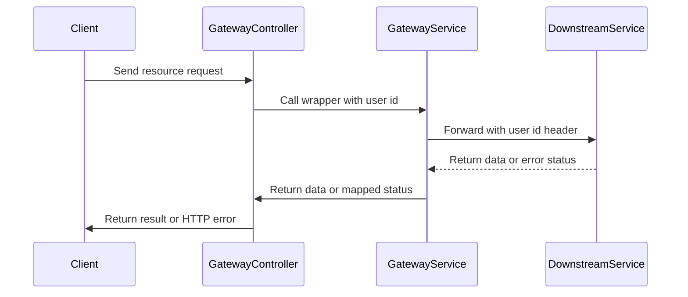
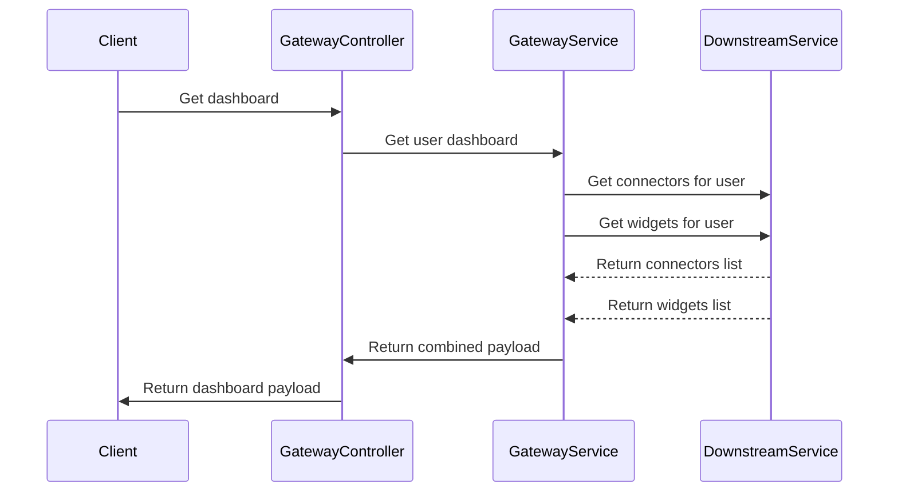

# Gateway Call Chains

## forwardRequest error mapping

Narrative step sequence:

```text
1. Controller calls a wrapper such as getConnector with id and user id.
2. Wrapper calls forwardRequest with verb, path, user id, and optional body.
3. forwardRequest builds a config holding the X-User-Id header.
4. forwardRequest picks the matching axios call for get, post, put, or delete.
5. On success it returns response dot data unchanged.
6. On failure with error dot response it logs the status and throws HttpException with the same status.
7. On failure without error dot response it logs reachability failure and throws HttpException 503.
```

Why the chain exists: the gateway must hide axios details from controllers while keeping upstream meaning. Controllers stay thin. All header handling, verb dispatch, and status mapping live in one place.

Edge cases and error paths:

```text
Missing user id sends header with undefined value downstream.
Unknown verb never matches any branch and leaves response undefined.
Upstream message missing falls back to Error from connectors service.
Network timeout after 10000 ms becomes 503 Service unavailable.
DNS or refused connection becomes 503 Service unavailable.
```



## getUserDashboard parallel fan out

Narrative step sequence:

```text
1. Controller handles GET dashboard and passes req dot user dot id.
2. getUserDashboard starts getConnectors and getWidgets together with Promise dot all.
3. Each branch calls forwardRequest with its own user scoped path.
4. Both downstream GET calls run at the same time.
5. On success the method returns one object with connectors and widgets.
6. On any branch failure it logs Failed to fetch dashboard data.
7. It then throws HttpException 500 with the same message.
```

Why the chain exists: the dashboard page needs two lists at once. Running them in parallel keeps page load close to the slower of the two calls instead of the sum. Wrapping them in one method gives the client a single stable shape.

Edge cases and error paths:

```text
One branch fails and the whole Promise dot all fails even if the other branch passed.
Original upstream status is lost and replaced by generic 500.
Synchronous try catch in controller cannot catch async fan out failure without await.
Downstream unreachable in either branch surfaces as dashboard 500, not 503.
```


