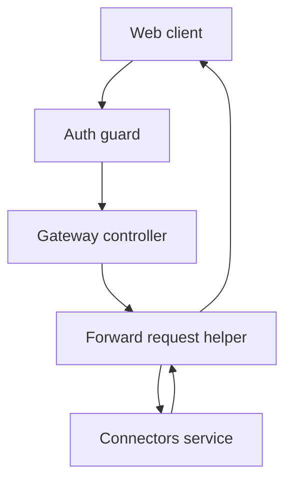
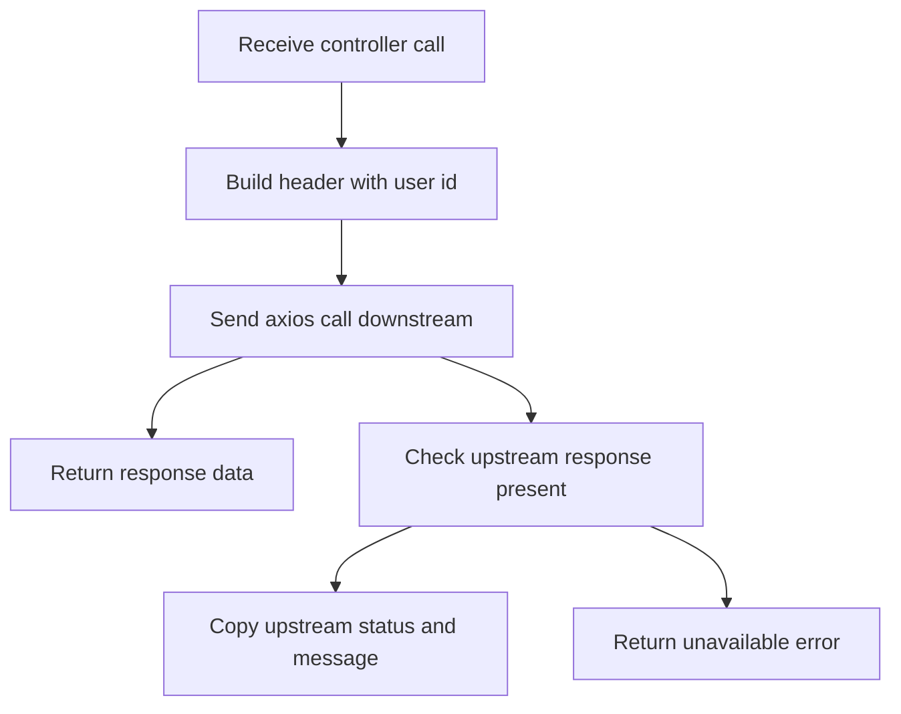

# Gateway Data Flow

## Inputs

Every request starts with an authenticated HTTP call into `GatewayController`. The real inputs are:

```http
GET /dashboard
GET /connectors
GET /connectors/:id
POST /connectors
PUT /connectors/:id
DELETE /connectors/:id
GET /widgets
GET /widgets/:id
POST /widgets
PUT /widgets/:id
DELETE /widgets/:id
POST /widgets/:id/refresh
```

From the request object the controller reads:

```ts
const userId = req.user.id; // set by CustomAuthGuard
const id = req.params.id;   // for routes with :id
const data = req.body;      // for POST and PUT routes, typed as any
```

The service also reads one piece of configuration at startup:

```text
CONNECTORS_SERVICE_URL, default http localhost on port 3000
```

## Transformations

`GatewayService.forwardRequest` is the only real transformation step. It turns a controller call into a downstream axios call:

```ts
// simplified shape of forwardRequest in gateway.service.ts
const config = { headers: { 'X-User-Id': userId } };
response = await connectorsClient.get(path, config);
// or post and put with data, or delete without data
return response.data;
```

Route level mapping is fixed in code:

```text
GET dashboard -> fan out to GET connectors user plus GET widgets user
GET connectors -> GET connectors user with id when user id present
GET connectors id -> GET connectors id
POST connectors -> POST connectors with body
PUT connectors id -> PUT connectors id with body
DELETE connectors id -> DELETE connectors id
GET widgets -> GET widgets user with id
GET widgets id -> GET widgets id
POST widgets -> POST widgets with body
PUT widgets id -> PUT widgets id with body
DELETE widgets id -> DELETE widgets id
POST widgets id refresh -> POST widgets id refresh
```

Error mapping in `forwardRequest`:

```ts
if (error.response) {
  throw new HttpException(
    error.response.data?.message || 'Error from connectors service',
    error.response.status,
  );
}
throw new HttpException('Service unavailable', 503);
```

`getUserDashboard` adds one more transformation. It runs two forwards in parallel with `Promise.all` and wraps the pair as `{ connectors, widgets }`. Any failure inside becomes a `500` with message `Failed to fetch dashboard data`.

## Outputs

The gateway returns `response.data` from the connectors service unchanged for single resource calls. For the dashboard call it returns:

```ts
return {
  connectors,
  widgets,
};
```

Error outputs are Nest `HttpException` objects. Upstream statuses are preserved when present. Unreachable downstream always becomes:

```text
HTTP 503 Service unavailable
```

Dashboard fan out failure always becomes:

```text
HTTP 500 Failed to fetch dashboard data
```

## State changes

The gateway keeps no business state. There is no database and no cache. The only state is the in memory axios instance created once in the constructor with `baseURL` and a `10000` millisecond timeout. Each request is independent. Retries are not stored. User identity is not stored between calls. It is read fresh from `req.user.id` on every request.

## Data flow diagram



## Activity diagram for forward request error mapping


