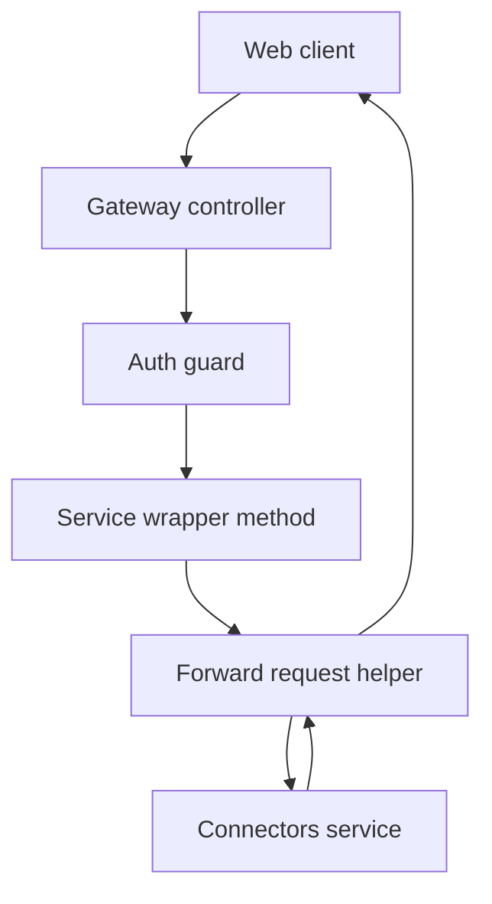
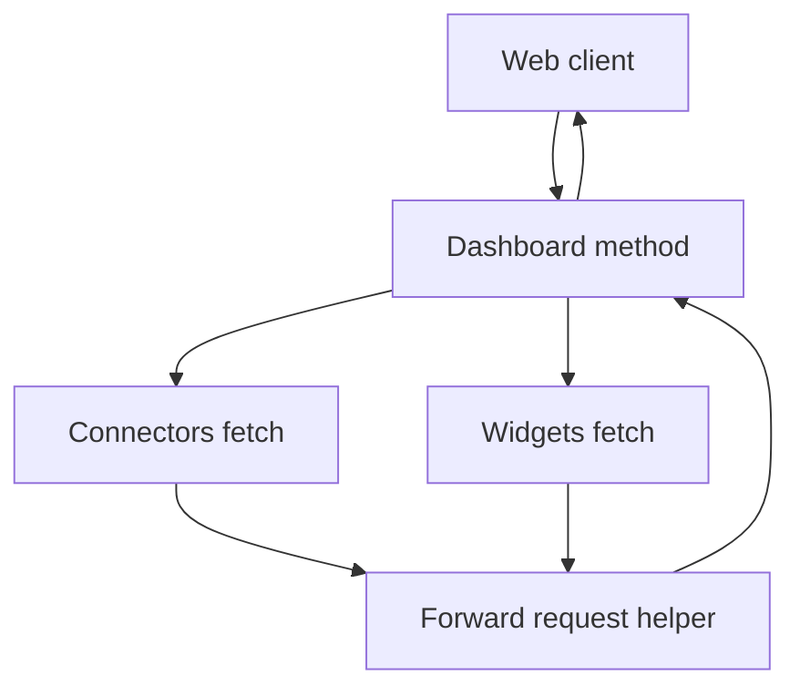

# Gateway Functions

## Public API surface

All routes live in `auth-service/src/gateway/gateway.controller.ts` at root level and all require `CustomAuthGuard`. Real endpoints only:

```http
GET /dashboard
GET /connectors
GET /connectors/:id
POST /connectors
PUT /connectors/:id
DELETE /connectors/:id
GET /widgets
GET /widgets/:id
POST /widgets
PUT /widgets/:id
DELETE /widgets/:id
POST /widgets/:id/refresh
```

Service methods in `auth-service/src/gateway/gateway.service.ts`:

```ts
getConnectors(userId?: string)
getConnector(connectorId: string, userId: string)
createConnector(data: any, userId: string)
updateConnector(connectorId: string, data: any, userId: string)
deleteConnector(connectorId: string, userId: string)
getWidgets(userId?: string)
getWidget(widgetId: string, userId: string)
createWidget(data: any, userId: string)
updateWidget(widgetId: string, data: any, userId: string)
deleteWidget(widgetId: string, userId: string)
refreshWidget(widgetId: string, userId: string)
getUserDashboard(userId: string)
```

Each method is a thin wrapper around `forwardRequest` except `getUserDashboard`, which fans out to `getConnectors` plus `getWidgets`.

## Internal helpers

There is one private helper:

```ts
private forwardRequest<T>(
  method: 'get' | 'post' | 'put' | 'delete',
  path: string,
  userId?: string,
  data?: any,
): Promise<T>
```

It builds the `X-User-Id` header, picks the axios verb, awaits the downstream call, returns `response.data`, and maps errors. No other helpers exist. There is no validation, no caching, and no data shaping helper. Request bodies are passed through as `any`.

## Relationships

```text
GatewayController -> GatewayService -> axios connectorsClient -> connectors-service
GatewayModule -> imports AuthModule so CustomAuthGuard is available
GatewayController -> CustomAuthGuard for req.user.id
GatewayService -> ConfigService for CONNECTORS_SERVICE_URL
getUserDashboard -> getConnectors and getWidgets in parallel
getConnectors and getWidgets -> forwardRequest
all other public methods -> forwardRequest
```

The controller never calls axios directly. The service never reads `req` directly. The controller extracts `req.user.id`, `id`, and `data`, then the service adds the header and picks the path.

## Data flow between functions

A normal call moves like this:

```ts
// controller layer
getConnector(id, req) {
  return gatewayService.getConnector(id, req.user.id);
}
// service layer
getConnector(connectorId, userId) {
  return forwardRequest('get', `/connectors/${connectorId}`, userId);
}
// helper layer
forwardRequest('get', path, userId) {
  // axios GET with X-User-Id header, return response.data
}
```

The dashboard call is the exception because it branches:

```ts
async getUserDashboard(userId: string) {
  const [connectors, widgets] = await Promise.all([
    this.getConnectors(userId),
    this.getWidgets(userId),
  ]);
  return { connectors, widgets };
}
```

Note on `getConnectors` and `getWidgets` in the controller: both wrap the service call in a synchronous `try` plus `catch` fallback without `await`. An async rejection from the service therefore bypasses that fallback and propagates as an `HttpException` from `forwardRequest`.

## Interaction flowchart for single resource forwarding



## Interaction flowchart for dashboard fan out


