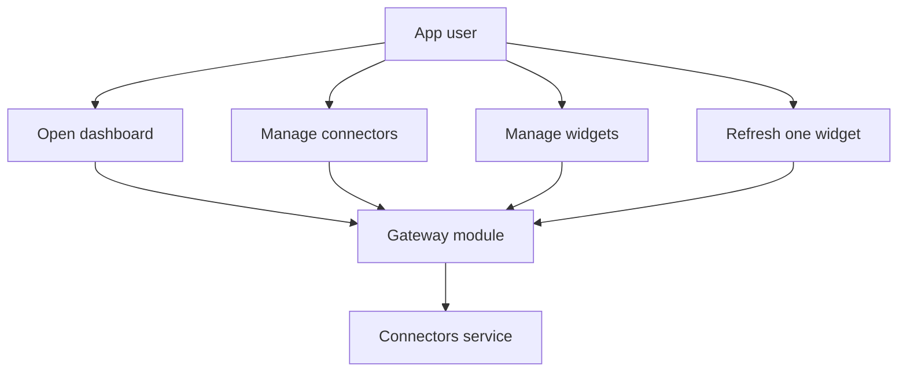
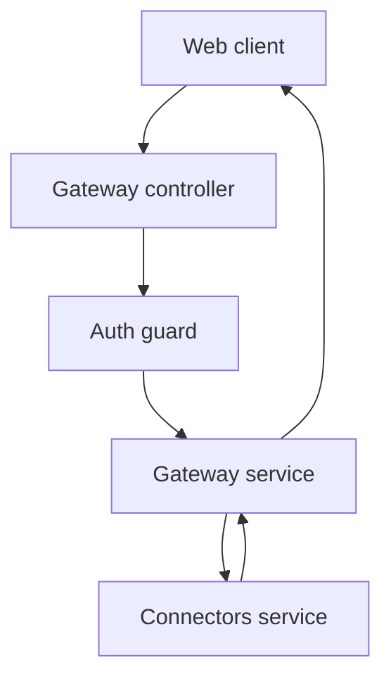

# Gateway Module

## What this module is for

The gateway is the front door of the backend. Your browser talks to it, it checks who you are, and then it passes your request along to the connectors service. You never have to remember two addresses. You just call the gateway and it sorts things out.

Think of it like a reception desk in an office building. It checks your badge and then forwards your message to the right room.

## Where it lives in the code

Real paths inside `auth-service`:

```text
auth-service/src/gateway/gateway.controller.ts
auth-service/src/gateway/gateway.service.ts
auth-service/src/gateway/gateway.module.ts
```

The guard it uses for authentication lives at:

```text
auth-service/src/auth/guards/auth.guard.ts
```

It talks to the downstream service whose address comes from the `CONNECTORS_SERVICE_URL` setting.

## Main characters

```ts
// auth-service/src/gateway/gateway.controller.ts
export class GatewayController {
  getDashboard(req) { /* GET dashboard */ }
  getConnectors(req) { /* GET connectors */ }
  getConnector(id, req) { /* GET connectors/:id */ }
  createConnector(data, req) { /* POST connectors */ }
  updateConnector(id, data, req) { /* PUT connectors/:id */ }
  deleteConnector(id, req) { /* DELETE connectors/:id */ }
  getWidgets(req) { /* GET widgets */ }
  getWidget(id, req) { /* GET widgets/:id */ }
  createWidget(data, req) { /* POST widgets */ }
  updateWidget(id, data, req) { /* PUT widgets/:id */ }
  deleteWidget(id, req) { /* DELETE widgets/:id */ }
  refreshWidget(id, req) { /* POST widgets/:id/refresh */ }
}
```

```ts
// auth-service/src/gateway/gateway.service.ts
export class GatewayService {
  private connectorsClient: AxiosInstance;
  private forwardRequest(method, path, userId, data) { /* shared forwarder */ }
  getUserDashboard(userId) { /* parallel fan out */ }
  // plus one thin wrapper per route listed above
}
```

`CustomAuthGuard` is the bouncer. Every route in `GatewayController` needs it. It fills in `req.user.id`, which the service then forwards as the `X-User-Id` header.

## How it connects to other modules

The gateway imports `AuthModule` so it can use `CustomAuthGuard`. It does not import any database code. It talks to the connectors service over plain axios HTTP:

```ts
// auth-service/src/gateway/gateway.service.ts
this.connectorsClient = axios.create({
  baseURL: connectorsUrl,
  timeout: 10000,
});
```

Each outgoing call adds this header:

```ts
const config = {
  headers: { 'X-User-Id': userId },
};
```

If the downstream service answers with an error status, the gateway copies that status into a new `HttpException`. If the downstream service cannot be reached at all, it throws a `503` with the message `Service unavailable`.

## Typical happy-path flow

Say you open your dashboard. Your browser calls `GET dashboard` with your login cookie or token. The guard accepts you and gives the service your user id. The service asks for your connectors and your widgets at the same time, waits for both, and returns one combined object with `connectors` and `widgets` in it.

## Use case diagram



## Module context


