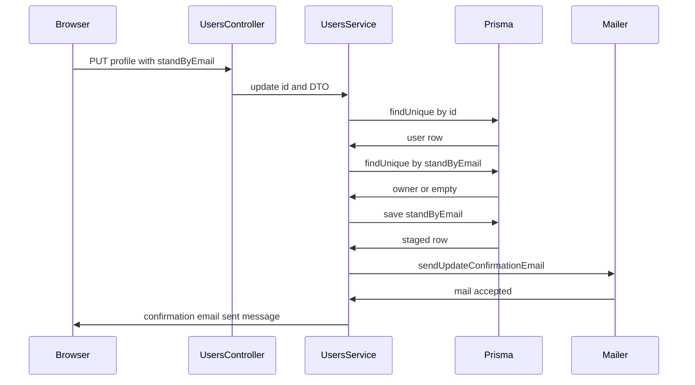
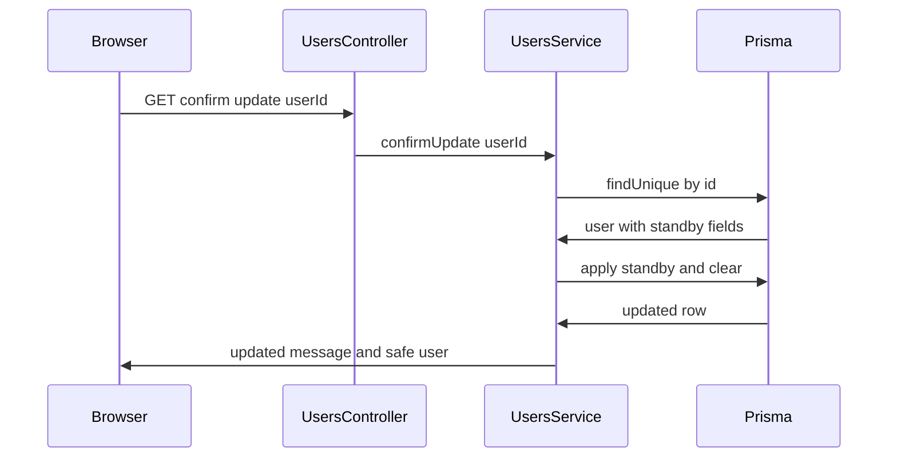

# Users Module Call Chains

## Update with standByEmail branch

Narrative step sequence:

1. Browser calls `PUT /users/profile` with `UpdateUserDto` containing `standByEmail`, or an admin calls `PUT /users/:id`
2. `CustomAuthGuard` verifies the token and `CurrentUser` or path id selects the target user
3. `UsersService.update` loads the user and throws 404 when missing
4. When `standByEmail` is present the service looks up that email and throws 409 when another account owns it
5. Service saves only `standByEmail` on the user row and leaves the real `email` unchanged
6. Service calls `sendUpdateConfirmationEmail` with username, current email, user id, and the new email
7. Helper builds a frontend confirm link, renders `updateConfirmation.html`, and sends it to the current email
8. Service returns a confirmation email sent message
9. When `standByEmail` is absent the service writes direct fields and returns the safe user

Why the chain exists:

- Staging protects login and mail delivery because the real email only changes after the owner clicks the link sent to the old address

Edge cases and error paths:

- Unknown user id returns user not found
- Standby email owned by another user returns email already in use
- Same user reusing their own current email passes the owner check and resends confirmation
- Direct branch silently ignores `standByUsername` because only `standByEmail` has a staging branch in `update`
- `UpdateUserDto` spells one field `standByusername` with a lowercase u while Prisma uses `standByUsername`, so that DTO field may not map cleanly

## ConfirmUpdate

Narrative step sequence:

1. User clicks the mailed link and the frontend or API client calls `GET /users/confirm-update/:userId`
2. Controller passes the path id to `UsersService.confirmUpdate`
3. Service loads the user and throws 404 when missing
4. Service copies `standByEmail` to `email` and clears `standByEmail` when present
5. Service copies `standByUsername` to `username` and clears `standByUsername` when present
6. Service throws no pending updates found when both standby fields are empty
7. Service writes the combined update in one Prisma call
8. Service returns account updated successfully plus the safe user

Why the chain exists:

- One confirmation endpoint finalizes either pending value atomically so profile reads never see a half applied rename plus email change

Edge cases and error paths:

- Unknown user id returns user not found
- No standby values returns no pending updates found
- Email that became taken after staging is not rechecked, so confirmation can create a duplicate if the database allows it
- Route must stay above `GET /users/:id` or the literal `confirm-update` path would be treated as a user id

