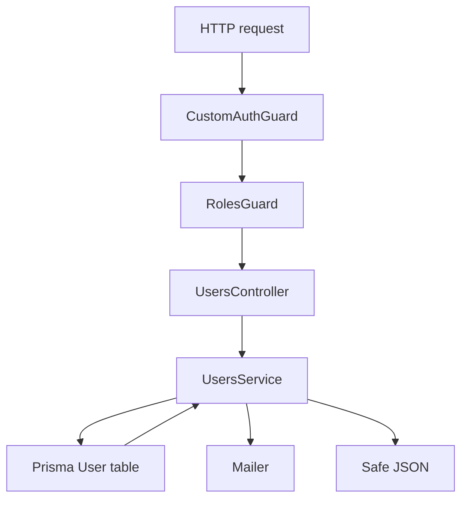
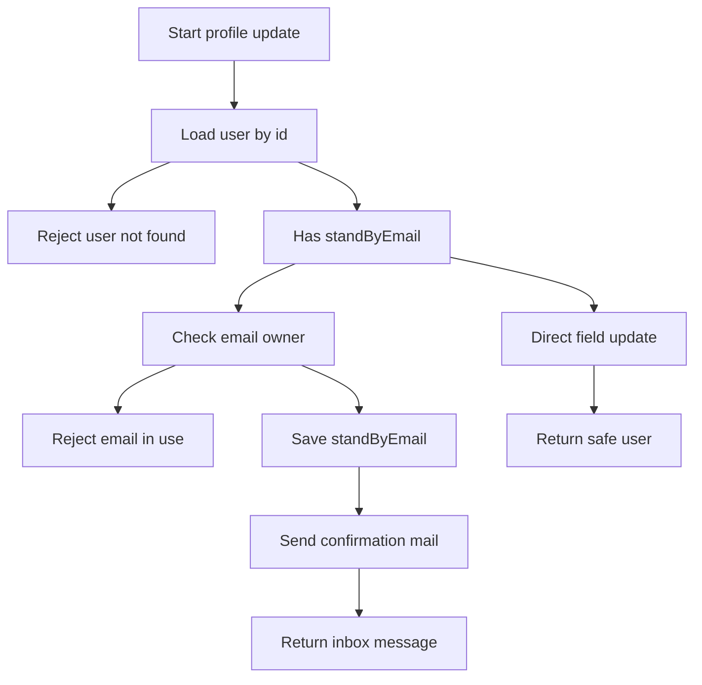

# Users Module Data Flow

## Inputs

- `GET /users/profile` identity from `CurrentUser` populated by `CustomAuthGuard`
- `PUT /users/profile` body as `UpdateUserDto` with optional `username`, `standByusername`, `email`, `standByEmail`, `image`, `connectedServiceIds`, `verified`, and `role`
- `PUT /users/:id` path id plus `UpdateUserDto` body for admin updates
- `GET /users/confirm-update/:userId` path parameter `userId` from the emailed link
- `GET /users/:id` path id for single user reads
- `DELETE /users/:id` path id for admin deletes
- `POST /users/services/:serviceId` and `DELETE /users/services/:serviceId` service ids for the current user
- `POST /users/widgets/:widgetId` and `DELETE /users/widgets/:widgetId` widget ids for the current user
- `FRONTEND_URL` and `MAIL_FROM` or `MAIL_USER` environment values for mailed links and sender

## Transformations

- Whole controller runs behind `CustomAuthGuard`, which loads `request.user` through `AuthService.verifyToken` before any handler starts
- Admin routes add `RolesGuard` plus `Roles('ADMIN')` and reject non admin roles
- Route ordering keeps `GET /users/confirm-update/:userId` above `GET /users/:id` so the literal path is not mistaken for an id
- `findById` loads a user by id and throws 404 when missing, then strips secrets
- `findByEmail` returns the raw Prisma row by email without secret stripping
- `findAll` loads users newest first and strips secrets from each row
- `update` with `standByEmail` checks email ownership, rejects use by another account with 409, saves only `standByEmail`, sends a confirmation email, and returns a check your inbox message instead of the user
- `update` without `standByEmail` writes `username`, `email`, `image`, `verified`, `role`, `connectedServiceIds`, and `activeWidgetIds` directly, with undefined fields left untouched by Prisma
- `confirmUpdate` loads the user, copies `standByEmail` to `email` and `standByUsername` to `username`, clears standby fields to null, rejects empty pending state with 404, and returns the updated safe user
- `sendUpdateConfirmationEmail` builds a frontend confirm link, renders `updateConfirmation.html`, strips unused conditional blocks, and sends the mail to the current email address
- `addConnectedService` and `addActiveWidget` skip duplicates and return the current profile unchanged
- `removeConnectedService` and `removeActiveWidget` filter one id out of the stored array
- `delete` removes the row by id and returns a deleted message
- `excludePassword` removes `password`, `accessToken`, and `refreshToken` from every outward response except `findByEmail`

## Outputs

- Safe user JSON without password or OAuth tokens for profile reads, lists, direct updates, confirmations, and service or widget changes
- `{ message: Confirmation email sent }` style response when an email change is staged
- `{ message: Account updated successfully, user }` after `confirmUpdate`
- `{ message: User deleted successfully }` after delete
- Unchanged safe user when connecting an already connected service or activating an already active widget
- 401 from the guard for missing or bad tokens, 403 or false from role checks on admin routes, 404 for unknown users or no pending updates, and 409 for email already in use

## State changes

- `standByEmail` set when an email change is requested, real `email` unchanged until confirmation
- `email` replaced and `standByEmail` cleared to null on `confirmUpdate`
- `username` replaced and `standByUsername` cleared to null on `confirmUpdate` when that standby value exists
- `username`, `email`, `image`, `verified`, `role`, `connectedServiceIds`, and `activeWidgetIds` overwritten on direct updates
- `connectedServiceIds` grown or shrunk by service connect and disconnect calls
- `activeWidgetIds` grown or shrunk by widget activate and deactivate calls
- Full `User` row removed on delete
- Mail provider state changes when an update confirmation email is accepted

