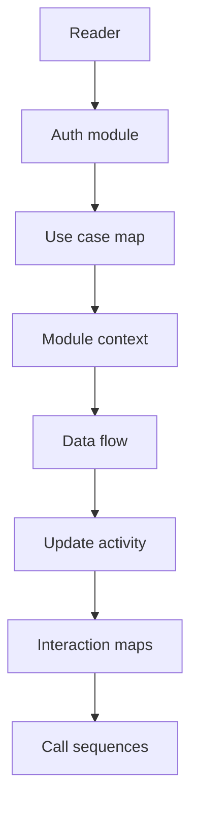

# Users Module Diagrams

## Reading order

1. Use case map in `docs/modules/users/README.md`
2. Module context flowchart in `docs/modules/users/README.md`
3. Data flow flowchart in `docs/modules/users/DATA_FLOW.md`
4. Update activity flowchart in `docs/modules/users/DATA_FLOW.md`
5. Public interaction flowchart in `docs/modules/users/FUNCTIONS.md`
6. Update internals flowchart in `docs/modules/users/FUNCTIONS.md`
7. Update with standby sequence in `docs/modules/users/CALL_CHAINS.md`
8. Confirm update sequence in `docs/modules/users/CALL_CHAINS.md`

## Diagram purposes

1. Use case map shows owner versus admin goals from profile read to user delete in one glance.
2. Module context flowchart shows how browser, guard, controller, service, database, mailer, and frontend connect.
3. Data flow flowchart traces requests through auth guard, role guard, controller, service, storage, mail, and safe JSON.
4. Update activity flowchart orders the trickiest staged email branch against the direct field update branch.
5. Public interaction flowchart maps profile, admin, confirm, and service or widget routes into one shared service.
6. Update internals flowchart isolates the standby branch, direct branch, mail helper, confirmation, lookup, and membership reuse.
7. Update with standby sequence details ownership check plus standby save plus confirmation mail in time order.
8. Confirm update sequence details standby copy plus standby clear plus final safe user return.

## Prerequisites

- Read the auth module first, especially `CustomAuthGuard`, `RolesGuard`, `CurrentUser`, `Roles`, and `verifyToken`, because every users route depends on them.
- Read `auth-service/src/users/users.controller.ts` and `auth-service/src/users/users.service.ts` before all flow and sequence diagrams.
- Read `auth-service/prisma/schema.prisma` before standby and id array behavior so pending versus applied values make sense.
- Read `auth-service/src/common/utils/emailTemplate.utils.ts` plus `auth-service/src/email-templates/updateConfirmation.html` before mail steps.
- Read `auth-service/src/app.module.ts` and `auth-service/src/main.ts` for global throttling, mail transport, validation, cookies, and CORS.

