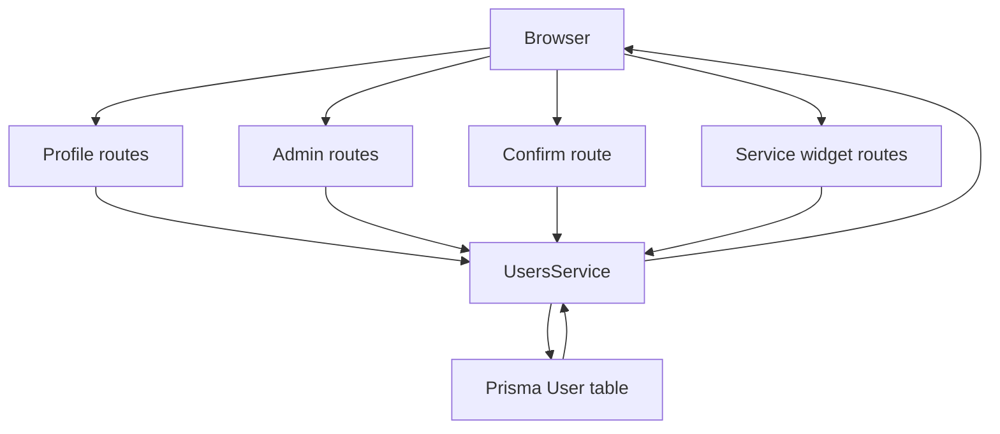
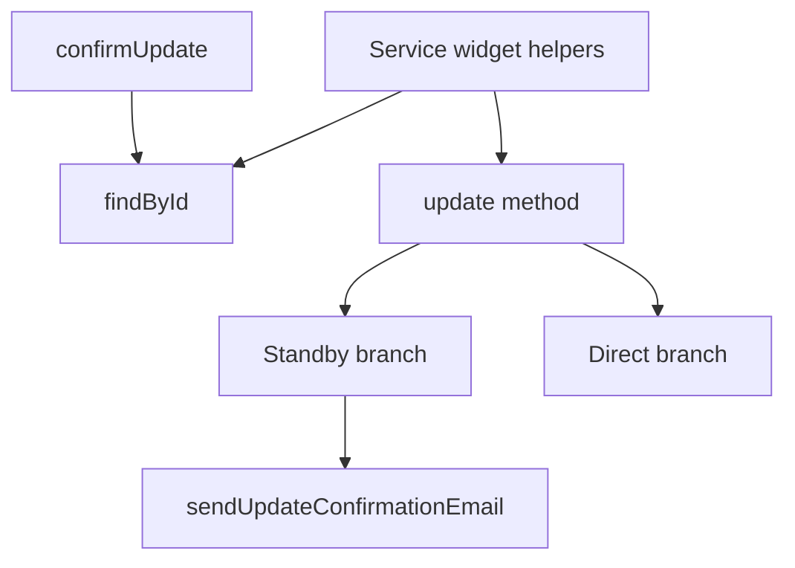

# Users Module Functions

## Public API surface

Controller routes in `auth-service/src/users/users.controller.ts`, all behind `CustomAuthGuard`:

- `GET /users/profile` calls `findById` with the current user id
- `GET /users` guarded by `RolesGuard` plus `Roles('ADMIN')`, calls `findAll`
- `GET /users/confirm-update/:userId` calls `confirmUpdate` with the path user id
- `GET /users/:id` calls `findById` with the path id
- `PUT /users/profile` calls `update` with the current user id and `UpdateUserDto`
- `PUT /users/:id` guarded by `RolesGuard` plus `Roles('ADMIN')`, calls `update` with the path id and `UpdateUserDto`
- `DELETE /users/:id` guarded by `RolesGuard` plus `Roles('ADMIN')`, calls `delete` with the path id
- `POST /users/services/:serviceId` calls `addConnectedService` with current user id and service id
- `DELETE /users/services/:serviceId` calls `removeConnectedService` with current user id and service id
- `POST /users/widgets/:widgetId` calls `addActiveWidget` with current user id and widget id
- `DELETE /users/widgets/:widgetId` calls `removeActiveWidget` with current user id and widget id

Service methods in `auth-service/src/users/users.service.ts`:

- `findById(id: string)` returns one safe user or throws 404
- `findByEmail(email: string)` returns the raw Prisma row by email
- `findAll()` returns all safe users newest first
- `update(id: string, data: object)` stages standby email or writes fields directly
- `confirmUpdate(userId: string)` applies standby email and username values
- `delete(id: string)` removes a user row
- `addConnectedService(userId: string, serviceId: string)` appends a service id unless present
- `removeConnectedService(userId: string, serviceId: string)` removes a service id
- `addActiveWidget(userId: string, widgetId: string)` appends a widget id unless present
- `removeActiveWidget(userId: string, widgetId: string)` removes a widget id

## Internal helpers

- `sendUpdateConfirmationEmail(username, currentEmail, userId, newEmail, newUsername)` builds the frontend confirm link, renders `updateConfirmation.html` through `EmailTemplateUtil`, and sends it with `MailerService`
- `excludePassword(user: any)` removes `password`, `accessToken`, and `refreshToken` before returning user JSON
- `CustomAuthGuard` from `auth-service/src/auth/guards/auth.guard.ts` authenticates every users route
- `RolesGuard` from `auth-service/src/auth/guards/roles.guard.ts` gates admin routes
- `CurrentUser` from `auth-service/src/auth/decorators/current-user.decorator.ts` injects the logged in user
- `Roles` from `auth-service/src/auth/decorators/roles.decorator.ts` marks admin only handlers
- `EmailTemplateUtil.getUpdateConfirmationEmail` handles `newEmail` and `newUsername` conditional blocks in the HTML template

## Relationships

- `UsersController` depends only on `UsersService`
- `UsersService` depends on `MailerService`
- `UsersModule` imports `AuthModule` through `forwardRef` to access guards and decorators
- `AuthModule` imports `UsersModule` through `forwardRef` to let `AuthService.confirmMail` call `UsersService.update`
- `update` is shared by profile edits, admin edits, email verification, and service or widget membership changes
- `confirmUpdate` is reachable both from the emailed frontend link and from direct API calls
- `findById` is reused by profile reads, single user reads, and all four service or widget membership methods
- `UpdatePasswordDto` lives in the users DTO folder but is consumed by the auth change password route

## Data flow between functions

- Profile read goes from `getProfile` to `findById` to `excludePassword`
- Admin list goes from `findAll` controller method to service `findAll` to per user `excludePassword`
- Staged email change goes from `updateProfile` or admin `update` to `update` standby branch to `sendUpdateConfirmationEmail`
- Confirmation goes from `confirmUpdate` controller method to service `confirmUpdate` to Prisma write to `excludePassword`
- Service connect goes from `connectService` to `addConnectedService` to `findById` to `update` direct branch
- Service disconnect goes from `disconnectService` to `removeConnectedService` to `findById` to `update` direct branch
- Widget activate goes from `activateWidget` to `addActiveWidget` to `findById` to `update` direct branch
- Widget deactivate goes from `deactivateWidget` to `removeActiveWidget` to `findById` to `update` direct branch
- Auth email verification goes from `AuthService.confirmMail` into `UsersService.update` with `verified true`

