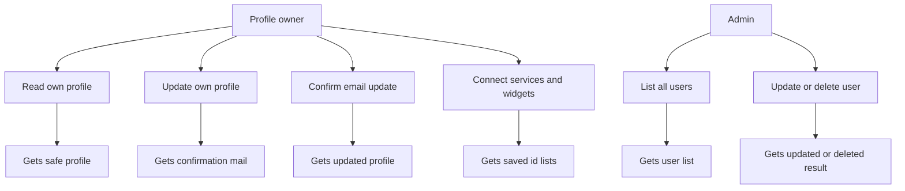
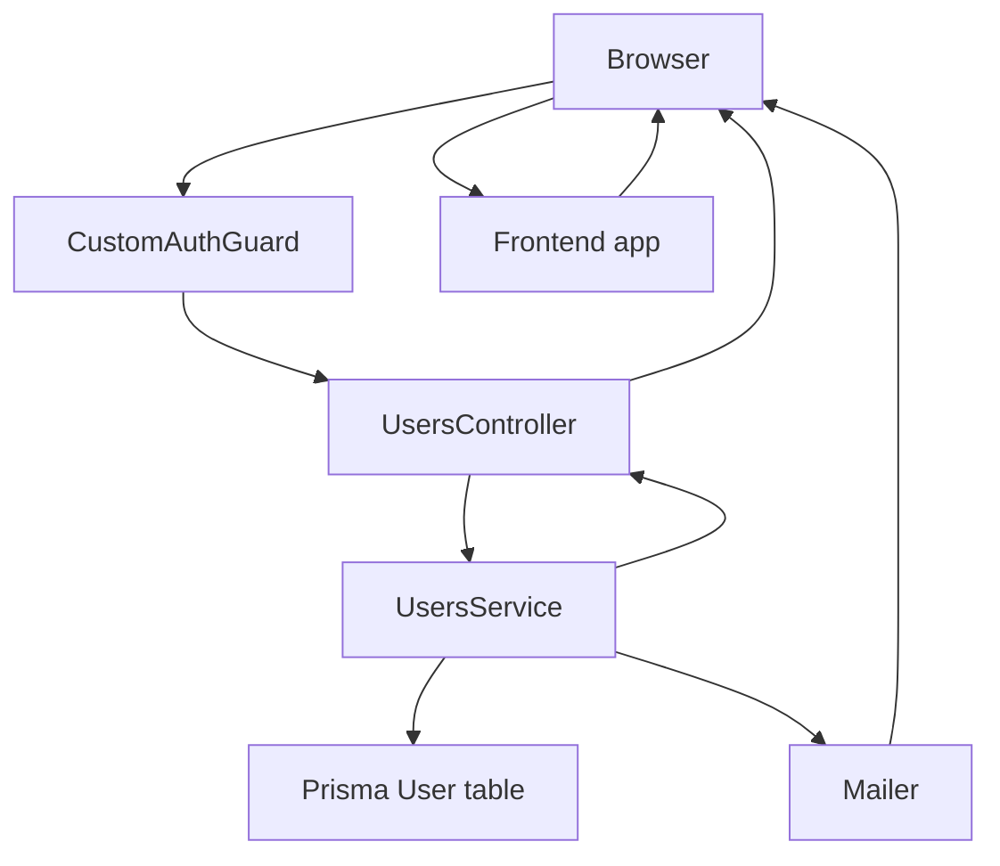

# Users Module

## What this module is for

This module manages people's profiles after they have logged in. You can read your own profile, update it, connect services and widgets, and confirm an email change. Admins can also list, read, update, and delete any user.

Think of it like a contacts app where you can edit your own card, but only a manager can edit or remove everyone else's cards.

## Where it lives in the code

All users code lives under `auth-service/src/users/`:

- `auth-service/src/users/users.controller.ts` defines the HTTP routes under `users`
- `auth-service/src/users/users.service.ts` holds the real logic
- `auth-service/src/users/users.module.ts` wires the controller and service with a `forwardRef` to auth
- `auth-service/src/users/dto/update-user.dto.ts` defines `UpdateUserDto`
- `auth-service/src/users/dto/update-password.dto.ts` defines `UpdatePasswordDto` used by the auth change password route
- `auth-service/src/users/dto/create-user.dto.ts` holds a duplicate `UpdateUserDto` definition on disk
- `auth-service/src/users/dto/user-response.dto.ts` defines `UserResponseDto`
- `auth-service/lib/prisma.ts` exports the shared Prisma client
- `auth-service/prisma/schema.prisma` defines the `User` model with `standByEmail`, `standByUsername`, `connectedServiceIds`, `activeWidgetIds`, `connectors`, and `widgets`
- `auth-service/src/common/utils/emailTemplate.utils.ts` renders the update confirmation email
- `auth-service/src/auth/guards/auth.guard.ts` supplies `CustomAuthGuard` used on every users route
- `auth-service/src/auth/guards/roles.guard.ts` supplies `RolesGuard` for admin routes
- `auth-service/src/auth/decorators/current-user.decorator.ts` supplies `CurrentUser`
- `auth-service/src/auth/decorators/roles.decorator.ts` supplies `Roles`

## Main characters

- `UsersController` maps profile, admin, email confirmation, service, and widget routes to the service
- `UsersService` reads and writes users, stages email changes with standby fields, confirms them, and edits service and widget id arrays
- `UpdateUserDto` allows optional `username`, `standByusername`, `email`, `standByEmail`, `image`, `connectedServiceIds`, `verified`, and `role`
- `CustomAuthGuard` protects the whole controller, so every call needs a valid login token
- `RolesGuard` plus `Roles('ADMIN')` locks list, admin update, and delete routes to admins
- `EmailTemplateUtil.getUpdateConfirmationEmail` builds the confirm your update mail from `updateConfirmation.html`
- Prisma `User` model stores profile data plus `standByEmail` and `standByUsername` pending values

## How it connects to other modules

- It imports `AuthModule` with `forwardRef` so it can reuse `CustomAuthGuard`, `RolesGuard`, `CurrentUser`, and `Roles`
- It is imported by `AuthModule` with `forwardRef` so `AuthService.confirmMail` can call `UsersService.update`
- It reads and writes the same `User` table that the auth module uses, through `auth-service/lib/prisma.ts`
- It sends mail through the global `MailerModule` to confirm email changes
- Its `UpdatePasswordDto` is consumed by `auth-service/src/auth/auth.controller.ts` for the change password route
- Its service and widget id arrays reference entities owned by the connectors service, but it stores only string ids and JSON blobs

## Typical happy-path flow

You call `PUT /users/profile` with a new `standByEmail`. The service saves that value in `standByEmail` without changing your real email, then emails your current address with a confirmation link. You click `GET /users/confirm-update/:userId`, the service copies the standby email into `email`, clears the standby field, and returns your updated profile.

