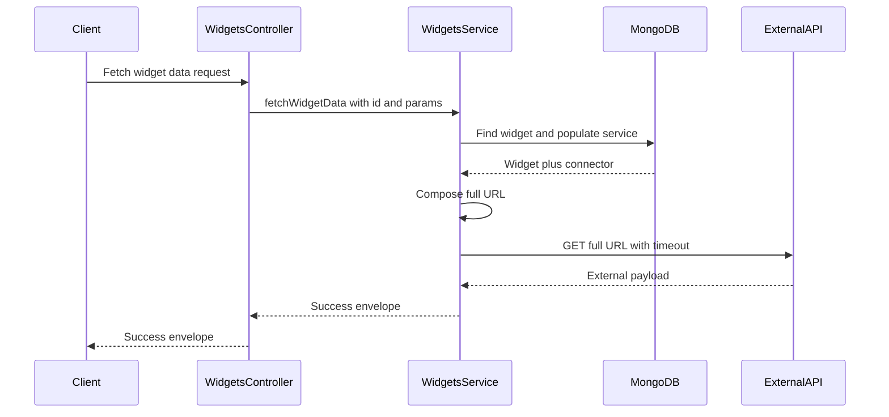
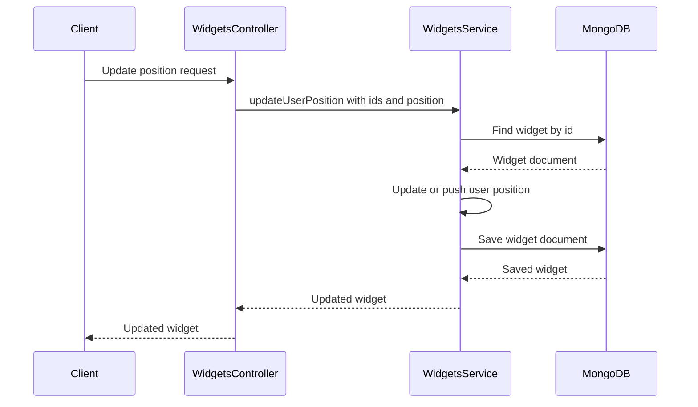
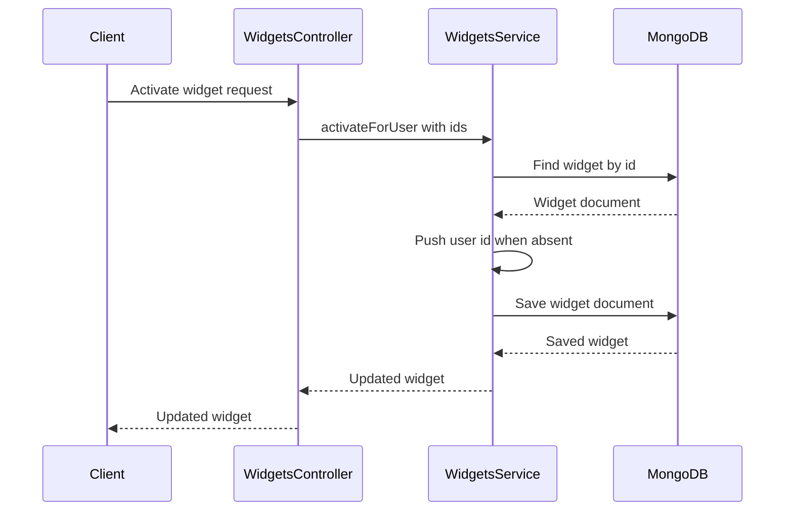
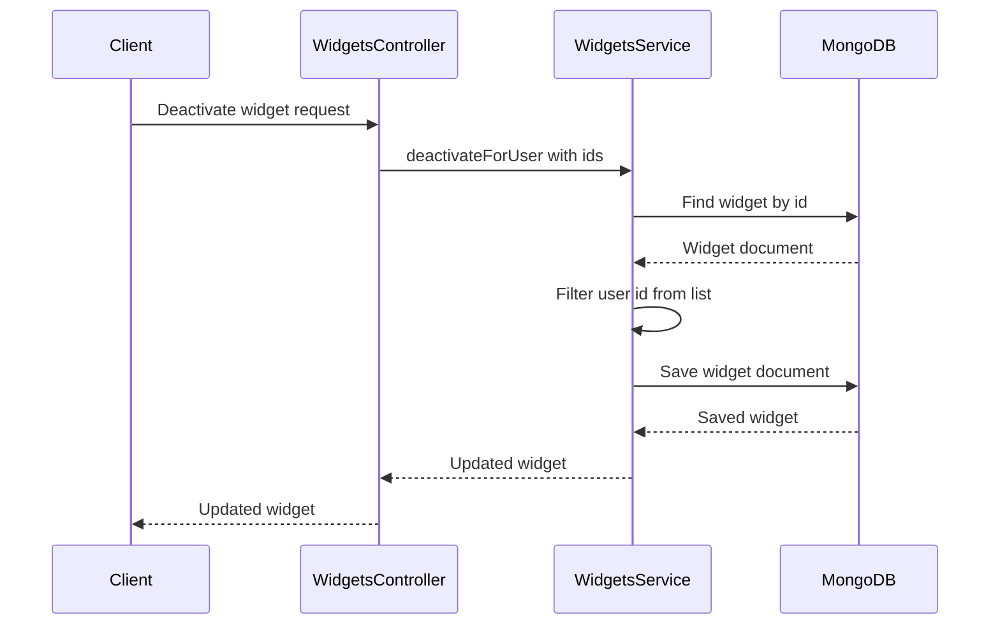

# Widgets Call Chains

## FetchWidgetData

Narrative step sequence:

1. `WidgetsController.fetchWidgetData` receives `id` and the raw query object.
2. `WidgetsService.fetchWidgetData` loads the widget by id and populates `serviceId`.
3. The service throws `NotFoundException` when the widget is missing.
4. The service reads the populated connector and throws when `baseUrl` is absent.
5. It joins `baseUrl` with `widget.endpoint`, appends extra params with the correct separator, and issues `axios.get` with a 15 second timeout.
6. On external HTTP 200 it returns `success`, `data`, and the `id` plus `name` widget summary.

Why the chain exists: the client only knows a widget id, so the backend must resolve the connector address, complete the URL, and normalize every third-party answer into one envelope.

Edge cases and error paths:

- Unknown widget id raises `NotFoundException`.
- Missing connector or empty `baseUrl` raises `NotFoundException` for an invalid connector.
- Any `axios` failure, timeout, or non-200 status is converted to `InternalServerErrorException`.
- Empty `additionalParams` skips URL mutation and calls the bare joined URL.

## UpdateUserPosition

Narrative step sequence:

1. `WidgetsController.updatePosition` receives `widgetId`, `userId`, and the `position` body.
2. `WidgetsService.updateUserPosition` loads the widget without populating references.
3. A missing widget raises `NotFoundException`.
4. The service scans `positions` for an entry whose `user_id` string matches `userId`.
5. A match overwrites `position`, while no match pushes a new `user_id` plus `position` pair.
6. The service saves the document and returns the updated widget.

Why the chain exists: dashboard layout is per user, so one widget document must remember a separate grid position for every user who placed it.

Edge cases and error paths:

- Unknown widget id raises `NotFoundException`.
- An invalid `userId` object id can fail at save time.
- Concurrent saves may overwrite positions because the whole document is re-saved.

## ActivateForUser

Narrative step sequence:

1. `WidgetsController.activateForUser` receives the widget id and user id from the path.
2. `WidgetsService.activateForUser` loads the widget by id.
3. A missing widget raises `NotFoundException`.
4. The service pushes `userId` only when `userIds` does not already include it.
5. The service saves and returns the widget.

Why the chain exists: activation records that a user subscribed to a shared widget without duplicating the widget document per user.

Edge cases and error paths:

- Unknown widget id raises `NotFoundException`.
- Repeating activation is safe because the includes check prevents duplicates.

## DeactivateForUser

Narrative step sequence:

1. `WidgetsController.deactivateForUser` receives the widget id and user id from the path.
2. `WidgetsService.deactivateForUser` loads the widget by id.
3. A missing widget raises `NotFoundException`.
4. The service filters every occurrence of `userId` out of `userIds`.
5. The service saves and returns the widget.

Why the chain exists: deactivation removes one subscription while leaving the shared widget and all other users untouched.

Edge cases and error paths:

- Unknown widget id raises `NotFoundException`.
- Deactivating a user who was never active still saves the document and returns success.

