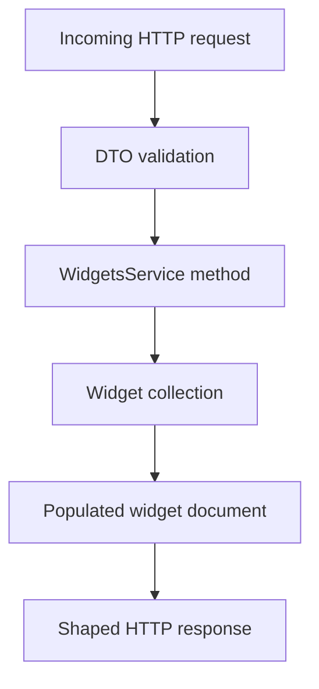
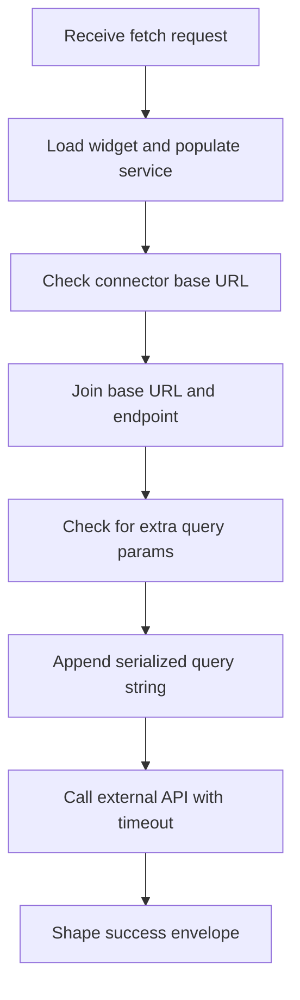

# Widgets Data Flow

## Inputs

- HTTP path parameters such as `id`, `userId`, `serviceId`, and `widgetId` from `widgets.controller.ts`.
- JSON bodies validated by `CreateWidgetDto` and `UpdateWidgetDto`, including `serviceId`, `name`, `icon`, plus optional `userIds`, `description`, `functionName`, `endpoint`, and `refreshRate`.
- A `position` object with numeric `x` and `y` on the position update route.
- Free-form query params on `GET :id/fetch`, forwarded as additional external API params.
- MongoDB documents from the `Widget` collection, including the populated `serviceId` reference.
- Third-party HTTP responses returned through `axios.get`.

## Transformations

- DTO validation runs through `class-validator` decorators before the service is called.
- `create` builds a new Mongoose document and saves it unchanged.
- `findAll`, `findOne`, and `findByUser` populate `serviceId` so callers get connector details alongside the widget.
- `updateUserPosition` searches the embedded `positions` array by stringified `user_id` and either overwrites the stored position or pushes a new entry with a fresh `ObjectId`.
- `activateForUser` pushes `userId` only when it is not already present, while `deactivateForUser` filters it out.
- `fetchWidgetData` composes the outbound URL in three steps shown below: join `baseUrl` with `endpoint`, pick `?` or `&` as separator, then append the serialized query string.

```ts
let fullUrl = `${connector.baseUrl}${widget.endpoint || ''}`;
if (Object.keys(additionalParams).length > 0) {
  const params = new URLSearchParams(additionalParams as any);
  const separator = fullUrl.includes('?') ? '&' : '?';
  fullUrl = `${fullUrl}${separator}${params.toString()}`;
}
const response = await axios.get(fullUrl, { timeout: 15000 });
```

## Outputs

- Single widgets or widget arrays, usually with a populated `serviceId`.
- The updated widget document after create, update, position change, activation, or deactivation.
- No content after a successful `remove`, or a `NotFoundException` when the id does not exist.
- A fetch envelope of the shape below on HTTP 200 from the external API:

```json
{
  "success": true,
  "data": {},
  "widget": { "id": "widgetId", "name": "widgetName" }
}
```

- Stub arrays and objects from `GoogleController` for the Gmail and Translate demo endpoints.

## State changes

- The `Widget` collection gains, changes, or loses documents through create, update, and remove.
- The embedded `positions` array gains one entry per user or mutates that user's stored `x` and `y`.
- The `userIds` string array grows on activation and shrinks on deactivation.
- Schema timestamps update automatically because the schema is created with `timestamps: true`.
- No state changes on read-only paths such as `findAll`, `findOne`, `findByUser`, `findByService`, or the stub endpoints.

## Diagrams

Data-flow flowchart:



Activity flow for the trickiest path, fetch URL composition:


