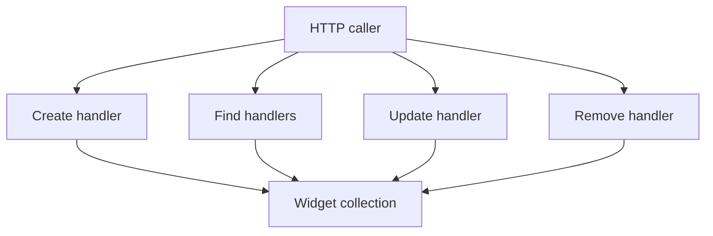
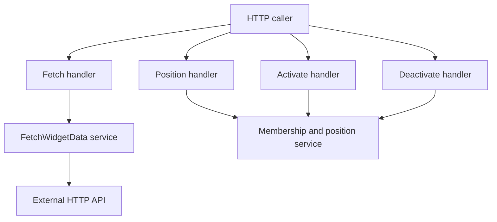

# Widgets Functions

## Public API surface

All routes below are real handlers from `widgets.controller.ts` and `google.controller.ts`. Both controllers use the `widgets` prefix.

```text
POST    widgets
GET     widgets
GET     widgets/user/:userId
GET     widgets/service/:serviceId
GET     widgets/:id
GET     widgets/:id/fetch
PUT     widgets/:id
DELETE  widgets/:id
PUT     widgets/:widgetId/user/:userId/position
POST    widgets/:id/activate/:userId
DELETE  widgets/:id/deactivate/:userId
GET     widgets/gmail
GET     widgets/translate
```

Service methods from `widgets.service.ts`, in call order used by the controller:

```ts
create(dto: CreateWidgetDto)
findAll()
findByUser(userId: string)
findByService(serviceId: string)
findOne(id: string)
fetchWidgetData(widgetId: string, additionalParams = {})
update(id: string, dto: UpdateWidgetDto)
remove(id: string)
updateUserPosition(widgetId: string, userId: string, position)
activateForUser(widgetId: string, userId: string)
deactivateForUser(widgetId: string, userId: string)
```

DTO surface from `dto/create-widgets.dto.ts`, all inherited as optional by `UpdateWidgetDto`:

```ts
userIds?: string[]
serviceId: string
name: string
description?: string
functionName?: string
endpoint?: string
icon: string
refreshRate?: number
```

## Internal helpers

- `URLSearchParams` serializes the free-form `additionalParams` object on the fetch path.
- The `?` versus `&` separator check keeps appended params valid whether or not the endpoint already has a query string.
- `axios.get` with a `15000` millisecond timeout performs the single outbound call.
- `populate('serviceId')` resolves the linked connector so `baseUrl` is available at fetch time.
- The `positions.find` comparison on stringified `user_id` decides between updating an existing position and pushing a new one.
- `userIds.includes` and `userIds.filter` guard activation and deactivation without extra queries.
- `GoogleController.getGmailInbox` and `getTranslateWidget` return hard-coded demo payloads with no database access.

## Relationships

- Every controller handler delegates directly to the same-named service method, except `activateForUser` and `deactivateForUser`, which map from `activateForUser` and `deactivateForUser` route handlers.
- `fetchWidgetData` is the only method that touches three systems in one call: MongoDB, the linked connector record, and the external API.
- `findAll`, `findOne`, and `findByUser` share the populate pattern, while `findByService` queries by `serviceId` without populating.
- `create`, `update`, and `remove` share the same not-found behavior on update and delete paths.
- `WidgetsModule` binds everything by registering both controllers, the `WidgetsService` provider, and the `Widget` plus `Connector` Mongoose models.

## Data flow between functions

1. The controller extracts path params, query params, or a validated body and passes plain values to the service.
2. The service queries or mutates the `Widget` model and returns documents or shaped envelopes.
3. The controller returns the service result directly with no extra mapping.
4. On the fetch path the service result depends on the populated connector and the live `axios` response, not only on MongoDB.

## Diagrams

CRUD interaction flowchart:



Fetch and membership interaction flowchart:


