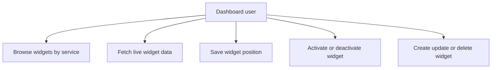
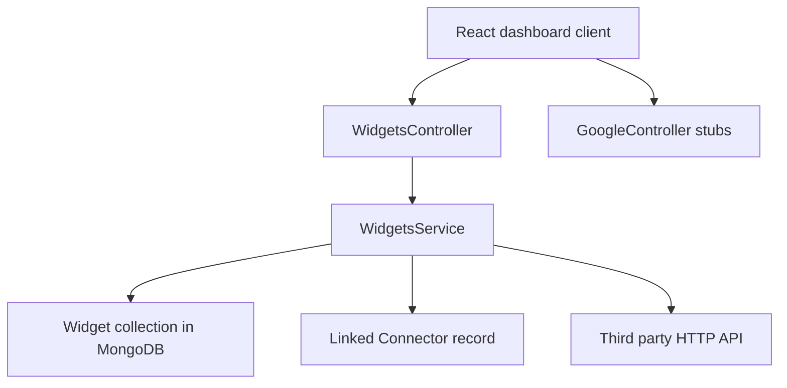

# Widgets Module

## What this module is for

This module is the part of the connectors backend that stores widget definitions and fetches their live data for you. If you pick a widget on the dashboard, it'll find its setup in the database, build the right third-party URL, call it, and hand the result back. Think of it as a power strip between the dashboard and outside APIs: one plug shape on your side, many different outlets on the other.

## Where it lives in the code

All source files are under `connectors-service/src/modules/widgets/`:

- `text` — `widgets.controller.ts` defines the REST routes under the `widgets` prefix
- `text` — `widgets.service.ts` holds the database and fetch logic
- `text` — `google.controller.ts` returns stub Gmail and Translate payloads
- `text` — `widgets.module.ts` wires the controllers, service, and Mongoose models
- `text` — `dto/create-widgets.dto.ts` validates widget creation payloads
- `text` — `dto/update-widgets.dto.ts` reuses the creation rules as optional fields
- `text` — `schemas/widgets.schema.ts` defines the MongoDB `Widget` document

## Main characters

- `ts` — `WidgetsController`: receives HTTP requests such as create, list, fetch, position update, activate, and deactivate
- `ts` — `WidgetsService`: talks to MongoDB through the `Widget` model and calls outside APIs with `axios`
- `ts` — `GoogleController`: serves two stub endpoints for Gmail and Translate
- `ts` — `Widget` schema: stores `userIds`, `serviceId`, `name`, `description`, `functionName`, `icon`, `endpoint`, `refreshRate` with default `300`, and a `positions` array of `user_id` plus `x` and `y`
- `ts` — `CreateWidgetDto` and `UpdateWidgetDto`: enforce field types before anything reaches the database

## How it connects to other modules

- It references the connectors module through `serviceId`, populating the linked `Connector` to read its `baseUrl`.
- It is consumed by the React client, which calls routes such as `GET widgets/service/:serviceId` and `GET widgets/:id/fetch`.
- It depends on `MongooseModule` for the `Widget` and `Connector` models and on `axios` for outbound HTTP calls.

## Typical happy-path flow

1. The client asks for widgets of one connector service.
2. The controller calls `findByService` and the service returns matching documents.
3. The user clicks one widget, so the client calls the fetch route with optional query params.
4. The service loads the widget, joins `baseUrl` with `endpoint`, appends the query string, and calls the outside API with a 15 second timeout.
5. The client receives an object with `success`, `data`, and a small `widget` summary containing `id` and `name`.

## Diagrams

Use-case overview, drawn as a flowchart:

Module context flowchart:

