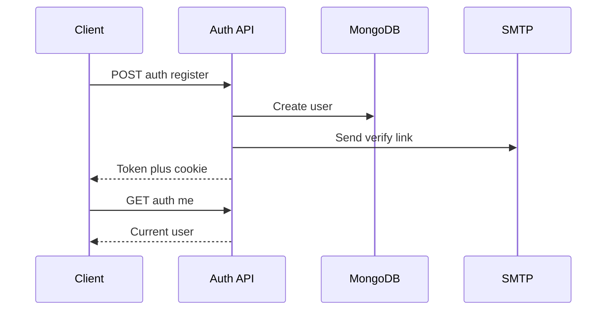

# Auth API Guide

## Overview

The auth-service on port 3001 owns identity: registration, login, OAuth, sessions, profiles, and the gateway into the catalog. Base URL below is `http://localhost:3001`.

## Use Cases

Single-page clients, server-rendered frontends, and scripts that need a token plus user-scoped catalog access through `/dashboard`, `/connectors`, and `/widgets`.

## Prerequisites

MongoDB reachable, `JWT_SECRET` and mail settings configured, and either cookie support (`credentials: include`) or manual `Authorization: Bearer` headers.

### Step 1: Register

**Endpoint/Function**: `POST /auth/register`

**Request/Input**:

```json
{
  "email": "you@example.com",
  "username": "you",
  "password": "Strong1!",
  "passwordConfirmation": "Strong1!"
}
```

**Response/Output**:

```json
{
  "access_token": "jwt...",
  "user": { "id": "u1", "email": "you@example.com", "verified": false }
}
```

**What happens**: The service rejects duplicates and mismatches, hashes with bcrypt, stores the user, mails a verification link, and sets the `access_token` cookie.

**Next steps**: Store the token if you use headers, and confirm the emailed link.

### Step 2: Login and prove the session

**Endpoint/Function**: `POST /auth/login`, then `GET /auth/me`

**Request/Input**:

```json
{ "email": "you@example.com", "password": "Strong1!" }
```

**Response/Output**: Same shape as register; `GET /auth/me` returns the current user or `401`.

**What happens**: Only `LOCAL` users with a correct hash pass; OAuth-only accounts must use their provider.

**Next steps**: Call `GET /dashboard` for the merged connectors and widgets view.

### Step 3: Change password and manage profile

**Endpoint/Function**: `PUT /auth/change-password`, `PUT /users/profile`, `GET /users/confirm-update/:userId`

**Request/Input**:

```json
{ "currentPassword": "Strong1!", "newPassword": "Newer11!!" }
```

**Response/Output**: `{ "message": "Password changed successfully" }`; profile email changes reply that a confirmation email was sent until the link is visited.

**What happens**: Passwords re-hash with bcrypt; email changes stage into `standByEmail` and commit only via the mailed link.

**Next steps**: Re-login after a password change; re-read the profile after confirming.

## Integration Examples

```bash
curl -c jar.txt -X POST localhost:3001/auth/register \
  -H 'Content-Type: application/json' \
  -d '{"email":"you@example.com","username":"you","password":"Strong1!","passwordConfirmation":"Strong1!"}'
curl -b jar.txt localhost:3001/auth/me
```

```js
const login = await fetch('http://localhost:3001/auth/login', {
  method: 'POST',
  credentials: 'include',
  headers: { 'Content-Type': 'application/json' },
  body: JSON.stringify({ email, password }),
});
```

## Error Handling

`400` for validation and mismatches, `401` for bad credentials, missing tokens, and insufficient roles, `404` for unknown users, `409` for taken emails. Auth controller failures use `{ "message" }`; Nest validation uses `{ "statusCode", "message", "error" }`.

## Flow Diagram



## Expected Outcomes

`201` with token on register, `200` with token on login, `401` without credentials, and admin routes opening only for role `ADMIN`.

## Common Issues

- `401` with a fresh token: cookie not sent, enable credentials or use the Bearer header.
- OAuth account cannot log in by password: expected, use the provider flow.
- No email arrives: check `MAIL_*` settings; end-to-end tests mock the mailer.
