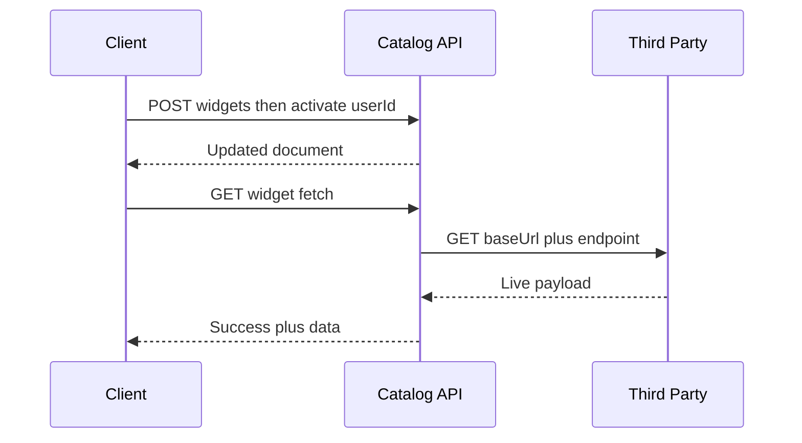

# Catalog API Guide

## Overview

The connectors-service on port 3000 owns connectors, widgets, live fetching, and the generic proxy. Base URL below is `http://localhost:3000`. Routes are public, so keep this port off the open internet.

## Use Cases

Listing the catalog, activating integrations per user, pulling live third-party data server-side, and proxying feeds that browsers cannot call directly.

## Prerequisites

MongoDB with database `dashboard` (seed with `npm run seed`), plus any third-party keys your widgets need in their query strings.

### Step 1: List connectors and their widgets

**Endpoint/Function**: `GET /connectors`, `GET /widgets/service/:serviceId`

**Response/Output**:

```json
[{ "_id": "c1", "title": "GitHub", "baseUrl": "https://api.github.com" }]
```

**What happens**: Plain Mongoose reads; widgets populate their parent connector on list and detail routes.

**Next steps**: Pick a connector id and activate it for the user id.

### Step 2: Activate for a user

**Endpoint/Function**: `POST /connectors/:id/activate/:userId`, `POST /widgets/:id/activate/:userId`

**Response/Output**: The updated document with `userIds` containing the id exactly once.

**What happens**: Idempotent push; repeating the call changes nothing. `DELETE` on the matching `deactivate` path filters the id out.

**Next steps**: Read `GET /widgets/user/:userId` to render the personal dock.

### Step 3: Fetch live data and proxy feeds

**Endpoint/Function**: `GET /widgets/:id/fetch?city=paris`, `GET /proxy?baseUrl=...&endpoint=...`

**Response/Output**:

```json
{ "success": true, "data": { "temp": 21 }, "widget": { "id": "w1" } }
```

**What happens**: The service composes `baseUrl + endpoint + query` with a 15-second timeout; the proxy renders news and Gmail as HTML and passes other APIs through as JSON, redirecting to Google login when an OAuth token is missing.

**Next steps**: Cache on the client using `refreshRate`; do not poll faster than the widget declares.

## Integration Examples

```bash
curl localhost:3000/connectors
curl -X POST localhost:3000/widgets/w1/activate/u1
curl 'localhost:3000/widgets/w1/fetch?city=paris'
curl 'localhost:3000/proxy?baseUrl=https://api.example.com&endpoint=/things'
```

```js
const widgets = await fetch('http://localhost:3000/widgets/user/u1').then((r) => r.json());
```

## Error Handling

`400` for invalid ids in bodies and non-http proxy URLs, `404` for unknown connectors and widgets, `500` for upstream failures with a `details` message. Validation failures list the offending fields.

## Flow Diagram



## Expected Outcomes

`201` on creates and activates, `200` on reads and deactivates, live JSON on fetch, and HTML only from the news and Gmail proxy branches.

## Common Issues

- `404` on a freshly created id: you read before the write settled or mistyped the id.
- Proxy `401` redirect loops: the Google OAuth token is absent; complete provider login first.
- Timeouts on fetch: the third party is slow; the 15-second cap is fixed, so prefer faster endpoints.
