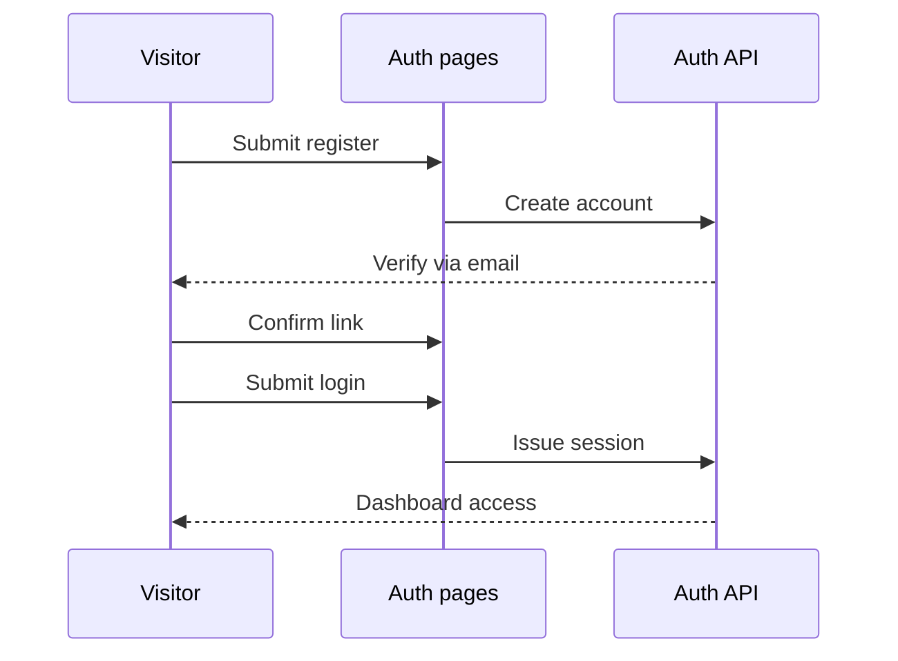

# Authentication Guide

## Overview

Authentication keeps the workspace yours: register once, confirm your email, then log in with email or a provider. This guide walks each screen.

## User Personas

New visitors creating an account, returning members logging in, and anyone resetting access via password change or provider login.

### Step 1: Register

**What to click**: The "Register" link, then the "Create account" button after filling the form.

**What appears**: Two cards, Account Info (username, email) and Security (password, confirmation).

**What to enter/select**: A username of 3 or more characters, a real email, and a password of 8 or more characters mixing upper and lower case, a digit, and a symbol such as `!`.

**Visual feedback**: A spinner replaces the button label while submitting; a red banner explains fixes, a green one confirms success.

**What happens next**: Check your inbox for the verification email before relying on the account.

### Step 2: Confirm your email

**What to click**: The verification link in the email.

**What appears**: A confirmation landing page.

**What happens next**: Your profile shows the verified badge and full access unlocks.

### Step 3: Login

**What to click**: The "Sign in" button, or "Continue with Google" or "Continue with GitHub".

**What appears**: Provider buttons redirect away and back; email login stays on the page with a spinner, then lands on the dashboard.

**What happens next**: Already-logged-in visits bounce straight to the dashboard.

### Step 4: Change your password

**What to click**: On the profile page, open change-password, fill both fields, and submit.

**What to enter/select**: Current password plus a new one following the same strength rule.

**What happens next**: You are logged out everywhere and log back in with the new password.

## Navigation Flow

## Expected Outcomes

One account, one verified email, sessions that survive reloads, and a clean logout that clears them.

## Common Issues

- No verification email: check spam, then resend from the profile page.
- Greyed-out submit: a required field is empty or the password is too weak.
- OAuth loops back to login: the provider withheld your email; retry or use email registration.
