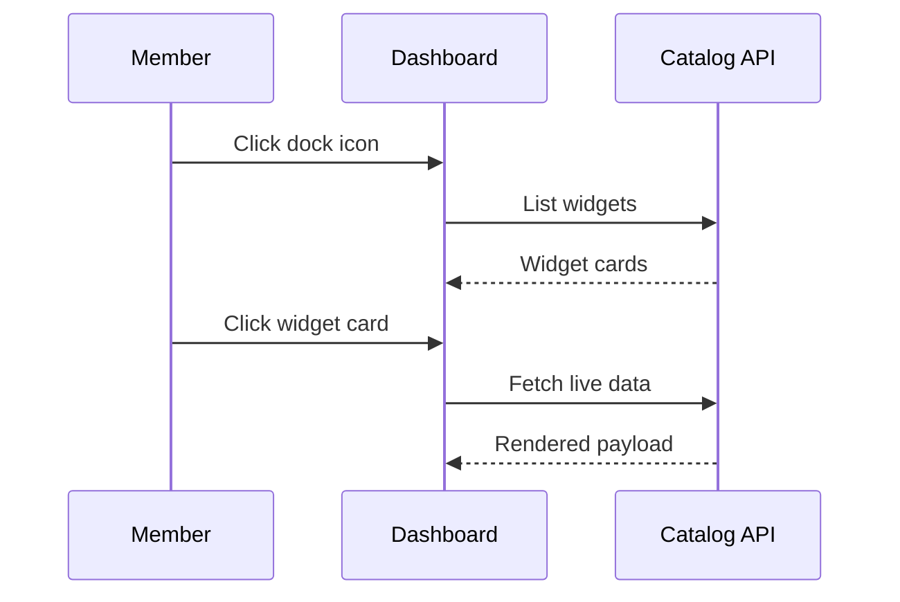

# Dashboard Guide

## Overview

The dashboard is your mission control: a bottom dock holds every connector, and clicking one opens a window with its live widgets. This guide walks you through it click by click.

## User Personas

Members who have confirmed their email and want to watch services at a glance. Admins see the same workspace plus user management on the profile page.

### Step 1: Open the dock

**What to click**: Nothing yet, just look at the bottom center of the home page.

**What appears**: A frosted-glass bar with a GitHub button plus one icon per connector, each labeled underneath.

**What happens next**: You know what is available before touching anything.

### Step 2: Open a connector window

**What to click**: Click a connector icon in the dock.

**What appears**: A floating window near the top of the screen showing the connector title, its description, and an "Available widgets" list.

**What happens next**: You can open several windows; newer ones stack above older ones. Click the `x` in a window header to close it.

### Step 3: Load live widget data

**What to click**: Click inside a widget card, for example the weather card.

**What appears**: A brief "Loading..." state, then the live payload: temperature, humidity, and wind for weather, or formatted JSON for generic widgets.

**Visual feedback**: A red message inside the card means the third-party API failed; the rest of the workspace keeps working.

**What happens next**: Re-click anytime to refresh that widget on demand.

### Step 4: Follow sports news

**What to click**: Open the Sports News widget and pick a sport from the dropdown, such as Soccer.

**What appears**: Article cards with image, title, source, and relative date, refreshing automatically at the widget rate.

**What happens next**: Changing the dropdown reloads the feed for the new sport.

### Step 5: Check GitHub without a connector

**What to click**: Click the GitHub button at the left of the dock.

**What appears**: A modal with two panels. Type a username in either panel and submit to see repos or starred projects with the last five shown as links.

## Navigation Flow

## Expected Outcomes

Open windows with fresh data, a dock that mirrors the catalog, and no full-page reloads during the whole flow.

## Common Issues

- Empty dock: no connectors exist or none are activated; seed the catalog or activate some on the profile page.
- "Cannot load widget": the third-party endpoint is down or needs a key; try another widget.
- Windows feel cramped on a phone: close windows you are not reading; the layout stacks them.
